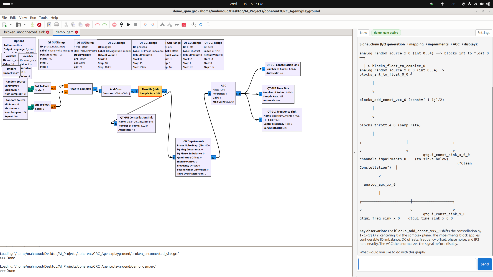
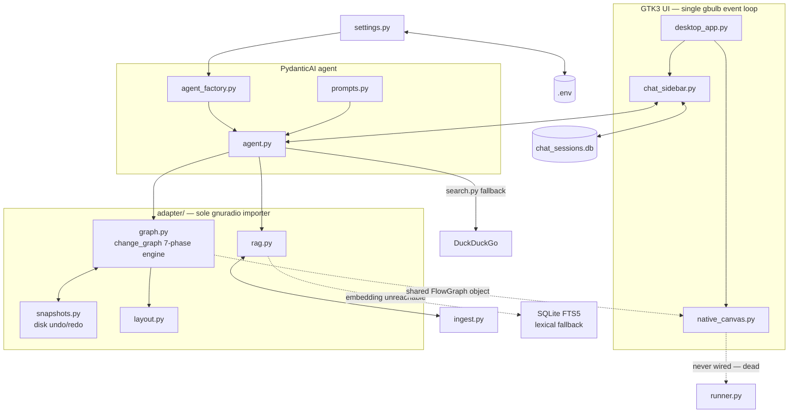

# Qoherent GRC Agent

[](LICENSE)

An autonomous AI agent for GNU Radio Companion. It reasons over your `.grc`
flowgraph, edits it through validated tool calls, and grounds every answer in
a RAG-searchable GNU Radio block catalog and docs wiki — chatting alongside a
live, directly-editable canvas in a single native desktop app.



---

## Architecture at a glance

Single-process, single-thread native GTK3 app (via `gbulb`). GRC's own
`MainWindow` is extended with a `ChatSidebar` — no web server, no subprocess,
no Broadway. The agent streams responses directly on the GLib main loop.

A single asyncio+GTK event loop (unified by `gbulb`) hosts GRC's native
window, the chat sidebar, and a PydanticAI agent that shares one live
`FlowGraph` object with the canvas — the agent mutates it in place, and the
canvas just redraws. Chat history persists to SQLite (`db.py`). `ingest.py`
is the only module permitted to read outside the package (the GNU Radio
docs corpus, for RAG).



| File | Role |
|------|------|
| `desktop_app.py` | Entrypoint. `gbulb` install, GRC `Application`/`MainWindow`, sidebar packing, Ctrl+/- zoom. |
| `chat_sidebar.py` | Native GTK chat UI. Streaming via `agent.iter()` + `run.next()`, settings dialog, slim blocks toggle, graph badge, Send/Stop button. |
| `native_canvas.py` | GRC `MainWindow` signal-wiring: dynamic graph resolution from `window.current_page`, notebook tab tracking, manual-edit disk-sync, agent-edit redraw, pan. |
| `agent_factory.py` | Builds the interactive `Agent` from saved settings (provider/model/API-key). |
| `runner.py` | Flowgraph Run/Stop subprocess lifecycle. |
| `adapter/` | Sole `gnuradio` importer. Flowgraph load/save, `change_graph`, param filtering, RAG (vector search with an SQLite FTS5 lexical fallback) with cached embed client, codegen. |
| `agent.py` | PydanticAI tools (`inspect_graph`, `query_knowledge`, `change_graph`), capabilities, scenario harness. |
| `settings.py` | Persisted preferences (provider, models, API keys) in `.env` via `python-dotenv`. |
| `ingest.py` | Builds the catalog/docs vector databases on first use. |

---

## Installation

### 1. Prerequisites
- **GNU Radio 3.10+** with Python bindings:
  ```bash
  sudo apt install gnuradio gnuradio-dev  # Ubuntu/Debian
  ```
- **Python >= 3.12** and **[uv](https://docs.astral.sh/uv/)**:
  ```bash
  curl -LsSf https://astral.sh/uv/install.sh | sh
  ```

### 2. Clone & Setup
```bash
git clone https://github.com/qoherent/grc-agent.git
cd grc-agent
uv venv --system-site-packages --python 3.12
uv sync --extra dev --python .venv/bin/python
```
`--system-site-packages` bridges the venv to your system-installed GNU Radio.

### 3. Setup LLM Backend
Three chat providers, switchable anytime from the app's Settings dialog. The
active provider and model names persist in `.env` (restart the app to apply).

#### Option A: Ollama (Local & Free)
```bash
ollama pull qwen3.6:35b-a3b-q4_K_M   # chat model
ollama pull embeddinggemma:latest    # embedding model
```

<details>
<summary>Required: increase Ollama's context window (click to expand)</summary>

Ollama's default context window is too small for multi-turn tool-calling.
Set it to `120000`:
- **Linux:** `sudo systemctl edit ollama`, add under `[Service]`:
  `Environment="OLLAMA_CONTEXT_LENGTH=120000"`, then
  `sudo systemctl daemon-reload && sudo systemctl restart ollama`.
- **macOS:** `launchctl setenv OLLAMA_CONTEXT_LENGTH 120000`, then restart the Ollama app.
- **Windows:** add `OLLAMA_CONTEXT_LENGTH` = `120000` to User Environment Variables, then restart Ollama.
</details>

#### Option B: OpenRouter (Cloud)
Get a key at [OpenRouter](https://openrouter.ai/), then set it from the
app's Settings dialog (gear button) or add `OPENROUTER_API_KEY` to `.env`.

#### Option C: Ollama Cloud (Cloud)
Get a key at [Ollama](https://ollama.com/settings/keys), then set
`OLLAMA_CLOUD_API_KEY` from Settings or `.env`.

> [!NOTE]
> Vector search (`query_knowledge`) always routes embeddings locally via
> Ollama (`embeddinggemma:latest`), even when using a cloud chat provider. If
> that backend is unreachable (Ollama not running, model not pulled),
> catalog/docs search automatically falls back to a local SQLite FTS5
> (BM25) keyword search over the same corpus instead of failing outright —
> the tool result always says `"search_mode": "lexical"` (vs. `"vector"`)
> so a fallback is never silent.

---

## Usage

### Launch the app
```bash
uv run grc-agent
```
Opens a native GTK3 window with GRC's canvas on the left and the chat sidebar
on the right. Open `.grc` files via GRC's native File menu — the agent
auto-detects the active graph from GRC's notebook tabs.

- **First run** builds the catalog/docs vector databases (a few minutes,
  needs a reachable embeddings backend). Cached afterward, rebuilt
  automatically if the embedding model or source data changes. If no
  embeddings backend is reachable on first run, a keyword (FTS5) index is
  built instead so search still works, lexically, until a real rebuild
  succeeds.
- **Model settings:** switch provider/model anytime from Settings (gear
  button); changes write to `.env` and need a restart.
- **Run/Stop & validation:** use GRC's own built-in toolbar buttons.
- **Undo/redo:** GRC's native Ctrl+Z/Y works directly.
- **Zoom:** Ctrl+/- to zoom the app, Ctrl+0 to reset.
- **Block library:** toggle via the slim arrow button on the left edge of the sidebar.

### Run the tests
```bash
uv run pytest tests/test_unit.py              # fast, no LLM
uv run pytest tests/test_isolation.py         # settings/model isolation, no LLM
uv run pytest tests/test_button_integration.py # tool integration, Ollama Cloud
uv run pytest tests/test_integration.py       # live model, ~15-20 min
uv run ruff check                             # lint
```

### Example prompts
- `Summarize this graph.`
- `Show parameters for analog_sig_source_x_0.`
- `Find a low-pass filter block.`
- `Change samp_rate to 48000 and validate.`
- `Change the signal source frequency from 440 to 1000.`

---

## More docs

- [`AGENTS.md`](AGENTS.md) — architecture, engineering rules, and live-verified design decisions.
- [`docs/technical_overview.md`](docs/technical_overview.md) — a deeper architecture writeup with diagrams and benchmarks.
- [`docs/codebase_audit_report.md`](docs/codebase_audit_report.md) — code quality & architecture audit with prioritized findings.
- [`docs/efficiency_audit.md`](docs/efficiency_audit.md) — performance/efficiency-focused audit: what's fixed, what's deferred and why.
- [`LICENSE`](LICENSE) / [`NOTICE.md`](NOTICE.md) — AGPL-3.0-licensed; the bundled GNU Radio docs corpus is CC BY-SA 3.0.
