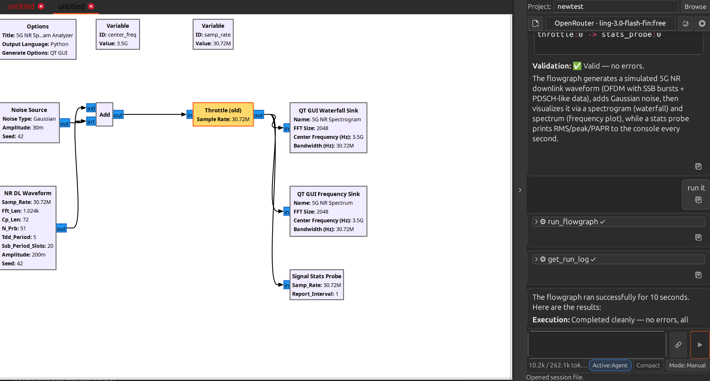
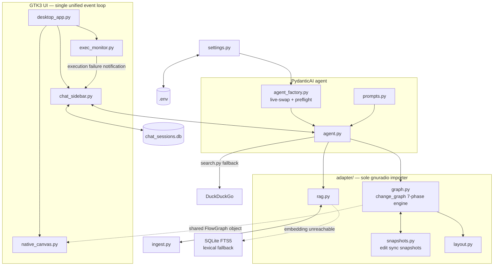

# Qoherent GRC Agent

[](LICENSE)

An autonomous AI agent for GNU Radio Companion. It reasons over your `.grc`
flowgraph, edits it through validated tool calls, and grounds every answer in
a RAG-searchable GNU Radio block catalog and docs wiki — chatting alongside a
live, directly-editable canvas in a single native desktop app.



---

## Architecture at a glance

Single-process, single-thread native GTK3 app. GRC's own
`MainWindow` is extended with a `ChatSidebar` — no web server, no subprocess,
no Broadway. The agent streams responses directly on the GLib main loop.

A single asyncio+GTK event loop (unified by PyGObject's `gi.events`, or
`gbulb` on older PyGObject) hosts GRC's native
window, the chat sidebar, and a PydanticAI agent that shares one live
`FlowGraph` object with the canvas — the agent mutates it in place, and the
canvas just redraws. Chat history persists to SQLite (`db.py`). `ingest.py`
is the only module permitted to read outside the package (the GNU Radio
docs corpus, for RAG).


```mermaid
flowchart TB
  subgraph UI["GTK3 UI — single unified event loop"]
    DA["desktop_app.py"]
    CS["chat_sidebar.py"]
    NC["native_canvas.py"]
    EM["exec_monitor.py"]
  end
  subgraph AGT["PydanticAI agent"]
    AF["agent_factory.py<br/>live-swap + preflight"]
    AG["agent.py"]
    PR["prompts.py"]
  end
  subgraph ADP["adapter/ — sole gnuradio importer"]
    GR["graph.py<br/>change_graph 7-phase engine"]
    SN["snapshots.py<br/>edit sync snapshots"]
    LY["layout.py"]
    RG["rag.py"]
  end
  ST["settings.py"] <--> ENV[(".env")]
  ST --> AF
  DA --> CS
  DA --> NC
  DA --> EM
  CS <--> AG
  CS <--> DB[("chat_sessions.db")]
  AF --> AG
  PR --> AG
  AG --> GR
  AG --> RG
  AG -->|"search.py fallback"| SR["DuckDuckGo"]
  RG <--> ING["ingest.py"]
  RG -.->|"embedding unreachable"| FTS["SQLite FTS5<br/>lexical fallback"]
  GR <--> SN
  GR --> LY
  GR -.->|"shared FlowGraph object"| NC
  EM -->|"execution failure notification"| CS
```

| File | Role |
|------|------|
| `desktop_app.py` | Entrypoint. Event-loop install, GRC `Application`/`MainWindow`, sidebar packing, Ctrl+/- zoom, startup preflight. |
| `event_loop.py` | asyncio+GLib unification: PyGObject's in-tree `gi.events`, falling back to `gbulb` on PyGObject < 3.50. |
| `chat_sidebar.py` | Native GTK chat UI. Streaming via `agent.iter()` + `run.next()`, settings dialog with live-swap, provider badge, auto-scroll tracking, Send/Stop button. |
| `native_canvas.py` | GRC `MainWindow` signal-wiring: dynamic graph resolution from `window.current_page`, notebook tab tracking, manual-edit disk-sync, agent-edit redraw, pan. |
| `exec_monitor.py` | Detects flowgraph execution failures from GRC's console message bus; auto-notifies the agent with the return code (agent reads the full log via `get_run_log`). |
| `agent_factory.py` | Builds the interactive `Agent` from saved settings (live-swappable). Includes preflight connection check and `ModelRequestLogger`. |
| `db.py` | SQLite chat-session persistence (save/load/delete, recent-sessions list). |
| `adapter/` | Sole `gnuradio` importer. Flowgraph load/save, `change_graph`, param filtering, RAG (vector search with an SQLite FTS5 lexical fallback) with cached embed client, codegen. |
| `agent.py` | PydanticAI tools (`inspect_graph`, `query_knowledge`, `generate_python`, `change_graph`, `get_run_log`), capabilities, scenario harness. |
| `settings.py` | Persisted preferences (provider, models, API keys) in `.env` via `python-dotenv`. |
| `ingest.py` | Builds the catalog/docs vector databases on first use. |

---

## Installation

### 1. Prerequisites
- **[GNU Radio 3.10](https://wiki.gnuradio.org/index.php?title=InstallingGR)**
  with Python bindings. CI covers Ubuntu 24.04 (GNU Radio 3.10.9.x) and
  Ubuntu 26.04 (3.10.12.x); other 3.10.x builds are likely fine.
- **Python 3.12 – 3.14** and **[uv](https://docs.astral.sh/uv/getting-started/installation/)**.
- GTK bindings from your distro, not PyPI:
  ```bash
  sudo apt install gnuradio python3-gi python3-gi-cairo
  ```

### 2. Clone & Setup
```bash
git clone https://github.com/qoherent/grc-agent.git
cd grc-agent
uv venv --system-site-packages --python /usr/bin/python3
uv sync --extra dev --locked --python .venv/bin/python
```
`--system-site-packages` bridges the venv to your system-installed GNU Radio.
`--locked` installs exactly what's pinned in `uv.lock` (matching CI) instead
of a loose resolve that could silently pick up untested dependency versions.

Use `/usr/bin/python3` explicitly rather than a bare `--python 3.12`. GNU
Radio's Python bindings are compiled against your system interpreter's ABI
only (`cpython-312` on 24.04, `cpython-314` on 26.04), so a different
interpreter — a uv-managed build, or a `pyenv`/`conda` shim earlier on your
`PATH` — will fail to `import gnuradio` even with `--system-site-packages`.

### 3. Setup LLM Backend
Two unified chat providers, switchable anytime from the app's Settings dialog:
1. **Ollama** (Local daemon or Ollama Cloud)
2. **OpenAI-Compatible** (OpenRouter, llama.cpp, vLLM, LM Studio, OpenAI, Groq, etc.)

The active provider, model name, base URL, and API keys persist in `.env` and apply immediately on Save (no restart needed).

#### Option A: Ollama (Local Daemon or Cloud)
- **Local Ollama:**
  ```bash
  ollama pull qwen3.6:35b-a3b-q4_K_M   # chat model
  ollama pull embeddinggemma:latest    # embedding model (optional — FTS5 lexical search is used if unavailable)
  ```
- **Ollama Cloud:**
  Set Base URL to `https://ollama.com/v1`, Model to `deepseek-v4-flash:cloud`, and enter your [Ollama Cloud API Key](https://ollama.com/settings/keys).

<details>
<summary>Required for local Ollama: increase context window (click to expand)</summary>

Ollama's default context window is too small for multi-turn tool-calling.
Set it to `120000`:
- **Linux:** `sudo systemctl edit ollama`, add under `[Service]`:
  `Environment="OLLAMA_CONTEXT_LENGTH=120000"`, then
  `sudo systemctl daemon-reload && sudo systemctl restart ollama`.
- **macOS:** `launchctl setenv OLLAMA_CONTEXT_LENGTH 120000`, then restart the Ollama app.
- **Windows:** add `OLLAMA_CONTEXT_LENGTH` = `120000` to User Environment Variables, then restart Ollama.
</details>

#### Option B: OpenAI-Compatible Endpoint (Local or Cloud)
Use any OpenAI-compatible server or cloud provider (e.g. `OpenRouter`, `llama.cpp` / `llama-server`, `vLLM`, `LM Studio`, `LocalAI`, `Groq`, `OpenAI`):
- **OpenRouter:** Base URL `https://openrouter.ai/api/v1`, Model `deepseek/deepseek-v4-flash`, paste your [OpenRouter API Key](https://openrouter.ai/).
- **Local Server (llama.cpp / vLLM / LM Studio):** Base URL `http://localhost:8080/v1` (or your server port), Model e.g. `qwen2.5-coder:32b`, API key optional.
- **OpenAI / Cloud Providers:** Base URL e.g. `https://api.openai.com/v1`, Model e.g. `gpt-4o`, paste your API key.

> [!NOTE]
> Vector search (`query_knowledge`) uses embeddings locally via Ollama
> (`embeddinggemma:latest`) when available. If the embedding
> backend is unreachable, search automatically uses local SQLite FTS5 (BM25)
> keyword search over the same corpus without requiring any manual setup —
> the tool result always indicates `"search_mode": "lexical"` (vs. `"vector"`).

---

## Usage

### Launch the app
```bash
uv run grc-agent
```
Opens a native GTK3 window with GRC's canvas on the left and the chat sidebar
on the right. Open `.grc` files via GRC's native File menu — the agent
auto-detects the active graph from GRC's notebook tabs.

- **First run** builds the catalog/docs vector databases (a few minutes,
  needs a reachable embeddings backend). Cached afterward, rebuilt
  automatically if the embedding model or source data changes. If no
  embeddings backend is reachable on first run, a keyword (FTS5) index is
  built instead so search still works, lexically, until a real rebuild
  succeeds.
- **Model settings:** switch provider/model anytime from Settings (gear
  button); changes apply immediately (live-swap, no restart).
- **Run/Stop & validation:** use GRC's own built-in toolbar buttons.
- **Undo/redo:** GRC's native Ctrl+Z/Y works directly.
- **Zoom:** Ctrl+/- to zoom the app, Ctrl+0 to reset.
- **Block library:** toggle via the slim arrow button on the left edge of the sidebar.

### Run the tests
```bash
uv run pytest tests/test_unit.py              # fast, no LLM
uv run pytest tests/test_isolation.py         # settings/model isolation, no LLM
uv run pytest tests/test_button_integration.py # tool integration, Ollama Cloud
uv run pytest tests/test_integration.py       # live model, ~15-20 min
uv run ruff check                             # lint
```

### Example prompts
- `Summarize this graph.`
- `Show parameters for analog_sig_source_x_0.`
- `Find a low-pass filter block.`
- `Change samp_rate to 48000 and validate.`
- `Change the signal source frequency from 440 to 1000.`

---

## More docs

- [`AGENTS.md`](AGENTS.md) — architecture, engineering rules, and live-verified design decisions.
- [`docs/technical_overview.md`](docs/technical_overview.md) — a deeper architecture writeup with diagrams and benchmarks.
- [`docs/efficiency_audit.md`](docs/efficiency_audit.md) — performance/efficiency-focused audit: what's fixed, what's deferred and why.
- [`docs/harness_tutorial_audit.md`](docs/harness_tutorial_audit.md) — capability audit against every GNU Radio wiki tutorial in the docs corpus: what the harness can and can't do, and why.
- [`LICENSE`](LICENSE) / [`NOTICE.md`](NOTICE.md) — AGPL-3.0-licensed; the bundled GNU Radio docs corpus is CC BY-SA 3.0.
