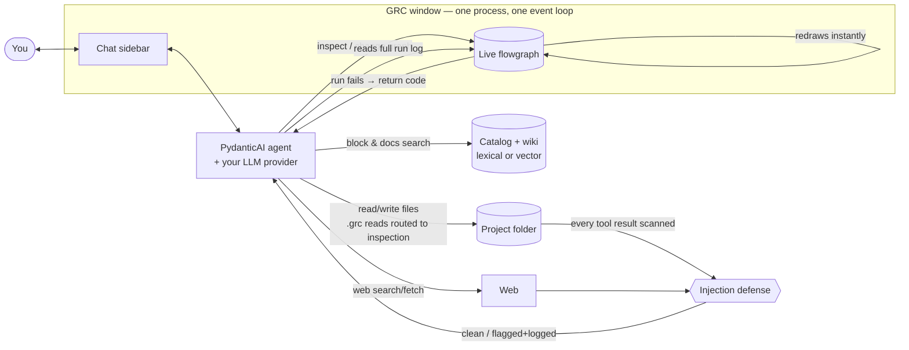

# Qoherent GRC Agent

[](LICENSE)

An AI agent for GNU Radio Companion, built into a native desktop app. It
works directly on your live `.grc` flowgraph: reads it structurally, edits
it through validated tool calls, answers grounded in GNU Radio documentation,
and helps debug runs — all in a chat sidebar next to the canvas you already
use.


The whole app is one native GTK3 process: GRC's canvas and the chat sidebar
share a single event loop, and the agent edits the **same live flowgraph
object** the canvas draws — no files are round-tripped between them.


```mermaid
flowchart LR
    U([You]) <--> CS[Chat sidebar]
    CS <--> AG[PydanticAI agent<br/>+ your LLM provider]

    subgraph GRC [GRC window — one process, one event loop]
        CS
        FG[(Live flowgraph)]
    end

    AG -- "inspect / change graph" --> FG
    FG -- "redraws instantly" --> FG

    AG -- "read/write files<br/>.grc reads routed to inspection" --> FS[(Project folder)]
    AG -- "block & docs search" --> KB[(Catalog + wiki<br/>lexical or vector)]
    AG -- "web search/fetch" --> WEB[Web]

    FS -- "every tool result scanned" --> DEF{{Injection defense}}
    WEB --> DEF
    DEF -- "clean / flagged+logged" --> AG

    FG -- "run fails → return code" --> AG
    AG -- "reads full run log" --> FG
```

---

## What it does

### Flowgraphs

- **Inspect & edit structurally** — the agent reads blocks, connections, and
  parameters; adds, removes, rewires, and re-parameterizes through one
  validated, rolled-back-on-failure edit. **Every edit requires your approval
  first** (the default "Manual" mode) — you see the agent's one-line reason and
  a structured summary of the proposed change before it applies (Approve / Deny
  / Always accept). The composer's **Mode toggle** switches to "Auto" to apply
  changes without asking, and back any time. The canvas redraws immediately,
  GRC's native undo/redo keeps working — what it changed is what you see.
  Topology changes re-arrange the whole graph into a clean layered layout
  (each independent chain gets its own row band, wires stay untangled), so
  the canvas never degrades into a pile of blocks after multi-step edits.
- **Run and stop flowgraphs itself** — the agent triggers GRC's native
  Execute/Stop (the same path as the toolbar Run button): output streams to
  the GRC console where you watch it live, and the agent reads the results
  back. Running requires your approval first (it may transmit RF on connected
  hardware); stopping never does. Ask for a **bounded run** and the agent
  stops the graph itself when the time budget is up ("run it for 10 seconds
  and report the log") — no leaked processes.
- **Plan before you implement** — a separate read-only Planner mode researches
  and drafts a durable step-by-step plan; nothing changes until you click
  "Implement the Plan" to hand it to the executor.
- **Diagnose failed runs** — when a run fails, the agent gets the return code,
  reads the full console log itself, and proposes the fix — and with the run
  tools above, the whole probe → run → read-log verification loop happens in
  one turn.
- **Preview generated code** — renders the exact Python GNU Radio would
  generate from the current graph, read-only, nothing written to disk.
- **Save reusable blocks** — exports a working Embedded Python Block into
  GRC's block library as a standalone catalog block for future flowgraphs.
- **New graphs save into your project folder** — Ctrl+S on an untitled
  flowgraph opens GRC's Save-As dialog already pointed at the project
  directory you configured in the sidebar.

### Your project files

- **Read anything in your project folder** — Python, C/C++, txt, markdown,
  MATLAB, JSON, YAML, XML, … And `.grc` files are never dumped as raw XML:
  they pass through the same structural inspection as the active graph.
- **Write source/config files** — create and edit with atomic saves and
  conflict detection; formats cover CMake, C++, YAML and friends, ready for
  out-of-tree module work. The agent can grep file contents and find files by
  name.
- **Flowgraphs are read-only to it on purpose** — graphs are only ever edited
  through the validated graph tools, never by writing the `.grc` file.

### Builds, SDR tools & the shell

- **Approved shell commands in your project folder** — build toolchains
  (`cmake`/`make`/`ctest`/`gr_modtool`), SDR utilities (`uhd_find_devices`,
  `SoapySDRUtil`, `rtl_*`, …), standalone scripts, and data analysis all run
  through the agent — every command shows you the **full literal command** on
  an approval card first. Approve once, or "Always allow `cmake`" for the rest
  of the session; the composer's Mode toggle switches to Auto to approve
  everything.
- **Long jobs run in the background** — start/check/stop tools manage captures
  and servers, cleaned up automatically when the turn ends.
- **Scoped and scrubbed** — commands run in the project directory, destructive
  commands (`rm`, `mkfs`, `dd`, …) are denied by default, and your provider
  API keys are stripped from every spawned command's environment.
- **Flowgraphs stay on the structured tools** — `.grc` files are still only
  ever edited through the validated graph tools, never by shell scripts.

### Grounded answers

- **Checks the docs, not its memory** — block IDs, port names, parameter keys,
  and concepts come from a searchable GNU Radio catalog and docs wiki, with
  web search as fallback for what's not covered.

### Reliability

- **Handles long conversations** — bulky old tool results are cleared, aging
  turns summarized (your messages always preserved), sized against the
  model's real context window probed from the backend.
- **Prompt-injection scanned** — every client-executed tool result (project
  files via the fs tools, web pages via the local fetch fallback) is
  scanned and every detection is logged; flagged content is disclosed, not
  silently injected into the model's context (detect-and-log, never
  withheld — withholding false-positived on official documentation).
  File access is sandboxed to your project folder; `.env` and `.git` are
  off-limits.
- **Sessions persist** — full chat history, resumable, searchable.

### The interface

- **System / Dark / Light theming** — one-click toggle in the header, paired
  with your installed dark theme.
- **Live context & cost readout** — the context row shows the active
  provider/model, tokens vs the model's real context window, and the latest
  turn's native cost whenever the backend reports pricing.

## Supported LLM providers

Pick any of these in Settings; model and API key apply immediately — no
restart. The model list can be loaded live from the provider, so you never
guess an id.

- Ollama — local or LAN
- Ollama Cloud
- OpenRouter
- OpenAI
- Any OpenAI-compatible endpoint (llama.cpp, vLLM, LM Studio, …)
- Anthropic (Claude)
- Google (Gemini)
- Groq
- Mistral
- Cohere
- xAI (Grok)
- ChatGPT Plus/Pro — sign in with your ChatGPT account, no API key

## Knowledge base search

Out of the box, search runs on **Lexical** (SQLite FTS5/BM25 keyword
search) — zero extra downloads, nothing running in the background.

Optionally, install **Local Vector Search** with one click from Settings:
a pinned llama.cpp + EmbeddingGemma runtime (~345 MB) is downloaded into
`~/.local/share/grc-agent` and served over a private local socket. Nothing
is installed system-wide. If it's ever unreachable, search falls back to
lexical automatically with a notice.

## Installation

### Prerequisites
- **[GNU Radio 3.10](https://wiki.gnuradio.org/index.php?title=InstallingGR)**
  with Python bindings (CI covers Ubuntu 24.04 and 26.04; other 3.10.x is
  likely fine).
- **Python 3.12–3.14** and **[uv](https://docs.astral.sh/uv/getting-started/installation/)**.
- GTK bindings from your distro, not PyPI:
  ```bash
  sudo apt install gnuradio python3-gi python3-gi-cairo
  ```
- **SDR hardware permissions** (if using physical SDRs like RTL-SDR, HackRF, USRP):
  Physical SDRs should be accessible without `sudo`. Distro packages (e.g.
  `uhd-host`, `rtl-sdr`, `hackrf`) install the required udev rules automatically.
  If you encounter a USB permission error after installing driver packages,
  reload rules and reconnect your device:
  ```bash
  sudo udevadm control --reload-rules
  ```

### Setup
```bash
git clone https://github.com/qoherent/grc-agent.git
cd grc-agent
uv venv --system-site-packages --python /usr/bin/python3
uv sync --extra dev --locked --python .venv/bin/python
```

`--system-site-packages` bridges the venv to your system GNU Radio. Use
`/usr/bin/python3` explicitly — the GNU Radio bindings are compiled against
your system interpreter's ABI, so a uv-managed or pyenv/conda Python will
fail to `import gnuradio` even with the bridge.

#### Search Backend Options

Choose how the agent searches the block catalog and documentation:

* **Option 1: Lexical Search (Default)** — Zero extra downloads, nothing running in the background. Uses SQLite FTS5/BM25 keyword search:
  ```bash
  uv run grc-agent
  ```

* **Option 2: Local Vector Search (Hybrid RAG)** — Pre-download the pinned local runtime (~345 MB: llama.cpp + EmbeddingGemma into `~/.local/share/grc-agent`) for semantic search combined with FTS5 lexical search via Reciprocal Rank Fusion (RRF):
  ```bash
  # Pre-provision vector runtime and enable hybrid search before launch:
  uv run python -c "from grc_agent import embed_runtime, settings; embed_runtime.provision(); settings.upsert_env_key('GRC_EMBED_BACKEND', 'llamacpp')"
  uv run grc-agent
  ```
  *(You can also install or switch vector search anytime with one click in the app's Settings dialog).*

Local Ollama note: the default context window is too small for multi-turn
tool-calling. Set `OLLAMA_CONTEXT_LENGTH=120000` and restart the daemon
(Linux: `sudo systemctl edit ollama`, add it under `[Service]`).

### Run
```bash
uv run grc-agent
```
A native GTK3 window opens: GRC's canvas on the left, the chat sidebar on
the right. Open `.grc` files from GRC's File menu — the agent follows the
active tab automatically.

- Zoom: Ctrl+/- and Ctrl+0. Block library: the slim arrow on the sidebar's
  left edge. Run/Stop and validation: GRC's own toolbar.

## Example prompts

**Understand & explain**
- `Summarize this flowgraph — what does it do end to end?`
- `Compare this graph with rx_bench.grc in the same folder.`
- `Show the parameters for analog_sig_source_x_0 and explain what they do.`

**Edit the graph**
- `Change samp_rate to 48000 and validate.`
- `Add a low-pass filter between the source and the sink, and explain your
  cutoff choice.`
- `Change the signal source frequency from 440 Hz to 1 kHz.`
- `Make the output smoother.` *(casual descriptions work too — the agent
  searches the block catalog for the right knob)*

**Work with files**
- `Read helper.py in this folder and explain what it does.`
- `Write a calibration_loader.py that reads cal_table.json and exposes the
  values as variables.`
- `Grep the project for everywhere samp_rate is referenced.`

**Debug & verify**
- `The run just failed — read the log and tell me what's wrong.`
- `Show me the Python GRC would generate for this graph.`
- `Add a probe so we can verify the throughput when I hit Run, then tell me
  what to look for.`

## Tests

```bash
uv run pytest tests/ --ignore=tests/test_integration.py --ignore=tests/test_button_integration.py  # fast, no LLM
uv run pytest tests/test_button_integration.py  # tool integration, needs Ollama Cloud key
uv run pytest tests/test_integration.py         # live model scenarios, ~15-20 min
uv run ruff check                               # lint
```
Sidebar/canvas tests need a display: `xvfb-run -a uv run pytest …`.

## More docs

- [`AGENTS.md`](AGENTS.md) — architecture, engineering rules, and live-verified design decisions.
- [`docs/technical_overview.md`](docs/technical_overview.md) — deeper architecture writeup with diagrams and benchmarks.
- [`LICENSE`](LICENSE) / [`NOTICE.md`](NOTICE.md) — AGPL-3.0; the bundled GNU Radio docs corpus is CC BY-SA 3.0.
