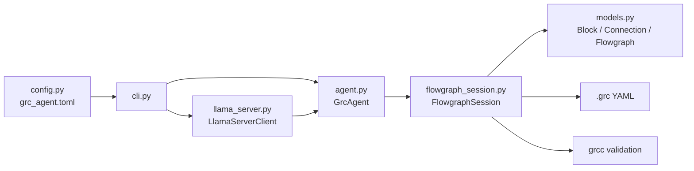

# Python Package Guide

This file is the quick human map of the Python package under [src/grc_agent](../src/grc_agent).
Use it to understand ownership and call flow.
Use [BLUEPRINT.md](BLUEPRINT.md) for validated GNU behavior, settled boundaries, and experiment evidence.

## Overall Vision

The package is intentionally layered so the model never edits raw `.grc` YAML directly.

- [config.py](../src/grc_agent/config.py) loads repo-backed llama runtime defaults from [grc_agent.toml](../grc_agent.toml).
- [flowgraph_session.py](../src/grc_agent/flowgraph_session.py) is the real mutation and validation boundary.
- [agent.py](../src/grc_agent/agent.py) is the narrower model-facing tool layer.
- [llama_server.py](../src/grc_agent/llama_server.py) is the thin llama.cpp HTTP adapter over that tool layer.
- [cli.py](../src/grc_agent/cli.py) is the thin entrypoint and smoke-test harness.
- [models.py](../src/grc_agent/models.py) is the typed in-memory shape used by the session.
- [__init__.py](../src/grc_agent/__init__.py) exposes the public package surface.

## [config.py](../src/grc_agent/config.py)

Used for: loading the repo-level runtime defaults used by the local llama.cpp path.

Human flow:

- read [grc_agent.toml](../grc_agent.toml)
- validate the required llama settings
- hand those defaults to the CLI so the local backend uses one configured model and server target

Main contents:

- `AppConfig`: top-level repo config shape
- `LlamaConfig`: runtime defaults for the llama.cpp path
- `load_app_config()`: reads and validates the repo config
- `default_config_path()`: resolves the workspace config location

Important defaults:

- `model`: the canonical API alias expected back from `/v1/models`
- `max_steps`: tool-round budget for the bounded llama.cpp loop
- `max_tokens`: completion ceiling only, not the summarize correctness guard
- `temperature` and `enable_thinking`: request-shaping defaults for the local server path

Read this file as: the repo-defaults loader, not a second runtime layer.

## [__init__.py](../src/grc_agent/__init__.py)

Used for: package-level exports so callers can import the main types from one place.

Human flow:

- import `grc_agent`
- receive the public names `GrcAgent`, `FlowgraphSession`, `Block`, `Connection`, and `Flowgraph`
- avoid reaching into internal files unless a lower-level import is really needed

Main contents:

- no classes or runtime logic
- only re-exports and `__all__`

## [models.py](../src/grc_agent/models.py)

Used for: the small typed in-memory representation of a parsed flowgraph.

Human flow:

- raw YAML is parsed
- the session converts blocks and connections into typed dataclasses
- edits operate on these objects while raw YAML is kept in sync for save and validation

Classes:

- `Block`: one block instance
  - attributes: `instance_name`, `block_type`, `params`
- `Connection`: one wire
  - attributes: `src_block`, `src_port`, `dst_block`, `dst_port`
- `Flowgraph`: one loaded graph
  - attributes: `blocks`, `connections`, `metadata`, `raw_data`

Why it stays small:

- this file is the thin IR, not the behavior layer
- parsing, validation, and mutation rules stay in the session

## [flowgraph_session.py](../src/grc_agent/flowgraph_session.py)

Used for: the single-session owner of load, save, validate, summarize, and all graph mutations.

Human flow:

- load `.grc` YAML
- parse blocks and connections into typed objects
- keep typed objects and raw YAML synchronized during edits
- validate candidate or live graphs with real `grcc`
- save the same raw snapshot that validation used

Main class: `FlowgraphSession`

Attributes:

- `path`: active graph path or `None`
- `flowgraph`: loaded `Flowgraph` or `None`
- `is_dirty`: whether in-memory state differs from disk
- `last_validation_stdout`: stdout from the last top-level validation run
- `last_validation_stderr`: stderr from the last top-level validation run
- `last_validation_returncode`: exit code from the last top-level validation run

Main methods:

- `load(path)`
  - reads YAML from disk
  - requires a top-level mapping
  - parses `blocks` and `connections`
  - stores the untouched remainder as metadata
  - resets the session to clean state
- `save(path=None)`
  - serializes the current raw YAML snapshot
  - writes to the provided path or the loaded path
  - updates `path`
  - clears `is_dirty`
- `validate()`
  - serializes the current raw snapshot into a temporary `.grc`
  - runs `grcc`
  - stores stdout, stderr, and return code
  - returns a boolean validity result using both exit code and known GNU error markers
- `summarize()`
  - returns a short human-readable graph summary
- `set_param(...)`, `connect(...)`, `disconnect(...)`, `remove_block(...)`
  - mutate both the typed model and raw YAML together
  - leave final correctness to explicit validation
- `add_block(...)`, `add_and_connect_qtgui_time_sink(...)`, `add_and_connect_char_to_float_to_qtgui_time_sink(...)`, `add_and_connect_analog_random_source_to_qtgui_time_sink(...)`
  - are narrow structural helpers only
  - use copy -> validate with real `grcc` -> commit
  - exist because broader generic APIs were not yet justified by evidence

Internal logic groups:

- parsing and serialization helpers
- validation helpers
- structural-edit helpers
- raw-data inspection helpers

Read this file as: the trusted mutation boundary, not a generic GNU abstraction layer.

## [agent.py](../src/grc_agent/agent.py)

Used for: the small runtime contract exposed to a model or fake runtime.

Human flow:

- receive a tool call name and arguments
- look up the tool in a fixed registry
- call the session through a narrow wrapper
- return a structured result
- block save until the latest dirty revision has validated successfully

Main class: `GrcAgent`

Attributes:

- `session`: active `FlowgraphSession`
- `history`: recorded turn history for smoke testing and future runtime use
- `_mutation_revision`: increments on each mutation
- `_last_validated_revision`: last revision that validated successfully
- `_last_validation_ok`: whether the latest validation passed
- `_tools`: runtime tool registry

Main methods:

- `get_system_prompt()`
  - states the runtime rules for safe tool use
- `execute_tool(tool_name, kwargs)`
  - dispatches one tool call
  - wraps failures into structured error payloads
- `_summarize_graph()`
  - returns the session summary plus dirty state
- `_set_variable(instance_name, value)`
  - allows only `variable` blocks
  - delegates to `set_param(..., "value", ...)`
- `_validate_graph()`
  - runs session validation
  - records which dirty revision passed
- `_save_graph(path=None)`
  - refuses to save if the current dirty state has not validated
- `run_step_fake(...)`
  - executes a deterministic fake conversation for smoke testing

Read this file as: the model guardrail layer, not the place where GNU semantics are discovered.

## [llama_server.py](../src/grc_agent/llama_server.py)

Used for: the thin llama.cpp HTTP adapter that calls the narrowed runtime through documented server endpoints.

Human flow:

- check server health
- discover the model id from `/v1/models` when one is not provided
- send chat history plus the fixed tool schemas to `/v1/chat/completions`
- normalize either native or generic tool-call payloads
- execute returned tool calls through `GrcAgent`
- repeat for a bounded number of assistant turns

Main pieces:

- `LlamaServerClient`
  - owns HTTP calls to `/health`, `/v1/models`, and `/v1/chat/completions`
  - tolerates both standard OpenAI-style and simplified tool-call payloads
- `LlamaToolCall`
  - normalized internal representation of one returned tool call
- `run_bounded_llama_turn(...)`
  - appends the user message to runtime history
  - executes tool calls serially in the order returned by the model
  - enforces a bounded number of tool rounds, then allows one final non-tool assistant answer
  - finalizes summarize from the `summarize_graph` payload rather than trusting raw model prose
  - finalizes supported mutation flows from `set_variable` and `validate_graph` tool results
  - refuses to surface raw tool-call-like text as a final answer when no tools actually ran

Important boundary:

- this file does not own GNU semantics
- it does not call `FlowgraphSession` directly
- it does not use llama.cpp built-in `/tools`
- it is a backend adapter, not a new orchestration framework

## [cli.py](../src/grc_agent/cli.py)

Used for: the thin command-line wrapper around the runtime.

Human flow:

- load repo defaults from [grc_agent.toml](../grc_agent.toml)
- parse CLI arguments
- load a graph when `--fake` is used
- load a graph and call the llama.cpp adapter when `--message` is used
- create `FlowgraphSession` and `GrcAgent`
- run the deterministic fake tool sequence
- print the resulting history

Main functions:

- `_build_parser()`
  - defines the CLI arguments
  - seeds llama.cpp defaults from the repo config
- `_run_fake_runtime(file_path)`
  - loads the graph
  - constructs the runtime
  - runs the fake tool sequence
  - prints the system prompt and resulting history
- `_run_llama_runtime(file_path, user_message, ...)`
  - loads the graph
  - checks llama.cpp server health
  - runs one bounded adapter turn through the narrowed runtime
  - prints the final assistant text and resulting history
- `main()`
  - routes either to the fake path or the bounded llama.cpp path
  - keeps the remaining CLI surface intentionally small

Read this file as: a boundary check, not the long-term product UX.

## How The Package Works End To End

1. The CLI loads repo defaults through [config.py](../src/grc_agent/config.py) and [grc_agent.toml](../grc_agent.toml).
2. The CLI or a future model adapter enters through [cli.py](../src/grc_agent/cli.py).
3. A real llama.cpp request goes through [llama_server.py](../src/grc_agent/llama_server.py), not directly into the session.
4. The runtime in [agent.py](../src/grc_agent/agent.py) exposes only a narrow safe tool surface.
5. All meaningful graph work happens in [flowgraph_session.py](../src/grc_agent/flowgraph_session.py).
6. The session keeps [models.py](../src/grc_agent/models.py) and raw YAML aligned.
7. Real graph validity is decided only by `grcc`, not by assumptions in Python code.

## Reading Rule

When a new behavior is proposed, do not treat this guide as proof that GNU Radio supports it.
Use this file to find the owner.
Use [BLUEPRINT.md](BLUEPRINT.md) plus a real `grcc` experiment to decide whether the behavior belongs in the supported contract.
