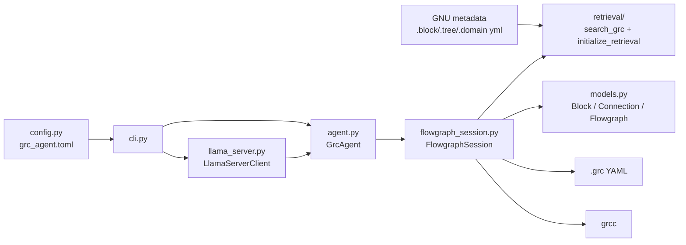
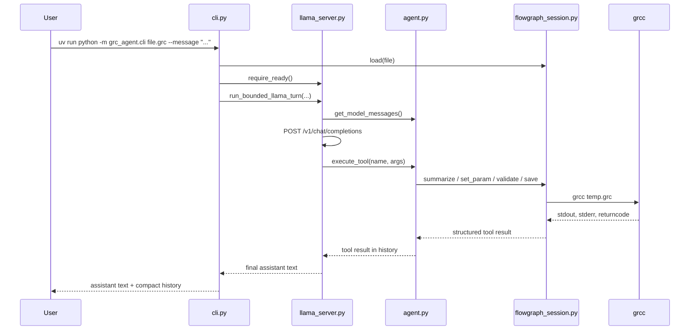

# Python Package Guide

This file is the engineer reference for the package under [src/grc_agent](../src/grc_agent).
Use it to answer three questions quickly:

1. Which file owns a behavior?
2. Which callable surfaces exist today, with what inputs and outputs?
3. How does one CLI or model-backed turn flow through the package?

Use [BLUEPRINT.md](BLUEPRINT.md) for validated GNU behavior, experiment evidence, and support boundaries.

## Architecture

The package is intentionally layered so the model never edits raw `.grc` YAML directly.



### Ownership by file

| File | Owns |
| --- | --- |
| [config.py](../src/grc_agent/config.py) | Repo-backed runtime defaults loaded from `grc_agent.toml` |
| [models.py](../src/grc_agent/models.py) | Thin in-memory dataclasses for parsed flowgraphs |
| [flowgraph_session.py](../src/grc_agent/flowgraph_session.py) | Load, summarize, save, validate, and all graph mutations |
| [retrieval/](../src/grc_agent/retrieval/) | GNU catalog discovery, graph build/load, bounded search, provenance, and readiness checks |
| [agent.py](../src/grc_agent/agent.py) | Narrow model-facing tool contract and runtime history |
| [llama_server.py](../src/grc_agent/llama_server.py) | Thin llama.cpp HTTP adapter and bounded tool loop |
| [cli.py](../src/grc_agent/cli.py) | Thin CLI entrypoint for `--fake`, one bounded llama turn, and retrieval startup readiness |
| [__init__.py](../src/grc_agent/__init__.py) | Public package re-exports |

## End-to-End Call Flow

This is the bounded llama-backed path. The fake path skips the HTTP adapter and injects scripted tool actions into `GrcAgent`.



## Public Package Surface

Import from `grc_agent` when possible:

- `GrcAgent`
- `FlowgraphSession`
- `Block`
- `Connection`
- `Flowgraph`
- `initialize_retrieval`
- `search_grc`

That public surface comes from [__init__.py](../src/grc_agent/__init__.py). Most code should not need lower-level imports unless it is working directly on the adapter or config layer.

## Retrieval Surface

Phase 1 retrieval stays package-level. It is intentionally separate from the current model-facing runtime.

### Retrieval package layout

| File | Owns |
| --- | --- |
| [retrieval/index.py](../src/grc_agent/retrieval/index.py) | Catalog root discovery, catalog/session index construction, cache management, readiness checks |
| [retrieval/search.py](../src/grc_agent/retrieval/search.py) | `search_grc(...)`, query normalization, deterministic ranking, bounded result assembly |
| [retrieval/graphify_adapter.py](../src/grc_agent/retrieval/graphify_adapter.py) | Thin wrapper around `graphify.build_from_json()` and graphify availability checks |
| [retrieval/schema.py](../src/grc_agent/retrieval/schema.py) | Shared retrieval dataclasses, result limits, success/error payload helpers |
| [retrieval/provenance.py](../src/grc_agent/retrieval/provenance.py) | Structured source pointers for catalog and session results |

### Retrieval entry points

| Callable | Input | Output | Purpose |
| --- | --- | --- | --- |
| `initialize_retrieval(catalog_root=None, warm_catalog=False)` | optional catalog root, optional warm flag | `{"ok","message","graphify_version","catalog_root","catalog_files","catalog_index_warmed",...}` | Bounded readiness check for startup paths and optional catalog warmup |
| `search_grc(query, scope="catalog|session", k=5)` | query string, scope, limit | `{"ok","scope","query","results",...}` or `{"ok": false, ...}` | Structured bounded search over system GNU metadata or the active `.grc` session |
| `build_catalog_index(catalog_root=None)` | optional catalog root | `RetrievalIndex` | Build a fresh GNU catalog index |
| `build_session_index(session, catalog_index=None)` | loaded `FlowgraphSession`, optional catalog index | `RetrievalIndex` | Build a retrieval graph for one active `.grc` session |

Notes:

- `search_grc(..., scope="session")` uses the active session context bound during startup by the CLI/runtime path.
- `initialize_retrieval(...)` now fails clearly when the selected catalog root exists but is empty or missing any of the required `.block.yml`, `.tree.yml`, or `.domain.yml` metadata sets.
- the searchable catalog/session index is block-centric by default; parameter and port text is folded into parent block search fields instead of being returned as equal top-level results.
- normalized field text and an inverted token index are precomputed during index build so search no longer rescans every record on each query.

### Retrieval result shape

`search_grc(...)` returns:

- `ok`
- `scope`
- `query`
- `results[*].node_id`
- `results[*].node_type`
- `results[*].label`
- `results[*].reason`
- `results[*].provenance`
- `results[*].score`
- `results[*].source_scope`
- optional `results[*].summary`
- optional `warnings`

Key rules:

- catalog scope indexes only the system GNU catalog roots for now
- session scope indexes the active parsed flowgraph, not raw YAML text search
- the CLI startup path now runs the cheap retrieval readiness check and binds the loaded active session context before runtime flow continues
- graphify is used only for graph assembly; ranking stays local and deterministic
- the default result limit is `5`
- the current max result cap is `25`

## Runtime Tool Contract

`GrcAgent` is the model-facing boundary. It intentionally exposes fewer capabilities than `FlowgraphSession`.

### Runtime tools

| Tool | Input args | Success payload | Side effects | Constraints |
| --- | --- | --- | --- | --- |
| `summarize_graph` | none | `{"tool","ok","message","summary","dirty"}` | none | Returns the session summary text. |
| `set_variable` | `instance_name: str`, `value: str|number|bool` | `{"tool","ok","message","instance_name","value","dirty"}` | Mutates one `variable` block's `value` parameter | Rejects missing blocks and non-`variable` targets. |
| `validate_graph` | none | `{"tool","ok","message","valid","dirty","stdout","stderr","returncode"}` | Runs real `grcc` validation on the current in-memory graph | `ok` means the tool ran; `valid` is the graph result. |
| `save_graph` | `path: str | omitted` | `{"tool","ok","message","path","dirty"}` | Persists the current raw YAML snapshot | Refuses dirty saves unless the latest dirty revision validated successfully. |

### Tool schemas sent to the model

`GrcAgent.get_tool_schemas()` publishes exactly four function schemas to chat-completions clients:

- `summarize_graph()`
- `set_variable(instance_name, value)`
- `validate_graph()`
- `save_graph(path=None)`

No generic `set_param`, `connect`, `disconnect`, `remove_block`, or structural helper is part of the model contract today.

### Runtime helper methods

These are the main call points in [agent.py](../src/grc_agent/agent.py):

| Method | Input | Output | Purpose |
| --- | --- | --- | --- |
| `get_system_prompt()` | none | `str` | States runtime rules for safe tool use |
| `get_tool_schemas()` | none | `list[dict]` | Returns the fixed function schema list |
| `get_model_messages()` | none | `list[dict]` | Renders system, user, assistant, and tool history into chat-completions messages |
| `execute_tool(tool_name, kwargs)` | `str`, `dict[str, Any]` | `dict[str, Any]` | Dispatches one runtime tool and wraps failures into structured results |
| `run_step_fake(user_msg, fake_assistant_actions)` | `str`, `list[dict]` | `None` | Drives the deterministic fake runtime path for smoke tests |

## Session Surface

`FlowgraphSession` is the real mutation and validation boundary. Direct code paths can call it, but the model should still go through `GrcAgent`.

### Session state

| Attribute | Type | Meaning |
| --- | --- | --- |
| `path` | `Path | None` | Active graph path |
| `flowgraph` | `Flowgraph | None` | Loaded parsed graph |
| `is_dirty` | `bool` | Whether in-memory state differs from disk |
| `last_validation_stdout` | `str | None` | Latest top-level validation stdout |
| `last_validation_stderr` | `str | None` | Latest top-level validation stderr |
| `last_validation_returncode` | `int | None` | Latest top-level validation exit code |

### Direct methods

| Method | Input args | Output | Mutates session | Notes |
| --- | --- | --- | --- | --- |
| `load(path)` | `str | Path` | `None` | Yes | Parses YAML, replaces session state, clears dirty flag and validation diagnostics |
| `save(path=None)` | `str | Path | None` | `None` | Yes | Writes the current raw YAML snapshot and clears `is_dirty` |
| `validate()` | none | `bool` | Yes | Runs `grcc` against a temp `.grc`, records diagnostics |
| `summarize()` | none | `str` | No | Returns a compact human-readable summary |
| `set_param(instance_name, parameter_key, value)` | `str`, `str`, `object` | `None` | Yes | Updates one block parameter in parsed and raw state |
| `connect(src_block, src_port, dst_block, dst_port)` | `str`, `int`, `str`, `int` | `None` | Yes | Adds one connection without auto-validating |
| `disconnect(src_block, src_port, dst_block, dst_port)` | `str`, `int`, `str`, `int` | `None` | Yes | Removes one exact connection without auto-validating |
| `remove_block(instance_name)` | `str` | `None` | Yes | Conservative removal: detached and unreferenced blocks only |
| `add_block(instance_name, block_type, parameters, states=None)` | `str`, `str`, `dict`, `dict | None` | `None` | Yes | Supported only for detached `variable` blocks |
| `add_and_connect_qtgui_time_sink(instance_name, parameters, src_block, src_port, states=None)` | `str`, `dict`, `str`, `int`, `dict | None` | `None` | Yes | Narrow atomic sink add-plus-connect helper |
| `add_and_connect_char_to_float_to_qtgui_time_sink(instance_name, parameters, src_block, src_port, sink_block, states=None)` | `str`, `dict`, `str`, `int`, `str`, `dict | None` | `None` | Yes | Narrow transform tap into an existing Qt GUI time sink |
| `add_and_connect_analog_random_source_to_qtgui_time_sink(source_instance_name, source_parameters, transform_instance_name, transform_parameters, sink_block, source_states=None, transform_states=None)` | `str`, `dict`, `str`, `dict`, `str`, `dict | None`, `dict | None` | `None` | Yes | Narrow source workflow into an existing Qt GUI time sink |

### Important session rules

- `save()` and `validate()` operate on the same in-memory raw YAML snapshot.
- `validate()` is the final graph-correctness gate.
- `connect()` and `disconnect()` are permissive staged edits; callers validate the final graph explicitly.
- Structural add helpers use copy -> validate with real `grcc` -> commit.
- The model should not call session methods directly; it should stay inside the four-tool runtime contract.

## Adapter Surface

[llama_server.py](../src/grc_agent/llama_server.py) is the thin backend adapter. It owns transport and bounded-turn control, not GNU semantics.

### `LlamaServerClient`

| Method | Input | Output | Purpose |
| --- | --- | --- | --- |
| `require_ready()` | none | `None` | Verifies `/health` returns `status=ok` |
| `get_model_id()` | none | `str` | Requires `/v1/models` to return exactly one model entry |
| `require_model_alias(expected_alias)` | `str` | `None` | Verifies the discovered alias matches the configured model id |
| `create_chat_completion(model, messages, tools)` | `str`, `list[dict]`, `list[dict]` | `dict[str, Any]` | Sends one POST to `/v1/chat/completions` |
| `parse_assistant_message(response)` | `dict[str, Any]` | `tuple[str | None, list[LlamaToolCall]]` | Extracts assistant text and normalized tool calls |

### `run_bounded_llama_turn(...)`

Signature:

```python
run_bounded_llama_turn(
    agent: GrcAgent,
    client: LlamaServerClient,
    user_message: str,
    *,
    model: str | None = None,
    max_steps: int = 2,
) -> dict[str, Any]
```

Behavior:

- Appends the user message to runtime history
- Sends the current system prompt, history, and fixed tool schemas to llama.cpp
- Executes returned tool calls serially through `GrcAgent`
- Treats `max_steps` as a tool-round budget
- Allows one final non-tool assistant answer after the last tool round
- Finalizes supported summarize and set-variable-plus-validate flows from tool results instead of trusting raw model prose

## CLI Surface

[cli.py](../src/grc_agent/cli.py) is intentionally thin.

### CLI arguments

| Argument | Type | Default | Meaning |
| --- | --- | --- | --- |
| `file` | positional `str` | none | Path to the `.grc` file to load |
| `--fake` | flag | `False` | Run the deterministic fake-model runtime path |
| `--message` | `str` | none | Run one bounded llama.cpp-backed turn |
| `--llama-server-url` | `str` | from config | Base URL for the llama.cpp server |
| `--model` | `str` | from config | Expected model id / server alias |
| `--api-key` | `str` | none | Optional HTTP auth token |
| `--max-steps` | `int` | from config | Tool-round budget for the bounded turn |

### CLI execution paths

| Path | Trigger | Behavior |
| --- | --- | --- |
| Fake runtime | `--fake file.grc` | Loads the graph, constructs `FlowgraphSession` and `GrcAgent`, runs scripted tool actions, prints system prompt and history |
| Llama runtime | `file.grc --message "..."` | Loads the graph, checks server health, runs one bounded llama-backed turn, prints assistant text and history |
| Default | no `--fake`, no `--message` | Prints the current placeholder message |

## Config Surface

[config.py](../src/grc_agent/config.py) loads repo-backed runtime defaults from [grc_agent.toml](../grc_agent.toml).

### TOML keys under `[llama]`

| Key | Type | Meaning |
| --- | --- | --- |
| `server_url` | `str` | llama.cpp base URL |
| `model` | `str` | Expected single model alias from `/v1/models` |
| `max_steps` | `int` | Tool-round budget |
| `max_tokens` | `int` | Completion ceiling |
| `temperature` | `float` | Request shaping default |
| `enable_thinking` | `bool` | Passed through `chat_template_kwargs.enable_thinking` |
| `request_timeout_seconds` | `float` | HTTP timeout for adapter requests |

### Config call points

| Callable | Output | Purpose |
| --- | --- | --- |
| `default_config_path()` | `Path` | Resolves the repo-level config path |
| `load_app_config(config_path=None)` | `AppConfig` | Loads and validates the runtime defaults |

## Models

[models.py](../src/grc_agent/models.py) is the thin in-memory IR.

| Dataclass | Fields |
| --- | --- |
| `Block` | `instance_name`, `block_type`, `params` |
| `Connection` | `src_block`, `src_port`, `dst_block`, `dst_port` |
| `Flowgraph` | `blocks`, `connections`, `metadata`, `raw_data` |

Keep behavior decisions out of this layer. Parsing, validation, and mutation rules stay in `FlowgraphSession`.

## Reading Rules

- Use this guide to find the owner and callable surface.
- Use [BLUEPRINT.md](BLUEPRINT.md) to decide whether a GNU-facing behavior is actually supported.
- Do not treat helper presence in Python as proof that GNU Radio accepts a broader contract.
