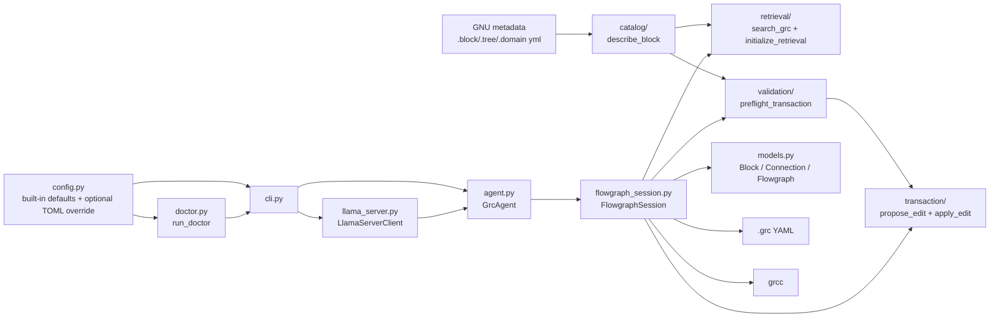
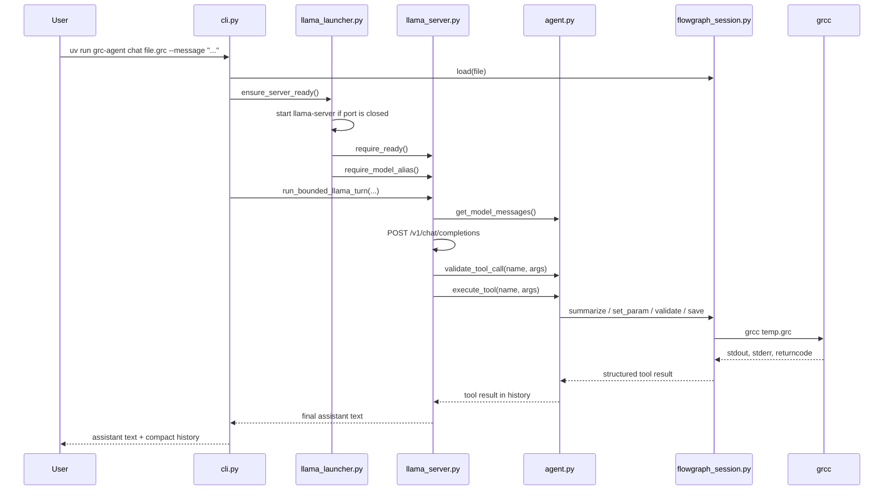

# Python Package Guide

This file is the engineer reference for the package under [src/grc_agent](../src/grc_agent).
Use it to answer three questions quickly:

1. Which file owns a behavior?
2. Which callable surfaces exist today, with what inputs and outputs?
3. How does one CLI or model-backed turn flow through the package?

Use [BLUEPRINT.md](BLUEPRINT.md) for validated GNU behavior, experiment evidence, and support boundaries.

## Architecture

The package is intentionally layered so the model never edits raw `.grc` YAML directly.



### Ownership by file

| File | Owns |
| --- | --- |
| [config.py](../src/grc_agent/config.py) | Built-in runtime defaults plus optional explicit/env/repo/user TOML overrides |
| [doctor.py](../src/grc_agent/doctor.py) | Packaged-app health checks for Python, GNU Radio, config, and retrieval readiness |
| [models.py](../src/grc_agent/models.py) | Thin in-memory dataclasses for parsed flowgraphs |
| [flowgraph_session.py](../src/grc_agent/flowgraph_session.py) | Load, summarize, inspect, save, validate, and all graph mutations |
| [catalog/](../src/grc_agent/catalog/) | Shared GNU catalog loading, metadata normalization, and `describe_block(...)` |
| [retrieval/](../src/grc_agent/retrieval/) | GNU catalog discovery, graph build/load, bounded search, provenance, and readiness checks |
| [session/](../src/grc_agent/session/) | Read-only package helpers for loading, bounded summaries, bounded context, and session provenance |
| [validation/](../src/grc_agent/validation/) | Pure staged preflight checks over session state and GNU block metadata |
| [transaction/](../src/grc_agent/transaction/) | Atomic proposal/apply flow over a copied `FlowgraphSession` with final GNU validation |
| [agent.py](../src/grc_agent/agent.py) | Narrow model-facing tool contract and runtime history |
| [runtime_tool_validation.py](../src/grc_agent/runtime_tool_validation.py) | Schema validation for model-returned tool calls before execution |
| [llama_launcher.py](../src/grc_agent/llama_launcher.py) | Local llama.cpp startup, readiness waiting, alias verification, and startup-state reuse |
| [llama_server.py](../src/grc_agent/llama_server.py) | Thin llama.cpp HTTP adapter and bounded tool loop |
| [cli.py](../src/grc_agent/cli.py) | Thin CLI entrypoint for `doctor`, `fake`, `chat`, and `tool`, including launcher handoff for the real chat path |
| [__init__.py](../src/grc_agent/__init__.py) | Public package re-exports |

## End-to-End Call Flow

This is the bounded llama-backed path. The fake path skips the HTTP adapter and injects scripted tool actions into `GrcAgent`.



## Public Package Surface

Import from `grc_agent` when possible:

- `GrcAgent`
- `FlowgraphSession`
- `Block`
- `Connection`
- `Flowgraph`
- `initialize_retrieval`
- `describe_block`
- `search_grc`
- `load_grc`
- `summarize_graph`
- `get_grc_context`
- `preflight_transaction`
- `propose_edit`
- `apply_edit`

That public surface comes from [__init__.py](../src/grc_agent/__init__.py). Most code should not need lower-level imports unless it is working directly on the adapter or config layer.

## Catalog Surface

Phase 2 catalog description also stays package-level and read-only.

### Catalog package layout

| File | Owns |
| --- | --- |
| [catalog/loaders.py](../src/grc_agent/catalog/loaders.py) | Shared GNU catalog root discovery, file collection, tree walking, and cached raw block loading |
| [catalog/normalize.py](../src/grc_agent/catalog/normalize.py) | Block-field normalization, category selection, signature building, and lightweight hierarchical-wrapper detection |
| [catalog/schema.py](../src/grc_agent/catalog/schema.py) | Structured catalog dataclasses for raw and normalized records |
| [catalog/errors.py](../src/grc_agent/catalog/errors.py) | Catalog-specific exceptions and stable error payload helpers |
| [catalog/describe.py](../src/grc_agent/catalog/describe.py) | `describe_block(...)` public entry point |

### Catalog entry point

| Callable | Input | Output | Purpose |
| --- | --- | --- | --- |
| `describe_block(block_id)` | block id string | `{"ok","block_id","label","category_path","flags","loaded_from","parameters","inputs","outputs","asserts","documentation","doc_url","warnings","signature"}` or `{"ok": false, ...}` | Return normalized GNU block truth for one installed catalog block |

Notes:

- `describe_block(...)` uses the same system GNU catalog roots as retrieval
- tree-derived category paths are normalized into plain parts such as `["Core", "Audio"]`
- malformed GNU metadata is wrapped into the catalog error payload instead of surfacing raw parser exceptions
- hierarchical wrappers are marked through `warnings` rather than a separate public boolean field
- the payload preserves literal GNU expressions such as `${ type }` and `${ num_inputs }`

## Retrieval Surface

Phase 1 retrieval stays package-level. It is intentionally separate from the current model-facing runtime.

### Retrieval package layout

| File | Owns |
| --- | --- |
| [retrieval/index.py](../src/grc_agent/retrieval/index.py) | Catalog/session index construction, cache management, and retrieval readiness checks |
| [retrieval/search.py](../src/grc_agent/retrieval/search.py) | `search_grc(...)`, query normalization, deterministic ranking, bounded result assembly |
| [retrieval/graphify_adapter.py](../src/grc_agent/retrieval/graphify_adapter.py) | Thin wrapper around `graphify.build_from_json()` and graphify availability checks |
| [retrieval/schema.py](../src/grc_agent/retrieval/schema.py) | Shared retrieval dataclasses, result limits, success/error payload helpers |
| [retrieval/provenance.py](../src/grc_agent/retrieval/provenance.py) | Structured source pointers for catalog and session results |
| [retrieval/text.py](../src/grc_agent/retrieval/text.py) | Search text normalization, tokenization, and compound-term expansion |

### Retrieval entry points

| Callable | Input | Output | Purpose |
| --- | --- | --- | --- |
| `initialize_retrieval(catalog_root=None, warm_catalog=False)` | optional catalog root, optional warm flag | `{"ok","message","graphify_version","catalog_root","catalog_files","catalog_index_warmed",...}` | Bounded readiness check for startup paths and optional catalog warmup |
| `search_grc(query, scope="catalog|session", k=5)` | query string, scope, limit | `{"ok","scope","query","results",...}` or `{"ok": false, ...}` | Structured bounded search over system GNU metadata or the active `.grc` session |
| `build_catalog_index(catalog_root=None)` | optional catalog root | `RetrievalIndex` | Build a fresh GNU catalog index |
| `build_session_index(session, catalog_index=None)` | loaded `FlowgraphSession`, optional catalog index | `RetrievalIndex` | Build a retrieval graph for one active `.grc` session |

Notes:

- `search_grc(..., scope="session")` uses the active session context bound during startup by the CLI/runtime path.
- `initialize_retrieval(...)` now fails clearly when the selected catalog root exists but is empty or missing any of the required `.block.yml`, `.tree.yml`, or `.domain.yml` metadata sets.
- the searchable catalog/session index is block-centric by default; parameter and port text is folded into parent block search fields instead of being returned as equal top-level results.
- normalized field text and an inverted token index are precomputed during index build so search no longer rescans every record on each query.
- session-scope retrieval indexes are now reused until the active `FlowgraphSession.state_revision` changes.
- catalog index construction now reuses the shared catalog snapshot for `.block.yml` metadata instead of re-reading every block file inside retrieval.

### Retrieval result shape

`search_grc(...)` returns:

- `ok`
- `scope`
- `query`
- `results[*].node_id`
- `results[*].block_id` for block-backed results
- `results[*].node_type`
- `results[*].label`
- `results[*].reason`
- `results[*].provenance`
- `results[*].score`
- `results[*].source_scope`
- optional `results[*].summary`
- optional `warnings`

Key rules:

- catalog scope indexes only the system GNU catalog roots for now
- session scope indexes the active parsed flowgraph, not raw YAML text search
- block-backed results now expose the canonical GNU `block_id` so callers can pass it directly to `describe_block(...)`
- the CLI startup path now runs the cheap retrieval readiness check and binds the loaded active session context before runtime flow continues
- graphify is used only for graph assembly; ranking stays local and deterministic
- the default result limit is `5`
- the current max result cap is `25`

## Session Inspection Surface

Phase 3 stays package-level and read-only. It is implemented as thin helpers over `FlowgraphSession` rather than as a second session owner.

### Session inspection package layout

| File | Owns |
| --- | --- |
| [session/load.py](../src/grc_agent/session/load.py) | `load_grc(...)` convenience loader |
| [session/summary.py](../src/grc_agent/session/summary.py) | `summarize_graph(session, ...)` structured bounded summary |
| [session/context.py](../src/grc_agent/session/context.py) | `get_grc_context(session, ...)` bounded neighborhood mini-graph |
| [session/provenance.py](../src/grc_agent/session/provenance.py) | Session provenance payload helper |
| [session/inspect.py](../src/grc_agent/session/inspect.py) | Shared read-only error payload helpers |

### Session inspection entry points

| Callable | Input | Output | Purpose |
| --- | --- | --- | --- |
| `load_grc(file_path)` | `.grc` path string/path | loaded `FlowgraphSession` | Create and load one session for package-level read flows |
| `summarize_graph(session, max_blocks=8)` | loaded session, optional preview limit | `{"ok","summary","path","graph_id","block_count","connection_count","variable_count","dirty","validation"}` or `{"ok": false, ...}` | Return a compact structured summary for one loaded graph |
| `get_grc_context(session, node_id, hops=1, max_nodes=20)` | loaded session, block instance name, optional bounds | `{"ok","node_id","hops","max_nodes","target","nodes","edges","provenance","dirty","validation","truncated"}` or `{"ok": false, ...}` | Return a bounded neighborhood around one session block |

Notes:

- `node_id` is the live block `instance_name`, not a retrieval node id.
- session provenance includes `path`, `graph_id`, `file_format`, and `grc_version`.
- unknown nodes fail as `{"ok": false, "error_type": "node_not_found", ...}`.
- summaries are now bounded previews rather than whole-graph dumps.

## Validation Surface

Phase 4 stays package-level and pure in-memory. It validates the narrow transaction surface Phase 5 will consume without mutating the live `FlowgraphSession`.

### Validation package layout

| File | Owns |
| --- | --- |
| [validation/preflight.py](../src/grc_agent/validation/preflight.py) | `preflight_transaction(...)` public entry point |
| [validation/checks.py](../src/grc_agent/validation/checks.py) | Staged snapshot simulation and explicit per-op checks |
| [validation/rules.py](../src/grc_agent/validation/rules.py) | Operation normalization, cached GNU block rules, and safe metadata-expression resolution |
| [validation/errors.py](../src/grc_agent/validation/errors.py) | Stable issue dataclass and public payload builder |
| [validation/messages.py](../src/grc_agent/validation/messages.py) | Stable user-facing issue text helpers |

### Validation entry point

| Callable | Input | Output | Purpose |
| --- | --- | --- | --- |
| `preflight_transaction(session, operations, catalog_root=None)` | loaded session, one operation mapping or ordered list | `{"ok","errors","warnings","error_count","warning_count","normalized_operations","operation_count"}` | Validate ordered staged edits before any Phase 5 apply/commit flow |

Notes:

- supported `op_type` values are `update_params`, `add_connection`, `remove_connection`, `remove_block`, and detached-`variable` `add_block`
- the validator clones the live raw YAML snapshot, reparses staged state after each passing op, and never mutates the live session
- connection checks reuse GNU catalog metadata for enum options, port domains, port multiplicity, occupied-input detection, and basic stream dtype compatibility
- ordered transactions can repair a later precondition on the staged snapshot, such as patching references before `remove_block("samp_rate")`
- `grcc` remains a downstream authority for final graph validity; the preflight layer only blocks what it can prove in memory
- existing session-backed raw parameter keys such as `comment` remain valid update targets even when the catalog payload omits them; enum validation still follows the catalog rules when present

## Transaction Surface

Phase 5 stays package-level. It consumes Phase 4 preflight validation, applies the normalized ops on a copied `FlowgraphSession`, runs final GNU validation on the candidate, and only then swaps the live session state.

### Transaction package layout

| File | Owns |
| --- | --- |
| [transaction/planner.py](../src/grc_agent/transaction/planner.py) | `propose_edit(...)` proposal wrapper over preflight validation |
| [transaction/apply.py](../src/grc_agent/transaction/apply.py) | `apply_edit(...)` atomic candidate-apply and final-validation flow |
| [transaction/edit.py](../src/grc_agent/transaction/edit.py) | Ordered normalized-op application plus affected-entity summaries |
| [transaction/commit.py](../src/grc_agent/transaction/commit.py) | Success/failure payload builders for apply flows |
| [transaction/rollback.py](../src/grc_agent/transaction/rollback.py) | Full-session snapshot capture/clone/restore helpers |

### Transaction entry points

| Callable | Input | Output | Purpose |
| --- | --- | --- | --- |
| `propose_edit(session, transaction, catalog_root=None)` | loaded session, one operation mapping or ordered list | `{"ok","message","planned_operations","normalized_operations","errors","warnings","commit_eligible","state_revision",...}` | Run Phase 4 preflight and shape a package-level edit proposal |
| `apply_edit(session, transaction, catalog_root=None)` | loaded session, one operation mapping or ordered list | `{"ok","message","applied","dirty","commit_eligible","validation","affected_blocks","affected_connections","state_revision_before","state_revision_after",...}` | Apply a narrow ordered transaction atomically after preflight and final GNU validation |

Notes:

- `apply_edit(...)` never mutates the live session until the candidate session has passed both preflight and final `grcc` validation
- preflight failures surface as `error_type="PreflightRejected"` and leave the live session unchanged
- final GNU failures surface as `error_type="GNUValidationFailed"` and also leave the live session unchanged
- the transaction surface is intentionally narrower than the current `FlowgraphSession` experimentation surface
- this package is now routed through the model-facing runtime, but the runtime still keeps the public edit contract narrow to the explicit transaction tools

## Runtime Tool Contract

`GrcAgent` is the model-facing boundary. It intentionally exposes fewer capabilities than `FlowgraphSession`.

### Runtime tools

| Tool | Input args | Success payload | Side effects | Constraints |
| --- | --- | --- | --- | --- |
| `load_grc` | `file_path: str` | bounded summary payload plus `provenance` and `active_session` | Replaces the active session | Loads one `.grc` through the package helper and rebinds the runtime session context. |
| `summarize_graph` | `max_blocks: int | omitted` | routed summary payload | none | Returns the active session summary text. |
| `search_grc` | `query: str`, `scope: str | omitted`, `k: int | omitted` | routed retrieval payload | none | Session scope depends on the active loaded session; catalog scope stays bounded. |
| `get_grc_context` | `node_id: str`, `hops: int | omitted`, `max_nodes: int | omitted` | routed bounded context payload | none | Returns a bounded neighborhood around one loaded block. |
| `describe_block` | `block_id: str` | routed catalog payload | none | Uses installed GNU metadata only. |
| `propose_edit` | `transaction: object | array` | routed proposal payload | none | Preflight only; never mutates the live session. |
| `apply_edit` | `transaction: object | array` | routed apply payload | Mutates only after final GNU validation | Supported edits stay limited to the narrow Phase 5 transaction contract. |
| `validate_graph` | none | `{"tool","ok","message","valid","dirty","stdout","stderr","returncode"}` | Runs real `grcc` validation on the current in-memory graph | `ok` means the tool ran; `valid` is the graph result. |
| `save_graph` | `path: str | omitted` | `{"tool","ok","message","path","dirty"}` | Persists the current raw YAML snapshot | Refuses dirty saves unless the latest dirty revision validated successfully. |

Every routed tool result also includes `active_session`, a compact snapshot of the currently bound file path, graph id, revision, dirty flag, and validation state.

### Tool schemas sent to the model

`GrcAgent.get_tool_schemas()` publishes exactly nine function schemas to chat-completions clients:

- `load_grc(file_path)`
- `summarize_graph()`
- `search_grc(query, scope="catalog|session", k=5)`
- `get_grc_context(node_id, hops=1, max_nodes=20)`
- `describe_block(block_id)`
- `propose_edit(transaction)`
- `apply_edit(transaction)`
- `validate_graph()`
- `save_graph(path=None)`

No direct `set_param`, `connect`, `disconnect`, `remove_block`, or structural helper is part of the model contract; supported structural edits now flow through `apply_edit(...)`.
Model-returned tool calls are validated against those declared schemas before execution. Unknown tool names, missing required args, wrong JSON-object shapes, type mismatches, enum mismatches, and unsupported extra fields are rejected with structured runtime errors instead of reaching the package owners.

### Runtime helper methods

These are the main call points in [agent.py](../src/grc_agent/agent.py):

| Method | Input | Output | Purpose |
| --- | --- | --- | --- |
| `get_system_prompt()` | none | `str` | States runtime rules for safe tool use |
| `get_tool_schemas()` | none | `list[dict]` | Returns the fixed function schema list |
| `get_model_messages()` | none | `list[dict]` | Renders system prompt, active-session messages, user turns, assistant turns, and tool history into chat-completions messages |
| `active_session_snapshot()` | none | `dict[str, Any] \| None` | Exposes the compact bound-session state used in CLI output and tool payloads |
| `validate_tool_call(tool_name, kwargs)` | `str`, `Any` | `dict[str, Any] \| None` | Rejects invalid model tool calls before execution with structured runtime errors |
| `execute_tool(tool_name, kwargs)` | `str`, `dict[str, Any]` | `dict[str, Any]` | Dispatches one runtime tool and wraps failures into structured results |
| `run_step_fake(user_msg, fake_assistant_actions)` | `str`, `list[dict]` | `None` | Drives the deterministic fake runtime path for smoke tests |

## Session Surface

`FlowgraphSession` is the real mutation and validation boundary. Direct code paths can call it, but the model should still go through `GrcAgent`.

### Session state

| Attribute | Type | Meaning |
| --- | --- | --- |
| `path` | `Path | None` | Active graph path |
| `flowgraph` | `Flowgraph | None` | Loaded parsed graph |
| `is_dirty` | `bool` | Whether in-memory state differs from disk |
| `last_validation_stdout` | `str | None` | Latest top-level validation stdout |
| `last_validation_stderr` | `str | None` | Latest top-level validation stderr |
| `last_validation_returncode` | `int | None` | Latest top-level validation exit code |
| `last_validation_ok` | `bool | None` | Latest top-level validation result or `None` before validation |
| `state_revision` | `int` | Monotonic revision used for inspection and retrieval cache invalidation |

### Direct methods

| Method | Input args | Output | Mutates session | Notes |
| --- | --- | --- | --- | --- |
| `load(path)` | `str | Path` | `None` | Yes | Parses YAML, replaces session state, clears dirty flag and validation diagnostics |
| `save(path=None)` | `str | Path | None` | `None` | Yes | Writes the current raw YAML snapshot and clears `is_dirty` |
| `validate()` | none | `bool` | Yes | Runs `grcc` against a temp `.grc`, records diagnostics |
| `summarize()` | none | `str` | No | Returns a compact human-readable summary |
| `graph_id()` | none | `str` | No | Returns a stable content-derived id for the active graph |
| `validation_state()` | none | `dict[str, Any]` | No | Returns the compact `unknown|valid|invalid` validation payload |
| `session_provenance()` | none | `dict[str, Any]` | No | Returns `path`, `graph_id`, `file_format`, and `grc_version` |
| `summary_payload(max_blocks=8)` | optional preview limit | `dict[str, Any]` | No | Returns the structured bounded summary payload used by Phase 3 |
| `context_payload(node_id, hops=1, max_nodes=20)` | block name, optional bounds | `dict[str, Any]` | No | Returns the bounded neighborhood payload used by Phase 3 |
| `set_param(instance_name, parameter_key, value)` | `str`, `str`, `object` | `None` | Yes | Updates one block parameter in parsed and raw state |
| `connect(src_block, src_port, dst_block, dst_port)` | `str`, `int`, `str`, `int` | `None` | Yes | Adds one connection without auto-validating |
| `disconnect(src_block, src_port, dst_block, dst_port)` | `str`, `int`, `str`, `int` | `None` | Yes | Removes one exact connection without auto-validating |
| `remove_block(instance_name)` | `str` | `None` | Yes | Conservative removal: detached and unreferenced blocks only |
| `add_block(instance_name, block_type, parameters, states=None)` | `str`, `str`, `dict`, `dict | None` | `None` | Yes | Supported only for detached `variable` blocks |
| `add_and_connect_qtgui_time_sink(instance_name, parameters, src_block, src_port, states=None)` | `str`, `dict`, `str`, `int`, `dict | None` | `None` | Yes | Narrow atomic sink add-plus-connect helper |
| `add_and_connect_char_to_float_to_qtgui_time_sink(instance_name, parameters, src_block, src_port, sink_block, states=None)` | `str`, `dict`, `str`, `int`, `str`, `dict | None` | `None` | Yes | Narrow transform tap into an existing Qt GUI time sink |
| `add_and_connect_analog_random_source_to_qtgui_time_sink(source_instance_name, source_parameters, transform_instance_name, transform_parameters, sink_block, source_states=None, transform_states=None)` | `str`, `dict`, `str`, `dict`, `str`, `dict | None`, `dict | None` | `None` | Yes | Narrow source workflow into an existing Qt GUI time sink |

### Important session rules

- `save()` and `validate()` operate on the same in-memory raw YAML snapshot.
- `validate()` is the final graph-correctness gate.
- `summary_payload(...)` and `context_payload(...)` are read-only and bounded.
- `connect()` and `disconnect()` are permissive staged edits; callers validate the final graph explicitly.
- Structural add helpers use copy -> validate with real `grcc` -> commit.
- The model should not call session methods directly; it should stay inside the routed runtime contract.

## Adapter Surface

[llama_server.py](../src/grc_agent/llama_server.py) is the thin backend adapter. It owns transport and bounded-turn control, not GNU semantics.

### `LlamaServerClient`

| Method | Input | Output | Purpose |
| --- | --- | --- | --- |
| `require_ready()` | none | `None` | Verifies `/health` returns `status=ok` |
| `get_model_id()` | none | `str` | Requires `/v1/models` to return exactly one model entry |
| `require_model_alias(expected_alias)` | `str` | `None` | Verifies the discovered alias matches the configured model id |
| `create_chat_completion(model, messages, tools)` | `str`, `list[dict]`, `list[dict]` | `dict[str, Any]` | Sends one POST to `/v1/chat/completions` |
| `parse_assistant_message(response)` | `dict[str, Any]` | `tuple[str | None, list[LlamaToolCall]]` | Extracts assistant text and normalized tool calls |

### `run_bounded_llama_turn(...)`

Signature:

```python
run_bounded_llama_turn(
    agent: GrcAgent,
    client: LlamaServerClient,
    user_message: str,
    *,
    model: str | None = None,
) -> dict[str, Any]
```

Behavior:

- Appends the user message to runtime history
- Sends the current system prompt, history, and fixed tool schemas to llama.cpp
- Validates every returned tool call against the declared runtime schemas before execution
- Executes only validated tool calls serially through `GrcAgent`
- Validation errors feed back to the model for retry instead of terminating
- Safety ceiling of 50 tool rounds prevents runaway loops
- Allows one final non-tool assistant answer after the last tool round
- Finalizes summarize from the summary payload and otherwise falls back to the latest structured tool `message` only when the model final turn is empty or tool-call-shaped

## CLI Surface

[cli.py](../src/grc_agent/cli.py) is intentionally thin.

### CLI modes

| Mode | Trigger | Behavior |
| --- | --- | --- |
| Doctor | `doctor [--json] [--skip-retrieval]` | Runs packaged-app environment, config, and optional retrieval readiness checks and prints either compact text or JSON |
| Fake runtime | `fake file.grc` | Loads the graph, runs retrieval readiness, constructs `FlowgraphSession` and `GrcAgent`, runs scripted routed tool actions, and prints system prompt plus history. This is a deterministic harness, not evidence for the real model-backed path. |
| Llama runtime | `chat file.grc --message "..."` | Loads the graph, prints the active session, runs retrieval readiness, ensures the configured local llama.cpp backend is running, waits for `/health`, verifies the configured alias, runs one bounded llama-backed turn, and prints assistant text plus history. Invalid model tool calls surface as a dedicated `Tool Validation` failure section. |
| Direct tool execution | `tool TOOL_NAME [--file file.grc] [--args '{"key":"value"}']` | Optionally loads a graph, routes one runtime tool directly, and prints the structured JSON result |

### CLI execution paths

| Path | Trigger | Behavior |
| --- | --- | --- |
| Doctor | `doctor ...` | Exercises the packaged-app readiness checks without loading a flowgraph |
| Fake runtime | `fake file.grc` | Uses the deterministic scripted phase-6 tool flow for smoke tests |
| Llama runtime | `chat file.grc --message "..."` | Uses the launcher plus bounded llama adapter with the full phase-6 tool list, validated tool calls, and active-session reporting |
| Direct tool execution | `tool ...` | Exercises the routed runtime surface without a model backend |

Compatibility note:

- The CLI still translates the old `--fake file.grc` and `file.grc --message "..."` call shapes into the explicit `fake` and `chat` modes, but the documented phase-6 surface is the subcommand form.

## Config Surface

[config.py](../src/grc_agent/config.py) loads built-in runtime defaults and optional TOML overrides.

### TOML keys under `[llama]`

| Key | Type | Meaning |
| --- | --- | --- |
| `server_url` | `str` | llama.cpp base URL |
| `model` | `str` | Expected single model alias from `/v1/models` |
| `hf_model` | `str` | Hugging Face model source passed to `llama-server -hf ...` when the CLI auto-starts the backend |
| `startup_timeout_seconds` | `float` | Launcher readiness deadline for `/health` plus alias verification |
| `max_tokens` | `int` | Completion ceiling |
| `temperature` | `float` | Request shaping default |
| `enable_thinking` | `bool` | Passed through `chat_template_kwargs.enable_thinking` |
| `request_timeout_seconds` | `float` | HTTP timeout for adapter requests |

### Config call points

| Callable | Output | Purpose |
| --- | --- | --- |
| `default_app_config()` | `AppConfig` | Returns the built-in packaged-app defaults |
| `default_config_path()` | `Path` | Resolves the source-workspace config path |
| `user_config_path()` | `Path` | Resolves the installed-app user config path |
| `resolve_config_path(config_path=None)` | `Path | None` | Chooses the explicit/env/repo/user override file when one exists |
| `load_app_config(config_path=None)` | `AppConfig` | Loads and validates the resolved config file or falls back to built-in defaults |

Config resolution order:

1. explicit `--config` / `config_path`
2. `GRC_AGENT_CONFIG`
3. repo `grc_agent.toml` when running from the source workspace
4. `~/.config/grc_agent/config.toml`
5. built-in defaults

## Models

[models.py](../src/grc_agent/models.py) is the thin in-memory IR.

| Dataclass | Fields |
| --- | --- |
| `Block` | `instance_name`, `block_type`, `params` |
| `Connection` | `src_block`, `src_port`, `dst_block`, `dst_port` |
| `Flowgraph` | `blocks`, `connections`, `metadata`, `raw_data` |

Keep behavior decisions out of this layer. Parsing, validation, and mutation rules stay in `FlowgraphSession`.

## Reading Rules

- Use this guide to find the owner and callable surface.
- Use [BLUEPRINT.md](BLUEPRINT.md) to decide whether a GNU-facing behavior is actually supported.
- Do not treat helper presence in Python as proof that GNU Radio accepts a broader contract.
