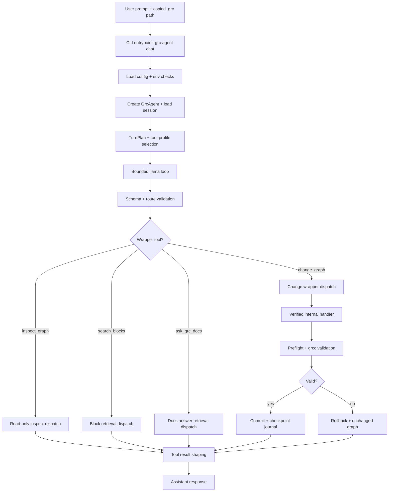

# Package Guide

Updated: 2026-05-05

## Scope

This guide explains the packaged runtime flow for production-candidate manual testing on copied
`.grc` graphs.

- Default model-facing tool surface is MVP wrappers only:
  - `inspect_graph`
  - `search_blocks`
  - `ask_grc_docs`
  - `change_graph`
- Advisor is shadow-only by default and does not control runtime routing.
- Current MVP Advisor shadow vocabulary is:
  `inspect`, `preview`, `change`, `clarify`, `unsupported`.
  (Old enums like `read_only`, `rewire`, etc. are historical archived experiments only).
- Legacy low-level tools remain internal/compatibility-only.

## Harness Flow



## Step-by-Step

1. `grc-agent chat <copied_graph.grc>` starts the harness.
2. Config is loaded (`grc_agent.toml` + defaults). Safe defaults include:
   `legacy_model_tool_surface=false`, `advisor_enabled=false`, temperature `0`,
   and `desired_context_tokens=120000` (when backend supports it).
3. Session is loaded and summarized into bounded context.
4. Turn planning narrows tool visibility.
5. Llama loop runs with bounded rounds and schema-constrained tool calls.
6. Runtime validates tool name, arguments, and route intent.
7. Wrapper dispatch routes to deterministic internals.
8. Mutation candidates run on cloned state with preflight + `grcc`.
9. Successful committed mutation records checkpoint/journal metadata.
10. Preview/failure paths do not create accepted mutation checkpoints.
11. Results are returned as compact tool outputs.
12. User gets final response; save remains explicit and controlled.

Context budget note:
- `max_tokens` caps generation and can truncate if too low; it is not used as
  a compression mechanism.
- Compression/compactness is enforced by wrapper output bounds, retrieval
  selection, snippet caps, and concise response schemas.

## Wrapper Surface And Internal Dispatch

## `inspect_graph`

Read-only multiplexer for:
- graph summary
- graph validation
- block/connection/variable listing
- local graph context

Internal routes include summary/context/validate/session snapshot helpers.
No mutation path is allowed.

## `search_blocks`

Block discovery wrapper.

Default output fields:
- `block_id`
- `name`
- `summary`

Internal behavior:
- exact ID/name/alias fast path
- conceptual lexical+semantic hybrid path
- bounded in-memory cache for repeated conceptual queries
- lexical fallback when vector index is missing

No mutation payloads are returned by default.

## `ask_grc_docs`

`ask_grc_docs` retrieves local docs and returns a grounded answer with sources. 
Docs answers are explanation-only and not mutation authority. 
Beta default uses deterministic grounded extraction and safe fallback.
DocsAnswerAdvisor helper synthesis is optional research-only best effort.

Default output fields:
- `answer`
- `sources` (title/source/excerpt)
- `insufficient_evidence`
- `fallback_used`

Internal behavior:
- lexical `search_manual` retrieval first
- optional semantic manual/tutorial retrieval when lexical evidence is weak
- deterministic typed answer builder over selected evidence
- optional bounded DocsAnswerAdvisor synthesis in research mode
- safe fallback to grounded excerpts when helper fails/times out

No mutation authorization, args, or recipes.

## `change_graph`

Single model-facing mutation wrapper.

Inputs include:
- `dry_run` (`true` preview / `false` commit path)
- `user_goal`
- optional exact target hints (`target_ref`, `connection_id`, endpoints, etc.)

Internal routes can use verified low-level handlers (`apply_edit`,
`propose_edit`, `remove_connection`, `rewire_connection`,
`insert_block_on_connection`, `auto_insert_block`) while preserving:
- schema/route validation
- preflight checks
- `grcc` validation
- rollback on failure
- checkpointing on committed success only

Unsupported requests (raw YAML/source edits, undo/redo, export/codegen) are
refused.

## Tool Profiles

- Default chat profile: MVP wrappers only (`inspect_graph`, `search_blocks`,
  `ask_grc_docs`, `change_graph`).
- Compatibility profile: legacy tool exposure is explicit and non-default.

## Safety Boundaries

- Never edit raw `.grc` YAML directly.
- Preview must never mutate.
- Save requires explicit request and valid state.
- Failed mutation must roll back.
- `grcc` is final validation authority.
- Vector/manual retrieval is read-only and never mutation authority.
- Restore is CLI-only and writes to explicit copy path.

## Production-Candidate Smoke (Local)

```bash
uv run grc-agent doctor
uv run grc-agent health
uv run grc-agent fake tests/data/random_bit_generator.grc
uv run python -m tests.retrieval_eval.vector_regression
uv run python -m unittest tests.test_mvp_tool_profile tests.test_mvp_wrapper_dispatch tests.test_history_journal
```

Run retrieval/vector eval gates sequentially while using a shared local index
path.

## Issue Intake

Use:

```bash
uv run grc-agent dogfood record "prompt" --source real_user --task-type other --failure-category other --json
```

Capture prompt, expected vs actual behavior, copied graph reference
(sanitized), validation/checkpoint results, and reproducibility notes.
