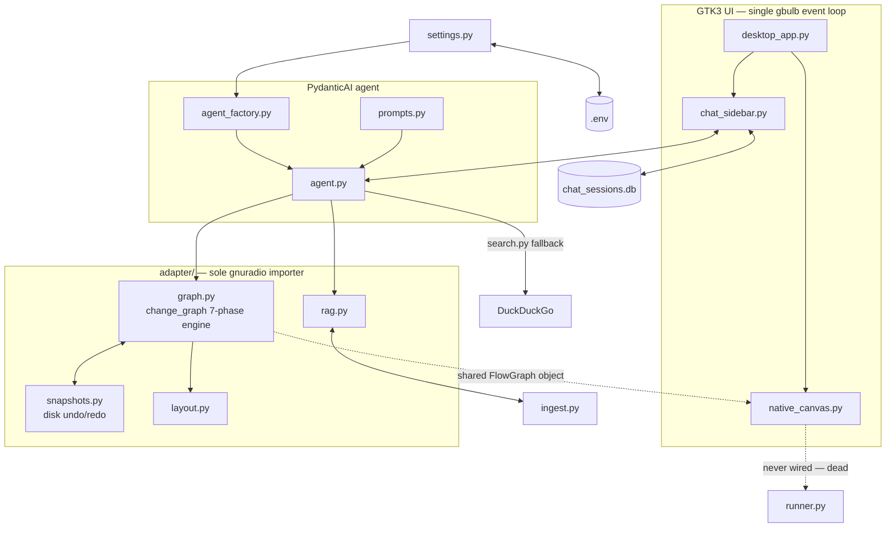

# GRC Agent Codebase Audit

**Code quality & architecture audit — four parallel streams, evidence-based, read-only.**

A review of the desktop app that embeds GNU Radio Companion behind a PydanticAI chat agent — covering the UI/event loop, the native canvas/runner integration, chat persistence, and the flowgraph mutation & RAG stack. Every finding below cites a `file:line` and was independently spot-checked against the working tree (in several cases against the installed `gnuradio` package source itself) before inclusion.

| Modules reviewed | Lines of source | Audit streams | Tagged findings | Critical (P0) |
|---|---|---|---|---|
| 16 | ~5,800 | 4 | 25 | 8 |

---

## Architecture overview

A single asyncio+GTK event loop (unified by `gbulb`) hosts GRC's native window, a chat sidebar, and a PydanticAI agent that shares one live `FlowGraph` object with the canvas — the agent mutates it in place; the canvas just redraws. Chat history now persists to SQLite (`db.py`, new this cycle) instead of the old JSON file. `ingest.py` is the only module permitted to read outside the package (the GNU Radio docs corpus, for RAG).

---

## Priority findings

The eight highest-impact issues across all four streams, ranked by blast radius. Full detail, remaining findings, refactor notes, and test gaps are in the per-module sections below.

### `UI-1` — Every error path in a chat turn wipes the user's message off screen — **CRITICAL**

In `_run_agent_turn`, every exception branch (cancellation, HTTP error, usage limit, API error, unexpected behavior, bare exception) calls `_save_history()` then `_render_history()` **before** appending the error bubble. `_render_history()` rebuilds the entire message list strictly from `self._message_history`, which is only reassigned on the success path. The user's just-sent message (appended straight to the widget tree, not derived from history) and any partially streamed reply are discarded on rebuild.

> **Concrete scenario:** user sends a message, the model streams a tool call, the connection drops mid-stream. The chat view snaps back to its pre-turn state plus a single trailing error bubble; the user's own question appears to have vanished.

Evidence: `chat_sidebar.py:1301-1369` · Confidence: verified directly.

### `UI-2` — "Clear History" claims irreversible deletion but deletes nothing — **CRITICAL**

The confirmation dialog reads: *"Are you sure you want to clear the chat history for this flowgraph? This cannot be undone."* The Yes handler calls `clear_messages()`, which only resets the in-memory list and detaches the session ID — it never calls `delete_session()` or overwrites the stored row. The full conversation remains intact in `chat_sessions.db` under the now-orphaned session id.

> **Concrete scenario:** a user clears history believing sensitive prompts/tool args are gone; they persist in the SQLite file indefinitely, reachable again only by accident (e.g. via Recent Sessions from a different tab).

Evidence: `chat_sidebar.py:544-604` · Confidence: verified directly.

### `UI-3` — A flowgraph's own chat session is unreachable while that tab is open — **CRITICAL**

`sync_to_file()` ignores its own `path` argument and unconditionally blanks the active session on every tab switch. Meanwhile the welcome screen's "Recent Sessions" list explicitly filters out any session matching the *currently open* file's path. No code path anywhere looks up "the session for this path" — so the one file you have open is the one prior conversation you cannot get back to from its own sidebar.

> **Concrete scenario:** open `filter.grc`, chat about it, close and reopen the app, open `filter.grc` again — its own history is neither restored nor listed. It only reappears if you open a *different* file first and find it there.

Evidence: `chat_sidebar.py:592-597, 674-677` · Confidence: verified directly.

### `CANVAS-1` — Blocking file lock with no timeout runs on the single UI thread — **CRITICAL**

`sync_manual_edit()` calls `fcntl.flock(fd, LOCK_EX)` with no `LOCK_NB`, no retry, and no offload. It runs on every canvas button-release and every 1.5s safety-net tick — both on the single thread gbulb unifies GTK and asyncio onto. Any contention (e.g. the same `.grc` file open in two app instances) blocks that thread — canvas redraws, chat streaming, and all agent tool calls — for the full contention window.

> **Concrete scenario:** the same flowgraph open in two windows; both drag a block near-simultaneously; the second window's entire UI freezes until the first's write completes.

Evidence: `native_canvas.py:188-189` · Confidence: verified directly.

### `ADPT-1` — Native undo/redo was never actually disabled — two histories now diverge live — **CRITICAL**

`disable_native_undo_redo()` exists specifically because GRC's built-in Ctrl+Z/Y "never touches disk, so it silently diverges from the shared undo/redo stack" — per its own docstring. It is exported from `adapter/__init__.py` but has **zero call sites** anywhere in `native_canvas.py` or `desktop_app.py`, confirmed by a repo-wide grep and by its absence across the native-canvas rewrite's entire git history. GRC's native undo is live today, doing exactly the divergence its own comment warns against.

> **Concrete scenario:** a user hits native Ctrl+Z; GRC's in-memory state cache reverts, but nothing is written to disk and the custom `snapshots.py` cursor never moves — the on-disk file, the undo stack, and the visible canvas can now disagree about "current" state.

Evidence: `adapter/graph.py:70-84` · Confidence: verified via grep + git history, zero call sites.

**Documentation drift found alongside this:** `docs/technical_overview.md`'s "Self-Correction & Native Validation" section states change_graph "guarantee[s] that the flowgraph is not left in a partially mutated or corrupted state." `ADPT-2` below shows this guarantee has a real gap.

### `ADPT-2` — change_graph's rollback doesn't cover its own validation gate — **CRITICAL**

Every other failure branch of the 7-phase mutation engine reverts via `flow_graph.import_data(initial_data)` before returning. But the final native-validation gate — `flow_graph.validate()`, `is_valid()`, `iter_error_messages()` — sits *after* the enclosing `try/except` closes (confirmed by reading lines 1063-1097 directly: the `except Exception as exc:` block ends at line 1066, and the validation gate at 1077-1097 is unguarded). If any of those three native calls raise, the exception propagates straight out of `change_graph()` with the shared, canvas-rendered `FlowGraph` left mutated and unreverted, and no `ok:false` ever returned.

> **Concrete scenario:** a native GRC validation call raises instead of populating an error list (plausible on unusual block/param states) — the batch silently corrupts the live in-memory graph with no error surfaced to the caller.

Evidence: `adapter/graph.py:1063-1097` · Confidence: code structure verified directly; trigger not reproduced.

### `ADPT-3` — "auto" dtype silently resets to a GNU Radio default for standalone new blocks — **CRITICAL**

Phase 5's auto-resolve loop `continue`s with no recorded error when a newly-added block's type-controlling param is `"auto"` but that block has zero connections in the current batch. Traced into the installed `gnuradio` package: `Param.get_value()` treats an unresolved `"auto"` as an invalid enum value and silently resets it to the param's schema default on the next `rewrite()` — with no error ever recorded. `change_graph` can return `{"ok": true}` having silently discarded the model's intended type.

> **Concrete scenario:** the agent adds a Multiply block with `type="auto"` in a batch where its connections are added in a follow-up call — the block silently keeps GNU Radio's arbitrary default type, and both the tool response and the graph look "fine."

Evidence: `adapter/graph.py:984-996` · `gnuradio/grc/core/params/param.py:121-125` · Confidence: verified against installed gnuradio source.

### `DB-1` — Blocking SQLite calls run directly on the single event-loop thread — **CRITICAL**

`db.py`'s functions are plain synchronous `sqlite3` calls, invoked with no `asyncio.to_thread` offload from inside the async `_run_agent_turn` coroutine (7 call sites) and from plain GTK signal handlers. This is inconsistent with the codebase's own precedent: `agent.py` explicitly wraps its own sqlite-backed `query_catalog`/`query_docs` calls in `asyncio.to_thread` specifically to avoid blocking the loop — `db.py`'s session persistence does not follow it.

> **Concrete scenario:** every agent turn saves history synchronously; on a slower disk or a lock-contended file (see CANVAS-1's sibling risk), the whole GTK+asyncio thread stalls for the write's duration — canvas and chat both freeze.

Evidence: `db.py` (all functions) · `chat_sidebar.py:1326-1367, 1294` · `agent.py:400,403` (established pattern) · Confidence: verified directly.

17 further findings — real but narrower in blast radius, plus documented architectural debt — are catalogued in the four module sections below, each tagged **CRITICAL**, **VIOLATION** (architectural rule violation), or **NOTE**.

---

## Core UI & event loop

**Scope:** `desktop_app.py` · `chat_sidebar.py`

The entrypoint installs `gbulb` and builds GRC's window inside an outer `Gtk.HPaned` with the chat sidebar. `chat_sidebar.py` carries a large uncommitted diff this cycle — the move from JSON-file to SQLite-backed session storage — which is where most of this stream's findings concentrate.

`UI-1`, `UI-2`, and `UI-3` are covered above. One more:

### `UI-4` — Recent Sessions renders an unbounded, ever-growing list — **NOTE** (shared with `DB-3`)

The welcome screen calls `get_recent_sessions()` on every tab switch and every session action. Since that query has no `LIMIT` and nothing ever purges old rows (detailed under `DB-3`), this screen's cost — and the staleness-filter loop that runs over it — grows for the life of the installation.

Evidence: `chat_sidebar.py:672-677` · `db.py:42-65`

### Refactoring & cleanup

- **Dead parameter:** `sync_to_file(self, _path)` takes and ignores a path — a vestige of the pre-SQLite per-file auto-load design (`chat_sidebar.py:592`). Either make it genuinely path-aware (fixing `UI-3`) or rename it to describe what it actually does.
- **Two independently-drifted markdown→Pango converters** coexist: the module-level `_markdown_to_pango`/`_node_to_pango` (lines 266-364) and near-duplicate instance methods used by `_render_markdown_to_box` (lines 995-1077) — already emitting different tag styles for the same inputs. Consolidate to one.
- **Untracked `chat_sessions.db`** sits at the repo root with no `.gitignore` entry (only `vectors/` is covered) — a stray `git add -A` would commit real local chat transcripts.
- **Stale `.gitignore` entry** for `recent_sessions.json` — the mechanism that wrote it was fully removed from `settings.py` this cycle; zero remaining references anywhere in the repo.

On the positive side: the removal of `load_recent_sessions`/`save_recent_session`/`load_history_for_path` from `settings.py` was clean — a repo-wide grep found zero leftover references, correctly honoring the project's "no backward-compatibility shims" rule.

---

## Native canvas & GRC integration

**Scope:** `native_canvas.py` · `runner.py`

Resolves the active flowgraph dynamically from the notebook's current page, and runs a 1.5s safety-net poll to catch edits (properties-dialog OK/Apply, context-menu actions) that don't fire a trackable GTK signal.

`CANVAS-1` is covered above.

### `CANVAS-2` — `FlowgraphRunner` is entirely dead code, with a latent double-spawn race — **CRITICAL** (currently unreachable)

A repo-wide grep for `FlowgraphRunner`/`grc_agent.runner` turns up nothing outside `runner.py` itself — no Run/Stop button anywhere wires to it, despite `AGENTS.md`'s own architecture table describing it as live. Independent of that: `start()`'s single-flight check (`is_running`) and its `self._proc` assignment straddle an `await asyncio.create_subprocess_exec(...)` with no lock — two overlapping calls can both pass the check before either assignment lands, spawning two subprocesses under one handle and orphaning one of them.

Evidence: `runner.py:8, 22-24, 37-50` · Confidence: dead code verified by exhaustive grep; race verified in code structure, unreachable until wired up.

### `CANVAS-3` — The safety-net poll can silently go blind for the rest of the session — **VIOLATION** (violates "no silent transformation")

`_check_for_unsynced_edit`'s `except Exception: pass` is the only bare, unlogged catch in the file — every sibling method (`reload_from_disk`, `sync_manual_edit`, `_scroll_to_new_blocks`) prints a diagnostic on failure. Since the poll re-arms regardless (`return True`), a single transient exception here silently disables the app's sole guard against un-synced manual edits for the rest of the session, with zero trace.

> "No Assumed Reasoning Failures … silent error message clipping. Correctness lives at the source." — AGENTS.md

Evidence: `native_canvas.py:361-372` · Confidence: verified directly.

### `CANVAS-4` — Tab-switch baseline sync has no exception guard — **NOTE**

`_on_page_switched`/`_sync_page_baselines` are the only signal handlers touching disk hashing with no `try/except`. If `flow_graph_content_hash` raises during a tab switch, the sidebar's "Active Graph" label goes stale and the next poll tick compares the new page's live hash against the old page's baseline — plausibly forcing an unwanted disk rewrite on a file the user never touched.

Evidence: `native_canvas.py:292-306` · Confidence: chain verified; trigger not reproduced.

### Refactoring & cleanup

- **Seven dead methods** with zero call sites anywhere in `src/` or `tests/`: `NativeCanvasManager.reload_from_disk()`, `get_drawing_area()`, `graph_count`, `validate()`; `NativeFlowgraphProxy.swap()`, `get_version()`, `is_loaded()` — vestiges of a pre-native-rewrite interface.
- **Full re-serialization every 1.5s:** the poll's hash check calls `flow_graph.export_data()` + YAML dump on the *entire* live flowgraph every tick, for the app's whole lifetime, with no measured cost at realistic block counts.
- **Stale comment** in `agent.py:503-505` describes a "reload from disk" behavior for the canvas proxy that the native path deliberately does not do (per the shared-`FlowGraph` invariant) — misleading to a future editor of that exact call site.
- **`runner.py`'s final `await proc.wait()`** after SIGKILL has no timeout — a process wedged in uninterruptible sleep would hang whoever awaits `stop()` forever. Low likelihood, cheap to add a `wait_for` if the runner is ever wired up.

---

## Database & persistence

**Scope:** `db.py` (new) · `settings.py`

`db.py` is new and untracked this cycle — SQLite-backed chat session storage using `ModelMessagesTypeAdapter` to serialize pydantic-ai message history. `settings.py`'s working diff is a clean, complete removal of the JSON-file mechanism it replaces.

`DB-1` is covered above.

### `DB-2` — `deserialize_messages` swallows every error, with zero logging — **VIOLATION** (violates "no silent transformation")

`except Exception: return []` — no log call, and `db.py` doesn't even import `logging`. A session saved by a different pydantic-ai version, a different provider's message shape, or any JSON bit-rot silently presents the user an *empty* chat with zero indication history existed.

Evidence: `db.py:92-100` · Confidence: verified directly.

### `DB-3` — No `LIMIT`, no eviction — the sessions table only grows — **VIOLATION** (regresses a bound the old code had)

`get_recent_sessions()` fetches the entire table — including every stored message blob — on every call, then trims to `limit` in a Python loop with a blocking `Path.exists()` check per row. The JSON mechanism it replaced explicitly bounded itself to 10 entries on write; nothing plays that role here, and no row is ever deleted except by explicit user action.

Evidence: `db.py:42-65` · Confidence: verified directly.

### `DB-4` — Connections are never explicitly closed — **NOTE** (resource hygiene)

Python's `with sqlite3.Connection:` only commits/rolls back — it never calls `.close()`, and none of the five call sites do either. Every public function also calls `init_db()` first, which opens its own separate connection — so every logical operation opens two un-closed connections, reclaimed only by the next cyclic-GC pass rather than deterministically.

Evidence: `db.py:18-24` and all 5 call sites · Confidence: verified via read; leak mechanism is standard sqlite3 behavior.

### `DB-5` — No schema-version guard, unlike the project's own vector-DB convention — **NOTE** (foreseeable gap, not yet triggered)

`rag.py`'s catalog/docs stores use a `_db_meta` table checked on every query with auto-rebuild on mismatch. `init_db()` here only issues a fixed `CREATE TABLE IF NOT EXISTS` — a future schema change would silently no-op against an older file and then raise a raw `sqlite3.OperationalError` the first time a new column is touched.

Evidence: `db.py:27-39` · Confidence: comparative, no bug yet.

### Refactoring & cleanup

- **Startup crash risk:** `get_recent_sessions()` has no try/except, and neither does its full call chain up through `desktop_app.py`'s startup. A corrupted or unwritable `chat_sessions.db` fails the entire app launch with a raw traceback instead of degrading gracefully.
- `save_session`'s check-then-act fallback to `INSERT` is silent if the given `session_id` no longer matches any row — not exploitable today, but undiagnosable if it ever happens.
- Every one of `db.py`'s four public functions unconditionally re-runs `init_db()`, doubling connection overhead on every call for no benefit past the first.

---

## Adapter, mutation engine, RAG & agent construction

**Scope:** `adapter/graph.py` · `rag.py` · `snapshots.py` · `layout.py` · `search.py` · `agent.py` · `agent_factory.py` · `ingest.py` · `prompts.py`

The sole importer of the `gnuradio` package, and the largest, most heavily-scrutinized stream: the 7-phase `change_graph()` mutation engine, `keep_param`'s "one uniform rule" filtering, sqlite-vec RAG, and how the PydanticAI agent itself is assembled.

`ADPT-1`, `ADPT-2`, and `ADPT-3` are covered above.

### `ADPT-4` — Hand-rolled dtype table reinvents — and gets wrong — a native GNU Radio mapping — **VIOLATION** (violates "prefer native methods")

`resolve_auto`'s `dtype_map` hand-maintains type aliases that GNU Radio's own `Constants.ALIASES_OF` already provides — and does so incorrectly: its `"u8"` entry does not correspond to any real GNU Radio type code at all (confirmed against the installed package: the real 8-bit alias is `s8`/`sc8`, both mapping to `byte` — `u8` doesn't exist in `ALIASES_OF`), while several genuine aliases (`fc64`, `sc64`, `sc32`, `sc16`, `bit`) are simply missing. An unrecognized token falls through `.get(other_type_val, other_type_val)` unchanged, feeding straight into the same silent-reset mechanism as `ADPT-3`.

Evidence: `adapter/graph.py:357-369` · `gnuradio/grc/core/Constants.py:123-139` · Confidence: verified against installed gnuradio source.

### `ADPT-5` — `prune_history` enforces the exact arbitrary limit AGENTS.md forbids — **VIOLATION** (direct rule contradiction)

Wired via PydanticAI's own sanctioned `ProcessHistory` extension point (the right mechanism), `prune_history`'s policy is a fixed message-count cutoff (trim once over 12, keep the trailing minus-10) with no connection to the configured backend's actual context window.

> "Do not enforce arbitrary context limits beyond what the backend actually supports." — AGENTS.md

Evidence: `agent.py:547-555` · `agent_factory.py:82` · Confidence: verified directly.

### `ADPT-6` — `keep_param` — the codebase's own canonical example — isn't quite as uniform as advertised — **NOTE** (documented in AGENTS.md itself)

`AGENTS.md` holds `keep_param` up as the model for "one uniform rule, no per-field allowlists." It contains three hardcoded param-key literals: `param_key == "showports"`, `param_key.startswith("bus_structure_")`, and `param_key == "generate_options"` — confirmed at lines 436 and 454. This is pre-existing, acknowledged debt (AGENTS.md documents the special-casing), not undocumented drift, but it sits in real tension with the standard it's cited to exemplify.

Evidence: `adapter/graph.py:424-464` · Confidence: verified directly.

### `ADPT-7` — RAG's DB-build path has no locking, unlike the flowgraph save path — **NOTE** (not reproduced)

`_ensure_db_built`/`ingest_catalog`/`ingest_docs` do unlocked `os.remove` + rebuild against the same sqlite file, dispatched via `asyncio.to_thread` — a real OS thread, not just the gbulb loop. Two concurrent cold-cache builds (a catalog query racing a docs query) could interleave writes, or race on the unsynchronized module-level embed-client and dimension caches.

Evidence: `adapter/rag.py:52-63, 122-123, 172-244` · `ingest.py:50-93, 132-174` · Confidence: structural; not empirically reproduced.

### `ADPT-8` — `search.py`'s own bug-fix docstring is only half true — **VIOLATION** (violates "no silent transformation")

The module claims to fix "the exact bug that made the previous `web_search` silently return nothing" — true for network errors, which now propagate via `raise_for_status()`. But if DuckDuckGo's HTML selectors drift, results stay empty and the function returns the same string as a genuine no-results case — indistinguishable, the exact silent failure mode the docstring claims to have eliminated. `zip(links, snippets, strict=False)` also silently truncates/misaligns whenever selector counts differ.

Evidence: `search.py:1-15, 31, 34-38, 43-44` · Confidence: verified directly.

### `ADPT-9` — Backup snapshot is taken outside the save lock — **NOTE** (narrow TOCTOU, low severity)

The pre-mutation backup copy runs before `fcntl.flock` is acquired for the actual save — the one unlocked step in an otherwise carefully-locked sequence. A concurrent writer between the copy and the lock could make the backup stale relative to what's about to be overwritten. Low severity given the single-process architecture.

Evidence: `adapter/graph.py:1111-1130`

### `ADPT-10` — Dead line reaching into a private attribute that `rewrite()` already clears — **NOTE** (verified redundant)

`flow_graph._error_messages = []` runs immediately after `flow_graph.rewrite()` — but `rewrite()`'s own implementation (`gnuradio/grc/core/base.py`, `FlowGraph.py`) already clears `_error_messages` recursively as part of that call. The line is both redundant and, unlike everything else in this heavily-commented file, touches a private underscore-prefixed attribute with no explanatory comment.

Evidence: `adapter/graph.py:1020` · Confidence: verified against installed gnuradio source.

### `ADPT-11` — The system prompt describes an already-fixed gap, and omits the real one — **NOTE** (documentation drift)

Both `AGENTS.md`'s "known gap" bullet and `prompts.py`'s system-prompt text — sent to the model on every turn — describe an "auto doesn't propagate between two brand-new blocks" scenario that `tests/test_unit.py`'s own comment confirms was already fixed ("must now fail loudly"). Neither document describes `ADPT-3`, the gap that is actually still live.

Evidence: `prompts.py` · `tests/test_unit.py:454-472`

### Refactoring & cleanup

- Replace `resolve_auto`'s hand-rolled `dtype_map` with `gnuradio.grc.core.Constants.ALIASES_OF` directly (`ADPT-4`).
- Either wire `disable_native_undo_redo()` into startup, or delete it along with the now-questionable `undo_flowgraph`/`redo_flowgraph` split in `snapshots.py` (`ADPT-1`).
- Update `AGENTS.md` and `prompts.py` to describe the actual remaining "auto" gap instead of the one that's already fixed (`ADPT-11`).
- `render_catalog_block`'s `mode="details"` string has no dedicated behavior in `keep_param` (any non-`"overview"` value is treated identically) — low-value magic-string coupling worth an explicit enum.
- Minor formatting inconsistencies in `agent.py` (irregular indentation on a few single-statement blocks) suggest the file wasn't run through `ruff format` before commit.

---

## Refactoring quick-reference

| Item | Where | Why |
|---|---|---|
| Delete or wire up `FlowgraphRunner` | `runner.py` | Entirely dead, documented as live in AGENTS.md (`CANVAS-2`) |
| Delete 7 dead `NativeCanvasManager`/`Proxy` methods | `native_canvas.py` | Zero call sites, pre-rewrite vestiges |
| Consolidate duplicate markdown→Pango converters | `chat_sidebar.py` | Two implementations already drifted |
| Gitignore `chat_sessions.db`; drop stale `recent_sessions.json` entry | `.gitignore` | New file untracked; old file's writer is deleted |
| Replace hand-rolled `dtype_map` with `Constants.ALIASES_OF` | `adapter/graph.py` | Reinvents a native table, incorrectly (`ADPT-4`) |
| Remove redundant `_error_messages = []` line | `adapter/graph.py:1020` | `rewrite()` already clears it (`ADPT-10`) |
| Fix stale "reload from disk" comment | `agent.py:503-505` | Describes non-native-path behavior at a native call site |
| Update AGENTS.md / system prompt's "auto" gap description | `AGENTS.md`, `prompts.py` | Describes an already-fixed scenario (`ADPT-11`) |
| `ruff format` pass | `agent.py` | Irregular indentation on several blocks |

---

## Test coverage, by module

Concrete gaps only — not a generic "add more tests." Each maps to a specific untested branch.

**Core UI**
- Zero test exercises any exception branch of `_run_agent_turn` — exactly the path behind `UI-1`.
- `test_clear_history_confirmation` mocks `clear_messages` itself, so it can't catch `UI-2` (no real DB call is ever made).
- No test covers whether a file's own prior session is reachable from its own welcome screen — `UI-3` in either direction.
- No test covers `_save_history`'s early-return guards (no active session, no proxy, no path) — the "unsaved flowgraph" case where a whole conversation is silently never persisted.

**Native canvas & runner**
- `NativeCanvasManager`, `NativeFlowgraphProxy`, and `FlowgraphRunner` are referenced by name in zero test files.
- `FlowgraphRunner` has no GTK/display dependency and is fully unit-testable today with plain `pytest-asyncio` — including reproducing `CANVAS-2`'s race with two concurrent `start()` calls. None exist.
- Much of `NativeCanvasManager`'s hash/sync logic operates on plain attributes and could be tested without a live window using the repo's existing `.grc` fixtures — untested today.

**Database & persistence**
- `serialize_messages`/`deserialize_messages` have zero direct test coverage — the round-trip test reimplements the same logic inline instead of calling them.
- `DB-2`'s exception-swallowing branch is untested; no test feeds malformed/incompatible JSON.
- `save_session`'s UPDATE branch (existing `session_id`) is never exercised against a real DB — only the always-INSERT path is tested.
- `load_session`'s not-found branch, `delete_session` on a nonexistent id, and `init_db()` idempotency are all untested.
- `tests/test_isolation.py` has zero references to `db.py`, despite an established isolation-test pattern for every other persisted store in the project.

**Adapter, mutation & RAG**
- Rollback coverage is shallow: grepping for the actual per-phase error codes returns zero matches for phases 1-4 and 6 — only phase-7 rollback and the final validation-bypass (`force=True`) path are tested. The true outer `mutation_failed` exception path is untested.
- `ADPT-3`'s still-live "auto" gap (standalone new block, no connection in batch) is untested — only the adjacent, already-fixed case is.
- `search.py` has exactly one test — a live happy-path network call, with no mocked-HTML regression test for selector drift or the `zip(strict=False)` truncation behavior.
- No test exercises concurrent `_ensure_db_built`/ingest calls against a cold cache (`ADPT-7`).
- Undo/redo end-to-end consistency has no test — existing undo tests only exercise the disk-based stack directly and can't observe GRC's native state cache, so `ADPT-1`'s divergence risk is invisible to the suite.

---

## Actionable implementation plan

Grouped by urgency. P0 items are either active bugs a user will hit in normal use, or violate an explicit AGENTS.md rule with a live trigger path.

### P0 — before next release

- [ ] `UI-1` Stop wiping the chat view on error — append the user's message and any partial reply to `_message_history` before every exception-branch render, not only on success.
- [ ] `UI-2` Make "Clear History" call `delete_session()` (or truthfully rewrite the confirmation copy if detach-not-delete is intended).
- [ ] `UI-3` Add a lookup for "the session belonging to this open file" instead of blanking and filtering it out.
- [ ] `CANVAS-1` Make the flock non-blocking (`LOCK_NB`) with a short retry/backoff, or move the whole sync off the gbulb thread.
- [ ] `ADPT-1` Call `disable_native_undo_redo()` at startup, or delete the disk-based undo/redo split entirely if native undo is now the accepted design.
- [ ] `ADPT-2` Wrap the `validate()`/`is_valid()` gate in the same rollback `try/except` as the rest of `change_graph`.
- [ ] `ADPT-3` Record an explicit error when an `"auto"` type param on a new block has nothing to resolve against in the batch, instead of silently continuing.
- [ ] `DB-1` Move every `db.py` call off the gbulb thread via `asyncio.to_thread`, matching `agent.py`'s own established pattern.

### P1 — schedule soon

- [ ] `DB-2` Log (don't swallow) deserialization failures in `deserialize_messages`.
- [ ] `DB-3` / `UI-4` Add a SQL `LIMIT` and a real eviction policy to `get_recent_sessions`.
- [ ] `DB-4` Explicitly `.close()` connections; stop double-opening via unconditional `init_db()` calls.
- [ ] `CANVAS-2` Delete `runner.py`, or wire it up and fix the `start()` race first.
- [ ] `CANVAS-3` Log the safety-net poll's exception branch instead of a bare `pass`.
- [ ] `ADPT-4` Replace the hand-rolled `dtype_map` with GNU Radio's own `Constants.ALIASES_OF`.
- [ ] `ADPT-5` Replace `prune_history`'s fixed message-count cutoff with a policy tied to the backend's actual context window (or remove it if not yet needed).
- [ ] `ADPT-8` Make selector-drift in `search.py` distinguishable from a genuine no-results response.
- [ ] `ADPT-7` Lock (or serialize) the RAG DB-build path the same way the flowgraph save path is locked.

### P2 — cleanup & polish

- [ ] Work through the [refactoring quick-reference](#refactoring-quick-reference) table — dead code deletions, stale comments, gitignore entries.
- [ ] `ADPT-6` Decide whether `keep_param`'s three hardcoded literals are acceptable permanent debt or worth removing to fully match its own cited standard.
- [ ] `ADPT-9` Move the pre-mutation backup copy inside the save lock.
- [ ] Close the test-coverage gaps listed in [Test coverage, by module](#test-coverage-by-module) — prioritize `_run_agent_turn`'s exception branches and `change_graph`'s per-phase rollback, since both back P0 fixes above.

---

Produced by four parallel audit streams (Core UI & event loop · Native canvas & runner · Database & persistence · Adapter, mutation engine & RAG), each grepping, reading, and in several cases cross-referencing the installed `gnuradio` package source directly. Every Priority Finding above was independently re-verified against the working tree before inclusion. No code was modified — read-only analysis.
