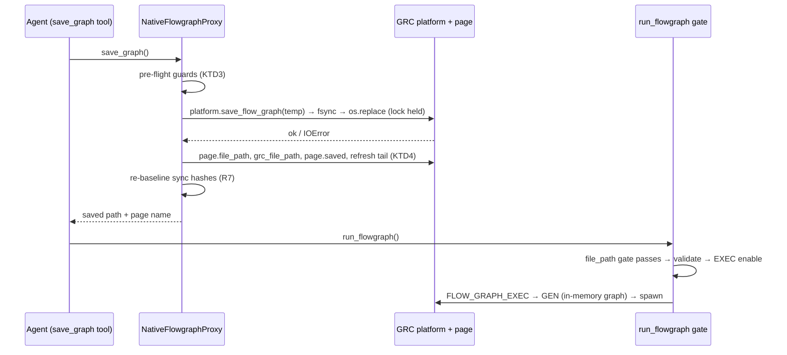
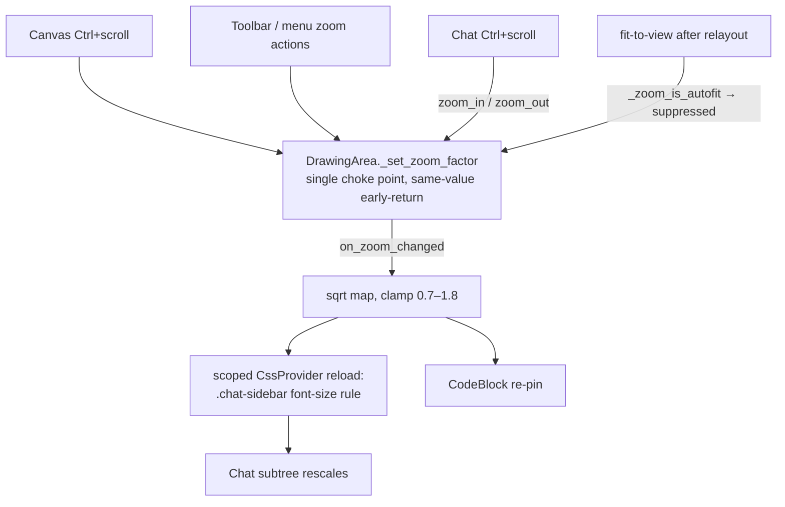

# Agent-Side Unsaved-Graph Save and Canvas-Chat Zoom Sync - Plan

## Goal Capsule

- **Objective:** The agent can take a GRC flowgraph from an empty project folder to a running, log-verified graph without asking the user to touch the GRC window. When the user zooms either the GRC canvas (blocks board included) or the agent chat, both surfaces move together.
- **Means:** A dedicated `save_graph` agent tool that saves through GRC's own native save path into the project directory (KTD1–KTD6), and a single-source zoom projection from the canvas into the chat sidebar (KTD7–KTD9).
- **Authority:** AGENTS.md invariants override everything; R-IDs own product behavior; KTD-IDs own mechanism; unit Approach carries only unit-local deltas.
- **Execution profile:** code. Repo gates in Verification Contract are the proof surface. Per AGENTS.md, re-verify Pydantic AI tool-registration APIs against the `building-pydantic-ai-agents` skill before implementing U3.
- **Stop conditions:** The run gate refuses only genuinely unrunnable states (no graph, invalid graph, already running, unsaved); a missing project directory refuses one hop earlier, in the save tool's pre-flight guard (KTD3, guard 1). Zoom projection never pushes chat text outside its readable clamp.
- **Tail ownership:** `ce-work` or the user. Single-branch `main`, conventionally scoped commit messages per AGENTS.md.

---

## Product Contract

### Summary

Add an agent-facing `save_graph` tool that names the page first and then runs GRC's native SAVE branch body — atomic write, full title/tab/recents parity, guard rails — so the save-then-run cycle is fully self-served. Make canvas zoom the single zoom source and project it into the chat sidebar (scoped CSS font scaling, clamped), with Ctrl+scroll over the chat driving the canvas in return.

### Problem Frame

The runner refuses to execute an unsaved graph: `NativeFlowgraphProxy.run_flowgraph` gates on `page.file_path` because GRC's Execute on an untitled page reroutes SAVE to the modal Save-As dialog, which would block the unified GTK+asyncio loop. Today the escape hatch is human: the user must press Ctrl+S in GRC before the agent can run anything, and the project folder stays empty until they do. Separately, GRC's canvas zoom (Ctrl+scroll, 0.1–5.0) and the agent chat sidebar share nothing — zooming the board never scales the chat and the chat has no zoom input at all, so the two surfaces drift apart on every zoom gesture.

### Requirements

**Unsaved-graph save flow**

- R1. The agent can save the active in-memory flowgraph into the project directory at any time through a dedicated save tool — no modal dialog, no user interaction.
- R2. A tool save is surface-indistinguishable from a native Ctrl+S: GRC's title bar, tab markup, Save action enablement, close-page guard state, and File > Open Recent (on first naming) all reflect the saved path.
- R3. Derivation never clobbers: an untitled page derives `untitled.grc`, then `untitled(<n>).grc` on collision; a titled page re-saves in place at its existing path (native SAVE semantics, no re-derivation).
- R4. A save never corrupts an existing file: the write is atomic (temp file in the target directory, then rename) under the existing per-graph lock; any failure leaves the target unchanged, keeps `page.saved` False, and reports a retryable error to the model.
- R5. Guarded targets: no project directory set → actionable directive error; derived path open in another tab → error naming that tab; target exists and is unwritable → error (read-only parity with native SAVE).
- R6. The unsaved-run gate directs the agent to call the save tool and retry, with wording that states the true invariant — GRC generates into the saved graph's directory and executes from there — and drops the "generates from the saved file" claim (generation runs from the in-memory graph; GRC's GEN auto-saves dirty named pages).
- R7. After a tool save, the sync baselines (in-memory export hash and disk hash) are refreshed so the next `_check_for_unsynced_edit` tick does not fire a spurious manual-edit sync.

**Zoom sync**

- R8. Canvas zoom is the single zoom source: every mutation path (canvas Ctrl+scroll, toolbar/menu zoom actions, fit-to-view) flows through one choke point, and the chat sidebar is a pure projection of it.
- R9. Sidebar text/UI scales with canvas zoom by one monotonic mapping — exact theme size at zoom 1.0, clamped to a readable band — scoped to the sidebar only; GRC's own panels and canvas rendering are untouched.
- R10. Ctrl+scroll over the chat message area zooms the canvas in or out without scrolling the chat, stealing focus, or disturbing the stick-to-bottom intent.
- R11. Fit-to-view auto-zoom (agent relayouts) does not rescale the chat: fit is a view convenience, not a zoom preference.
- R12. Code blocks render fully at any projected size — no clipped rows after a rescale.

### Key Decisions

- KD1. Agent-side saves land inside the project directory through a dedicated save tool. Rationale: the modal only exists because GRC's SAVE delegates to Save-As on an empty path; fs write tools structurally deny `.grc`; the project directory is where GRC generates and executes. (session-settled: user-directed — chosen over the manual "press Ctrl+S in GRC" round-trip this plan removes: the user hit that friction live and asked it be designed away.) Governs R1, R3, R5.
- KD2. Canvas zoom is the single zoom source; the chat sidebar follows it. Rationale: one source of truth removes the drift the user reported and makes bidirectional input loop-free by construction. (session-settled: user-directed — chosen over independent per-surface zoom: the split was reported as the defect itself.) Governs R8–R10.

### Scope Boundaries

- No auto-save on every `change_graph`; saving stays an explicit agent action that the run gate teaches.
- No scaling of GRC's own panels (console, block tree, menus, dialogs) and no app-wide DPI changes; the projection is scoped to the sidebar widget.
- No run-gate condition on dirty-but-named pages: GRC's GEN auto-save of a dirty named page is native Execute-button behavior and stays.

#### Deferred to Follow-Up Work

- Sidebar zoom persistence across sessions (the `settings.py` keyed-dict pattern is the ready home; GRC itself persists no zoom).
- An optional `prompts.py` harness-contract line for the save-then-run invariant (default: none — the gate's retry feedback plus the tool docstring carry it; AGENTS.md forbids tool enumeration in prompts).
- Saving non-foreground pages or an explicit target-path parameter.

### Acceptance Examples

- AE1. Covers R1, R2, R3. Given an empty project directory and an untitled graph with the default options id, when the agent saves, then `<project>/untitled.grc` exists, the tab and title show the saved name, the options id is `untitled`, and the run gate passes on retry.
- AE2. Covers R3, R5. Given `untitled.grc` already exists with different content, when the agent saves, then `untitled(1).grc` is written, the options id becomes the sanitized stem `untitled_1`, and the original file is byte-identical to before.
- AE3. Covers R4, R7. Given the target file content equals the serialized graph, when the agent saves, then no file bytes change, the page is marked saved, and no sync tick fires.
- AE4. Covers R5. Given the derived path is open on another tab, when the agent saves, then the tool fails naming that tab and writes nothing.
- AE5. Covers R9, R10. Given canvas zoom 1.0 with chat at theme default, when the user Ctrl+scrolls the canvas to 1.44, then sidebar text scales to about 1.2x (sqrt mapping, within clamp); when the user Ctrl+scrolls the chat instead, the canvas steps by the same factor with no chat scroll and no focus change.

---

## Planning Contract

### Key Technical Decisions

- KTD1. **Naming and identity.** Titled pages save in place at `page.file_path` (derive nothing — re-deriving orphans files and forks page identity). Untitled pages derive the filename from state: options id `default` → `untitled.grc`, collisions → SAVE_COPY counter precedent `untitled(<n>).grc`; a non-default id → `<id>.grc` (id == stem already holds). The options id is renamed to the file's sanitized id-safe stem (invalid chars → underscore, leading digit prefixed) when naming an untitled page, then the graph is refreshed — SAVE_AS parity (`grc/gui/Application.py` SAVE_AS branch renames id from filename), except the id sanitizes where the native basename would be an invalid id (`untitled(1)` → `untitled_1`).
- KTD2. **Atomic write seam.** `platform.save_flow_graph` writes with plain `open(w)` — no temp, no rename (verified: `grc/core/platform.py` save body). `save_graph` calls it on a temp path in the target directory, then fsync + `os.replace`, under `fcntl.flock` on the existing `.grc_agent/<stem>.lock` with `BlockingIOError` defer — the same discipline `sync_manual_edit` already uses. Failure keeps `page.saved = False`, sends the native fail-save console message, and raises `ValueError` (→ `ModelRetry` at the tool layer).
- KTD3. **Ordered pre-flight guards.** Applied uniformly on every save: (1) no project directory → directive error mirroring the fs-tool "Select a Project directory" wording; (2) target is `page.file_path` of another open page → error naming the tab (GRC's duplicate guard exists only on open); (3) target exists and `not os.access(target, W_OK)` → error (native `get_read_only` parity; this check is load-bearing — a directory-writable rename would otherwise clobber a read-only file); (4) target exists with content hash equal to the serialized export → state-only update, no write (uses the existing serialized-export vs `_sha256_file` comparison pair).
- KTD4. **Surface refresh tail.** There is no signal: GRC's action dispatch ends with Save-action enablement, `main.update()`, and redraw (`grc/gui/Application.py` dispatch tail), and first-time naming adds `config.add_recent_file` plus toolbar/menu submenu refreshes (SAVE_AS tail). `save_graph` calls this tail directly. Do not synthesize a `FLOW_GRAPH_SAVE` dispatch — it double-writes the file.
- KTD5. **Gate reword.** The unsaved-run gate keeps its `file_path`-only condition and its `ValueError` → `ModelRetry` path, and rewords to: untitled page → call `save_graph`, then retry `run_flowgraph`; invariant stated per R6. Errors name the page and path so the agent detects a tab switch between save and run. Two test assertions matching the old phrase are updated with this plan.
- KTD6. **No approval on save.** `save_graph` registers without `requires_approval` (fs write tools and `save_block` precedent; run start stays gated). The never-clobber derivation rule plus the other-tab and read-only guards remove the dangerous cases at the source instead of gating them.
- KTD7. **Zoom observation seam.** `_set_zoom_factor` is the verified single choke point for all canvas zoom mutations (Ctrl+scroll, ZOOM_IN/OUT/RESET actions, fit-to-view); GRC early-returns on same-value sets. `NativeCanvasManager` wraps the per-instance method at the established `_setup_drawing_area` per-page seam: call GRC's method, then fire a new `on_zoom_changed(zoom_factor)` callback (peer of `on_graphs_changed`, assigned by the desktop app). A transient `_zoom_is_autofit` flag around `_fit_to_view` suppresses the callback (R11).
- KTD8. **Projection mapping and mechanism.** Sidebar font multiplier = `sqrt(zoom_factor)`, clamped to 0.7–1.8, exact 1.0 at zoom 1.0 — one math rule, no per-surface branches. Mechanism: a scoped `CssProvider` on the sidebar's style context carrying one recalculated absolute rule (`.chat-sidebar { font-size: <base × multiplier>px }`); every sidebar CSS rule is already `em`-relative and Pango spans (`scale=1.16`, `size='small'`) stay relative, so one inherited rule rescales the subtree without leaking into GRC. Reload via `provider.load_from_data` on `on_zoom_changed`, on the unified main loop. Session-only; no persistence.
- KTD9. **Chat zoom input.** The sidebar's message ScrolledWindow gets one zoom-only `scroll-event` handler: Control-masked wheel drives canvas `zoom_in`/`zoom_out` (already clamped) and returns True; everything else returns False. It never grabs focus, never writes sidebar styles directly (projection is one-directional, so no loop), and never touches `_auto_scroll` intent — respecting the repo's prior lesson that handlers on this widget must not own scroll intent.

### High-Level Technical Design

**Save-then-run sequence (U1–U3):**

**Zoom single-source dataflow (U4–U5):**

### Assumptions

- Installed GNU Radio (inspected 2026-08-31 under `/usr/lib/python3/dist-packages/gnuradio/grc`) behaves at implementation time as inspected: SAVE branch body, SAVE_AS id rename, GEN auto-save at execute, non-atomic platform write, zoom choke point with same-value early-return. Re-verify if the GNU Radio version changes.
- The chat-sidebar font-size inventory (all rules `em`-relative; one pinned CodeBlock height) is complete per repo research; any future sidebar text site must stay relative to inherit projection.
- GRC's foreground-page semantics (`window.current_page`) remain the save/run target.

### Sequencing

U1 → U2 → U3 (Feature A, each unit lands as one commit-sized change; run the fast gate after each). U4 → U5 (Feature B; run the xvfb group after U5). The two features are independent and may interleave.

### System-Wide Impact

- The agent tool surface grows by one; Pydantic AI transmits the new schema automatically — no prompt enumeration (AGENTS.md).
- ApprovalCard needs no change; the tool registers ungated (KTD6).
- Saved `.grc` files are immediately visible to the fs-tool sandbox (same root), making saved graphs inspectable by the existing read tools.
- The zoom projection is scoped to the sidebar's style context; GRC canvas rendering and panels are untouched.

---

## Implementation Units

### U1. Target-path resolution helper (headless)

- **Goal:** One pure, display-free rule that turns (project dir, options id, existing files) into a save target path and sanitized id stem.
- **Requirements:** R3, R5. **KTDs:** KTD1.
- **Dependencies:** none.
- **Files:** `src/grc_agent/adapter/graph.py` (new helper beside the existing path/serialization helpers), `tests/test_adapter_graph.py`.
- **Approach:**
  1. Input: project directory, current options id, page's existing `file_path` (empty for untitled).
  2. Titled page → return the existing path unchanged (no derivation).
  3. Untitled page → `untitled.grc`, then smallest `untitled(<n>).grc` not present (SAVE_COPY counter precedent).
  4. Return the sanitized id-safe stem for the chosen file (invalid identifier chars → underscore, leading digit prefixed), for the caller to apply via SAVE_AS-parity id rename.
  5. No project directory → raise with the fs-tool "Select a Project directory" directive wording.
- **Patterns to follow:** `_UNSAVED_ROOT` in `src/grc_agent/fs_tools.py`; path/serialization helpers in `src/grc_agent/adapter/graph.py`; directive-error wording in `src/grc_agent/fs_tools.py` (`_NO_ACTIVE_GRAPH_MSG`).
- **Test scenarios:**
  - Default id `default`, empty directory → `untitled.grc`, stem `untitled`.
  - `untitled.grc` present → `untitled(1).grc`; also present → `untitled(2).grc`.
  - Non-default id `receiver` → `receiver.grc`, stem `receiver`.
  - Sanitizer: `untitled(1)` → `untitled_1`; leading digit and invalid chars normalized; valid ids pass through unchanged (idempotence).
  - Titled page input → identical path returned, no name derived.
  - No project directory → directive error raised.
- **Verification:** Fast unit gate green; helper imports without GTK.

### U2. `NativeFlowgraphProxy.save_graph` (native save parity)

- **Goal:** The proxy-level save that makes an agent save indistinguishable from Ctrl+S, atomically and guard-railed.
- **Requirements:** R1, R2, R4, R5, R7. **KTDs:** KTD2, KTD3, KTD4.
- **Dependencies:** U1.
- **Files:** `src/grc_agent/native_canvas.py` (method beside `run_flowgraph`/`stop_flowgraph`), `tests/test_run_stop_tools.py`.
- **Approach:**
  1. Resolve current page; guards in KTD3 order; hash-equal case updates page state only.
  2. Apply id rename (KTD1) before serialization; refresh the graph after rename (SAVE_AS calls a `flow_graph_update` equivalent).
  3. Acquire `.grc_agent/<stem>.lock` (`fcntl.flock`, `BlockingIOError` → defer with truthful message); render via GRC's `platform.save_flow_graph` to a temp file in the target directory; fsync; `os.replace`.
  4. Set `page.file_path`, `flow_graph.grc_file_path`, `page.saved = True`; on any write failure: `page.saved = False`, native fail-save console message, `ValueError` for the tool layer — target unchanged (atomicity).
  5. Refresh tail (KTD4): Save action enablement, `main.update()`, redraw; on first naming also `config.add_recent_file` + toolbar/menu submenu refreshes.
  6. Refresh `last_synced_export_hash`/`last_disk_hash` immediately (mirror `sync_manual_edit` post-write) per R7.
  7. Return path + page name in the result so gate errors and results let the agent detect tab switches (R6 support).
- **Patterns to follow:** `sync_manual_edit` lock/write/re-baseline block in `src/grc_agent/native_canvas.py`; hermetic fakes (`NativeCanvasManager.__new__`, `SimpleNamespace` page, `_FakeExecMonitor`) in `tests/test_run_stop_tools.py`.
- **Test scenarios:**
  - Happy path (AE1): untitled page → asserts call order — platform save targeted the temp path, `os.replace` to final, page state set, refresh tail called, recents added on first naming.
  - Titled page: existing `file_path` reused; no derivation, no id rename.
  - Collision (AE2): pre-existing `untitled.grc` with different content → writes `untitled(1).grc`; options id becomes `untitled_1`; original file untouched.
  - Hash-equal (AE3): no platform-save call; `page.saved = True`; no new file.
  - Other-tab guard (AE4): error names the tab; nothing written.
  - Unwritable target: `page.saved` stays False, fail-save console message sent, `ValueError` raised.
  - `IOError` from the platform write mid-render: target file unchanged (atomic replace), failure path as above.
  - Baseline refresh (R7): after save, one `_check_for_unsynced_edit` tick performs no `sync_manual_edit` call.
  - Lock contention: held lock → truthful defer message, no partial write.
- **Verification:** Fast unit gate green with the new scenarios; fakes assert call order rather than internals.

### U3. `save_graph` tool registration + run-gate reword

- **Goal:** Expose the save to the model and make the run gate self-serve.
- **Requirements:** R1, R6. **KTDs:** KTD5, KTD6.
- **Dependencies:** U2.
- **Files:** `src/grc_agent/agent.py` (tool function + registration), `src/grc_agent/native_canvas.py` (gate wording only), `tests/test_run_stop_tools.py`.
- **Approach:**
  1. Tool function follows `run_flowgraph_func`: resolve `ctx.deps` `save_graph` via `getattr`; unwired deps → environment-fault `ModelRetry` with explicit do-not-retry phrasing (existing convention); `ValueError` from the proxy → `ModelRetry` with the message.
  2. Register in `grc_tools()` with the house style: Google docstring + `require_parameter_descriptions=True` as the single description source; `max_retries = 3`; no `requires_approval` (KTD6).
  3. Reword the gate text per KTD5; update the two test assertions that match the old phrase.
  4. No `prompts.py` change (deferred item).
- **Patterns to follow:** `run_flowgraph_func` + registration block in `src/grc_agent/agent.py`.
- **Test scenarios:**
  - Gate on untitled page raises the new wording naming the save tool; both updated assertions match it.
  - Gate on a titled page still passes (condition unchanged — `file_path` only).
  - Tool wraps proxy `ValueError` as `ModelRetry` carrying the page/path detail.
  - Unwired deps produce the do-not-retry environment-fault message (not a retry loop).
  - Registered tool has `max_retries = 3` and no approval requirement.
- **Verification:** Fast unit gate green; `uv run ruff check` clean.

### U4. Zoom observation seam + mapping (canvas side)

- **Goal:** One callback that fires on every real canvas zoom change, and the pure mapping law the projection uses.
- **Requirements:** R8, R9, R11. **KTDs:** KTD7, KTD8 (mapping half).
- **Dependencies:** none (independent of U1–U3).
- **Files:** `src/grc_agent/native_canvas.py` (per-page wrap in `_setup_drawing_area`, `_zoom_is_autofit` flag around `_fit_to_view`, mapping function, `on_zoom_changed` attribute), `tests/test_native_canvas.py`.
- **Approach:**
  1. Wrap the page DrawingArea's `_set_zoom_factor`: call GRC's method, then fire `on_zoom_changed(da.zoom_factor)` only when GRC did not early-return (value actually changed).
  2. Set a transient flag around `_fit_to_view`'s zoom set; the wrapper suppresses the callback while flagged (R11).
  3. Mapping as a pure function: multiplier = `sqrt(zoom)` clamped to [0.7, 1.8]; multiplier is 1.0 exactly at zoom 1.0.
- **Patterns to follow:** per-page handler attachment in `_setup_drawing_area`; `on_graphs_changed` callback assignment in `src/grc_agent/desktop_app.py`; clamp constants precedent (`_FIT_ZOOM_MIN/MAX`) in `src/grc_agent/native_canvas.py`.
- **Test scenarios:**
  - Mapping (no GTK): monotonic; clamped at both ends; `sqrt(1.44) = 1.2`; zoom 1.0 → exactly 1.0.
  - Choke-point wrap: faked DrawingArea → callback fires on real change; same-value set stays silent (mirrors GRC's early-return).
  - Autofit suppression: `_fit_to_view` with flag → no callback; a user zoom gesture → callback.
  - All-zoom-paths coverage: toolbar-style `zoom_in`/`zoom_out`/`reset_zoom` calls each produce exactly one callback per real change.
- **Verification:** Fast unit gate green (headless fakes, no display).

### U5. Sidebar projection + chat zoom input

- **Goal:** The chat scales as a pure projection of canvas zoom, and Ctrl+scroll over chat drives the canvas.
- **Requirements:** R9, R10, R12. **KTDs:** KTD8 (mechanism half), KTD9.
- **Dependencies:** U4.
- **Files:** `src/grc_agent/chat_sidebar.py` (projection apply + zoom-scroll handler + anchor preservation; consumes U4 callback via a `set_zoom_projection` entry point), `src/grc_agent/ui/code_block.py` (re-pin entry point), `src/grc_agent/desktop_app.py` (wire `on_zoom_changed` to the sidebar), `tests/test_chat_sidebar.py`, `tests/test_desktop_app.py`.
- **Approach:**
  1. On first callback, create the scoped `CssProvider` on the sidebar's style context; on every callback, reload the one-rule CSS via `load_from_data` (base size × multiplier from U4's mapping).
  2. Preserve the stick-to-bottom anchor: snapshot `near_bottom` before applying; restore scroll anchoring after relayout settles; never touch `_auto_scroll` intent otherwise (streaming safety, per the single-authority scroll logic).
  3. Re-pin rendered code blocks (re-measure from current buffer + style font) after the CSS applies; blocks created later measure correctly on construction with no extra work.
  4. Zoom-scroll handler on the message ScrolledWindow per KTD9: Control-masked wheel only → canvas `zoom_in`/`zoom_out`; return True; all else False; no focus grab.
- **Patterns to follow:** single-provider CSS build in `src/grc_agent/ui/css.py`; scroll-anchor single-authority logic in `src/grc_agent/chat_sidebar.py`; widget wiring pattern for `on_graphs_changed` in `src/grc_agent/desktop_app.py`.
- **Test scenarios:**
  - Projection content (xvfb): after a zoom change, the provider's CSS contains the `.chat-sidebar` font-size rule with a value inside the clamp; zoom 1.0 restores the theme default.
  - Provider scope: attached to the sidebar's style context, not the screen (no GRC-wide effect).
  - CodeBlock re-pin (R12): after an inflate, existing block heights are re-measured (no clipped rows); a block created after the rescale sizes itself correctly.
  - Anchor preservation: with `near_bottom` true and simulated streaming rows, a font inflate keeps stick-to-bottom engaged and `_auto_scroll` intent unchanged.
  - Chat Ctrl+scroll (xvfb, synthesized Gdk event): canvas zoom steps exactly once per gesture; plain scroll passes through unzoomed; entry focus unchanged.
  - No feedback loop: canvas zoom change updates the sidebar CSS and leaves the sidebar's vadjustment value untouched.
- **Verification:** xvfb group (`tests/test_chat_sidebar.py`, `tests/test_native_canvas.py`, `tests/test_desktop_app.py`) green under `xvfb-run -a`.

---

## Verification Contract

| Gate | Command | When |
|---|---|---|
| Fast unit suite (zero errors required) | `uv run pytest tests/ --ignore=tests/test_integration.py --ignore=tests/test_button_integration.py` | After every unit; final gate |
| Lint | `uv run ruff check` | After every unit |
| Display-dependent GTK suites | `xvfb-run -a uv run pytest tests/test_chat_sidebar.py tests/test_native_canvas.py tests/test_desktop_app.py` | After U2, U4, U5 |
| Cheap inner loop while iterating U1–U3 | `uv run pytest tests/test_adapter_graph.py tests/test_run_stop_tools.py -q` | Continuously |

Behavioral skill note: per AGENTS.md, verify Pydantic AI tool-registration details against the `building-pydantic-ai-agents` skill during U3 rather than from memory. GRC-native behaviors cited in this plan were verified against the installed GNU Radio 3.x source on 2026-08-31; re-verify the touched branches (`gui/Application.py` SAVE/SAVE_AS/exec tail, `gui/DrawingArea.py` zoom, `core/platform.py` save) if the GNU Radio install changes.

---

## Definition of Done

- Global:
  - All Verification Contract gates pass with zero errors; no test skipped or disabled without recorded rationale.
  - AGENTS.md invariants hold: atomic writes, uniform `ModelRetry` error reporting, no tool enumeration in prompts, native GRC APIs only (no raw `.grc` XML manipulation), no version bumps in `pyproject.toml`/`CITATION.cff`/`CHANGELOG.md`.
  - Cleanup: no dead experiment code, unused helpers, or debug remnants from abandoned approaches remain in the diff.
  - End-to-end proof: with an empty project directory, the agent builds a graph, saves it via the new tool (file appears in the project dir, GRC title/tabs truthful), runs it, and reads the log — no manual GRC interaction; and a canvas Ctrl+scroll visibly moves chat text within the clamp while chat Ctrl+scroll moves the canvas.
- Per-unit: each unit's own Verification bullet plus its test scenarios passing is the unit-level done signal.
