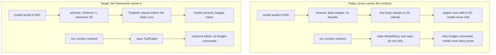
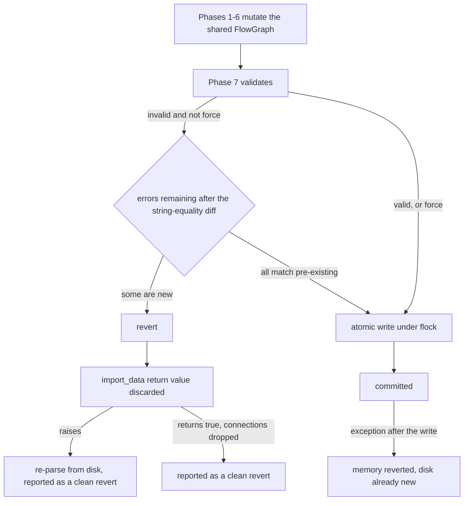

# Harness Lean-Out and Model-Facing Tool Contract Rework - Plan

## Goal Capsule

- **Objective:** Cut the harness down to what earns its place, and rebuild the model-facing tool surface on the contracts Pydantic AI actually provides — so that `inspect_graph`, `query_knowledge` and `change_graph` are cheap, schema-validated, uniformly shaped, and honest about what they omit.
- **Means:** Fix three user-visible defects first (R1–R4), delete verified-dead and write-only code (R5–R8), move argument validation from prose and runtime clamps into the JSON schema (R9–R14), adopt `ToolFailed` / `args_validator` / `FunctionToolset` / typed deps (R15–R18), make the read tools' payloads uniform and explicitly counted (R19–R23), reduce the system prompt to unobservable contracts (R24–R26), close the transaction, context-window and concurrency gaps (R27–R33), decompose the chat sidebar (R34–R40), restore the test gate (R41–R44), and settle the adapter on one error shape and GNU Radio's own vocabulary (R45–R51). Twenty units in four phases.
- **Authority:** AGENTS.md invariants override everything. R-IDs own behaviour; KTD-IDs own mechanism; unit `Approach` carries only unit-local deltas. Where a finding and AGENTS.md conflict, AGENTS.md is amended in the same commit (U2, U7, U9, U10) rather than the code drifting from it.
- **Execution profile:** code. Behaviour-preserving except where a requirement states otherwise. The repo gates in Verification Contract are the proof surface. Per AGENTS.md §2, re-verify every Pydantic AI and harness API against the `building-pydantic-ai-agents` / `pydantic-ai-harness` skills before implementing U8–U11, U13 and U14 — this plan's API claims were verified against the installed 2.31.0 / 0.23.0 and must be re-verified after U3's upgrade.
- **Stop conditions:** No unit may change what the model can *do* — only how reliably it can express it. Any change that would remove a model-facing capability, or that cannot be proven by the fast gate plus at most one bounded Ollama Cloud scenario run, stops and asks.
- **Tail ownership:** `ce-work` or the user. Single-branch `main`, conventionally scoped commit messages per AGENTS.md §3.

---

## Product Contract

### Summary

Reduce the harness to its load-bearing code and rebuild the eight domain tools' schemas, descriptions, error contracts and payload shapes on current Pydantic AI idiom. Fix one live consent-surface defect, one silent 79%-context-loss defect, and one rollback that reports success it never verified. Restore the fast test gate's hermetic contract.

### Problem Frame

The harness works, and its architecture is sound: Pydantic AI owns the loop, the harness owns filesystem/shell, GRC's own API owns the flowgraph. What has accumulated is around the edges. The tool layer is written against an early `Tool(fn, docstring_format=...)` idiom and hand-writes in prose what the framework now expresses structurally — bounds live in docstrings while code silently clamps or ignores them, environment faults raise `ModelRetry` with a prose "do not retry" instruction instead of `ToolFailed`, conditional approval is raised from inside the tool body instead of an `args_validator`, and construction kwargs are repeated eight times with `max_retries` poked on afterwards. Two zero-argument tools carry 1,693 characters of description between them.

Meanwhile the package ships a 547-line benchmark corpus, writes two independent `.grc` history mechanisms that nothing ever reads, threads a dead `view` parameter through three functions, and exports eleven private symbols so tests can reach them. Three of the audited defects are user-visible: the approval card renders `?` where every block name and parameter update should be, local models are compacted at 27,200 tokens regardless of their real window, and one live network test runs inside the gate AGENTS.md §6 documents as network-free.

### Requirements

**Consent, honesty, and correctness defects**

- R1. The `change_graph` approval card renders the real argument payload — every block name, initial block state, parameter update and state change the model proposed is legible before the user approves it, untruncated.
- R2. A local model's compaction budget is derived from its real context window whenever the backend can report one, and the conservative constant applies only while it cannot.
- R3. `change_graph` reports rollback success only when the graph was actually restored, and never reports a disk-reload substitution as a clean revert.
- R4. A `change_graph` call that commits an in-memory mutation without persisting it, or that commits while the graph is still invalid, says so explicitly in its result.

**Dead and legacy code removal**

- R5. The installed package contains no benchmark or evaluation harness; the scenario corpus lives with the tests that consume it.
- R6. The undo-snapshot stack is removed: nothing reads it, and its only reader is its own writer incrementing a counter. The `.grc` backup directory stays — plain `.grc` copies are read by a person with a file manager, so having no code reader is its design, not evidence of deadness.
- R7. Parameters, branches, guards and re-exports with no reachable consumer are deleted — including the `view`/`mode` axis through `inspect_graph`, the always-true `hasattr` guards, and the duplicated approval block.
- R8. The adapter package exports only names its own consumers use; tests import from the defining module.

**Tool schema optimisation**

- R9. Every bounded tool argument expresses its bounds in the JSON schema, and an out-of-range value is rejected by validation rather than silently clamped or silently accepted.
- R10. Optional tool arguments do not widen into nullable `anyOf` unions where a plain typed default carries the same meaning.
- R11. `inspect_graph` accepts one target shape, not a three-branch union.
- R12. A malformed connection string is rejected by argument validation before the mutation engine runs, with the expected form in the error.
- R13. The eight domain tools' model-visible description text is under 2,200 characters, with no tool restating failure modes its error path already carries.
- R14. No tool description states a limit, default or path that the schema or the runtime can state instead.

**Tool error and approval contracts**

- R15. An environment fault the model cannot fix is reported as a failed tool result, not as a retry carrying a prose instruction not to retry.
- R16. Conditional approval is decided before the tool body runs, so invalid arguments are rejected without asking a human.
- R17. The domain tools are registered as one group with shared settings, not eight repeated constructions with post-hoc attribute assignment.
- R18. Tool functions receive a typed dependency object; capability presence is not probed with `hasattr` on the live proxy.

**Read-tool payload quality**

- R19. `inspect_graph` omits an `omitted_*` counter when nothing was omitted.
- R20. `query_knowledge` returns one shape across both domains.
- R21. Catalog results prune universal GRC parameters by the same rule `inspect_graph` applies to instances.
- R22. `output_truncated` is accompanied by a count, or is replaced by one.
- R23. Every model-facing truncation carries an explicit marker and count, including the error-body clip, the validation-error cap, and the status-bar ellipsis.

**System prompt**

- R24. The system prompt carries only unobservable harness contracts, execution invariants and GRC platform quirks; GNU Radio troubleshooting recipes are retrievable from the knowledge corpus instead.
- R25. No rule is stated in more than two places across the prompt and the tool descriptions.
- R26. No prompt or capability guidance enumerates tools the schemas already transmit.

**Infrastructure**

- R27. Context-window resolution follows one order — live endpoint metadata, then the registry the harness already exposes, then an honest unknown — with no per-provider probe that cannot return a value.
- R28. The HTTP retry policy retries only transport faults and retryable statuses, honours `Retry-After`, and does not destroy the provider's error body.
- R29. Shutting down the embedding server cannot race a worker into spawning a replacement.
- R30. All file writes are atomic, including the embedding runtime's token and pid files.
- R31. Cached block metadata is invalidated when the block library changes.
- R32. Hand-rolled machinery is replaced by a library already in the dependency set only where the swap removes moving parts.
- R33. The Pydantic AI and harness pins are current and upper-bounded, and private-symbol imports are dropped wherever a public equivalent now exists.

**Chat sidebar**

- R34. `chat_sidebar.py` is decomposed into cohesive modules, each independently testable.
- R35. One font-scaling mechanism governs the sidebar.
- R36. A tool's rendered label is derived from the tool result's structured fields, not from substring matches on its repr.
- R37. Tool-call status renders identically while streaming and after re-render.
- R38. No SQLite or HTTP call blocks the unified GTK/asyncio loop.
- R39. Timers armed at construction are removed at destruction.
- R40. Provider-specific UI strings live in the provider catalog, not in render-path branches.

**Test suite**

- R41. The fast gate makes no LLM call and no external network request.
- R42. `tests/test_isolation.py` is split along its actual subjects.
- R43. Assertions that cannot fail are removed or made falsifiable.
- R44. The approval-gating contract is pinned by tests: `requires_approval`, denial, and the failed-tool-result contract on every environment fault.

**Uniform rules and error contracts**

- R45. The adapter package reports failures in one shape: an `ok` flag, a stable error code per entry, and a message that names the underlying exception type.
- R46. No adapter failure is swallowed without reaching either the caller or a log record that names the cause.
- R47. Model-supplied text is normalised by one rule applied to every argument, not to two of five.
- R48. Block role, state, dtype and enum classification use GNU Radio's own API and vocabulary rather than hardcoded identifiers or invented aliases.
- R49. Resolving a catalog block's implementation docstring does not execute block-library code; it resolves documentation through GRC's own template evaluation and the block definition's documentation field, and reports a resolution failure distinctly from a block that genuinely has no docstring.
- R50. Suppressing GNU Radio's log output is scoped to the records and the duration that need it, not raised process-wide from a worker thread.
- R51. A provider's base URL is read from the built model rather than from a fourth hand-maintained table.

### Acceptance Examples

- AE1. **Covers R1.** Given a `change_graph` call adding `lpf_0` (`filter_low_pass_filter_x`, `cutoff_freq=1000`) and setting `samp_rate.value` to `48000`, when the approval card renders, then it shows the block as `lpf_0` and the parameter update as `samp_rate.value = 48000` — today it shows `` `?` `` and `` `?.?` = `` (reproduced live against `format_change_summary`).
- AE2. **Covers R2.** Given a local Ollama model whose real window is 131,072 tokens and a build-time probe that failed, when a later request compacts, then the budget derives from 131,072. Today the window is frozen at build time, so every subsequent request is capped at `0.85 x 32_000 = 27,200` for the life of the agent. Note the registry cannot rescue this: `resolve_context_window` returns `None` for every local model id, so switching to `fallback_context_window` alone changes nothing.
- AE3. **Covers R9.** Given `query_knowledge(query="x", domain="catalog", k=500)`, when the call is validated, then it is rejected with the permitted range — today it is silently clamped to 20. Given `generate_python(k=500)`, today it is passed through unclamped.
- AE4. **Covers R3.** Given a rollback whose `import_data` returns `True` (connections dropped), when `change_graph` reports the failure, then `rollback_failed` is true.
- AE5. **Covers R15.** Given the run monitor is unwired, when the model calls `get_run_log`, then the result is a failed tool result the model adapts to, and no retry budget is consumed.
- AE6. **Covers R41.** Given `OLLAMA_CLOUD_API_KEY` is present in `.env`, when the fast gate runs, then no test opens a network connection — today `tests/test_isolation.py:765` performs a real chat completion and currently fails the gate with `ModelAPIError: Connection error`.

### Scope Boundaries

**In scope**

The agent/tool layer (`agent.py`, `prompts.py`, `fs_tools.py`, `shell_tools.py`, `exec_monitor.py`), the model/infra layer (`agent_factory.py`, `embed_runtime.py`, `db.py`, `settings.py`, `model_catalog.py`, `providers/`), the GRC adapter (`adapter/*`, `ingest.py`), the GTK layer (`chat_sidebar.py`, `native_canvas.py`, `ui/*`, `desktop_app.py`, `event_loop.py`), and the test tree.

**Deferred to follow-up work**

- Adopting `CodeMode` to collapse multi-tool sequences into one sandboxed script. It is a genuine fit for the inspect-then-change loop, but it changes how the agent works rather than making the current tools reliable.
- GtkSourceView replacing the hand-rolled Pygments-to-`TextTag` styler (~90 lines plus the `pygments` dependency). Real reduction, but it adds a GI typelib dependency and is orthogonal to everything else here.
- `mypy` joining the gate. Baseline is 42 errors across 12 files; fixing them is its own pass.
- Filing the upstream `pydantic-ai-harness` `Shell` stdin issue (`anyio.open_process` leaves an unwritten `PIPE`; verified still unfixed at 0.28.0).

**Outside this change's identity**

- New capabilities from `docs/backlog.md` (canvas screenshots, data-plane visualisation, project file-RAG, SigMF catalog).
- Knowledge-corpus content, except the pages U11 adds to carry the troubleshooting recipes out of the prompt.
- Any version bump in `pyproject.toml`, `CITATION.cff` or `CHANGELOG.md` (AGENTS.md §4).

---

## Planning Contract

### Key Technical Decisions

- **KTD1. Bounds go in the schema, not in a clamp.** Replace `k = max(1, min(20, k))` and the unclamped `generate_python(k)` with `Annotated[int, Field(ge=1, le=20, description=...)]`. Pydantic emits `minimum`/`maximum` into the tool schema and rejects out-of-range arguments before the body runs, so the model sees a precise validation error instead of a silent substitution. Verified via context7: `Field(description=...)` takes precedence over the docstring description and still satisfies `require_parameter_descriptions=True`.
- **KTD2. Keep the connection string; validate it with a `pattern`.** A structured `Connection` model would quadruple the per-connection token cost. A regex `pattern` on the string type costs nothing, is enforced by Pydantic locally regardless of whether the provider honours the schema hint, and moves `parse_conn`'s `invalid_connection_format` from a burned domain retry to a cheap argument-validation retry. Rejected: structured model (token cost), leaving it as-is (the runtime round-trip stays).
- **KTD3. `ToolFailed` for environment faults, `ModelRetry` for model-correctable ones.** Three tools (`get_run_log`, `run_flowgraph`, `save_graph`) currently raise `ModelRetry` carrying the prose "this is an environment fault — do not retry". `ToolFailed` is the framework's own expression of exactly that: a failed `ToolReturnPart` the model adapts to. But it deliberately consumes no retry budget, so converting these four sites raises the ceiling on a stuck model from three repeats to `StopGracefully`'s 40 requests — and AGENTS.md §3's do-not-retry clause exists precisely to prevent that loop. The conversion therefore ships with a replacement bound: a per-tool repeated-`ToolFailed` counter that ends the run through the existing `StopGracefully` capability. AGENTS.md §3 is amended in the same commit to name both exceptions, the boundary between them, and that bound.
- **KTD4. Conditional approval moves to `args_validator`.** `run_flowgraph` raises `ApprovalRequired()` from inside its body after a manual `action not in ("start","stop")` check that the `Literal` type already enforces. The skill is explicit that the validator is the better site: bad arguments are rejected before a human is asked, the deferral consumes no retry budget, and the validator re-runs with `ctx.tool_call_approved` set. The redundant manual check goes with it.
- **KTD5. One `FunctionToolset` for the domain tools.** `grc_tools()` constructs eight `Tool`s repeating `docstring_format="google", require_parameter_descriptions=True`, then assigns `.max_retries = 3` on four of them post-construction. `Tool.__init__` accepts `max_retries` directly, and `FunctionToolset(max_retries=3)` carries the group default. This removes the post-hoc attribute poke and the eight-fold repetition without changing any tool's identity.
- **KTD6. Omission counters are emitted only when non-zero.** `inspect_graph` emits `omitted_params_count`, `omitted_inputs_count` and `omitted_outputs_count` on every block regardless of value. Measured: 825 of 5,211 characters on `dial_tone.grc` and 1,155 of 6,889 on `fm_rx.grc` are zero-valued counters, plus 276 and 351 characters of empty `inputs: []` / `outputs: []` — **21% and 21.9% of the payload respectively**. Absence of a counter means nothing was omitted, which is exactly as honest as `0` and satisfies AGENTS.md §3's explicit-counts rule with no information loss — but only for a reader who knows the convention, so `inspect_graph`'s description states it in one clause. At 130 characters it is the smallest description on the surface and can afford it.
- **KTD7. The catalog renderer reuses `keep_param`.** `query_knowledge(domain="catalog")` returns `alias`, `affinity`, `minoutbuf`, `maxoutbuf` and `comment` on every block — 635 of 3,000 characters (21%) at `k=5`. `inspect_graph` already prunes these through `keep_param`'s uniform `hide`/value-vs-default rule. One rule, applied in both places.
- **KTD8. `keep_param`'s hardcoded identifiers are deleted, not extended.** `dtype == "id" or param_key == "showports" or param_key.startswith("bus_structure_")` is strictly worse than the `hide == "part"` rule three lines below it, which keeps such a param only when its value differs from the default or references a variable. The hardcoded branch hides params the user deliberately changed. `generate_options` as a hardcoded "structural" enum generalises through `type_controlling_params`' existing template-reference scan.
- **KTD9. The local window is resolved per request, not frozen at build time.** The local branch passes `context_window=32_000`, which the harness documents as overriding resolution entirely, while its own comment says it wants the fallback ("let the harness resolve the registry per request, with the old conservative guesses as the fallback denominator"). Swapping the keyword is *not* sufficient, and this was verified: `resolve_context_window` returns `None` for every local model id shape this app builds, so `fallback_context_window=32_000` yields the same 27,200 budget. The registry cannot answer for a self-hosted deployment. The fix is therefore to resolve the app's own `/api/show` probe lazily inside the compaction capability instead of once at agent-build time, so a probe that failed while the backend was down succeeds on a later request — with `fallback_context_window=32_000` underneath it for the case where the backend never answers.
- **KTD10. Context-window probes are pruned, not replaced wholesale.** Verified live: `resolve_context_window` (already exported by the installed harness 0.23.0) returns a value for `openai` (128k/400k), `anthropic` (1M), `google` (1M), `xai` (256k) and `groq` (131k with a current model ref), and `None` for `mistral`, `cohere`, `openrouter` and `ollama`. OpenRouter's own `/v1/models` does return `context_length` (confirmed live), and Ollama's `/api/show` is irreducible for user-pulled weights. So: front the chain with `resolve_context_window`, and keep the OpenRouter and Ollama probes and Codex's own `context_window`. A per-provider branch is deleted only when both halves are shown: the provider's live `/v1/models` response carries no per-model context field, **and** the registry answers for the model this project actually ships for that provider. Vendored SDK schemas suggest `openai`, `groq`, `mistral`, `cohere` and `xai` all return `None` from `json["data"][*]["context_length"]`, and `_google_context_length` is redundant with the registry — but that is a starting hypothesis, not the criterion. Registry coverage is model-dependent (`groq` resolves for one model reference and not another), so a branch that cannot be shown to return `None` under the live check stays. Rejected: deleting all four probes (the registry does not cover this project's default providers).
- **KTD11. The scenario harness is relocated, not deleted.** It is the only agent-behaviour evaluation surface in the repo. Moving it to `tests/scenarios/harness.py` costs three import statements and one test move, and takes 547 lines out of the installed wheel.
- **KTD12. Sidebar decomposition follows the existing pure-function seams first.** Extract the zero-GTK helpers (formatting, error shaping, history cleaning, usage collection) before the widget-owning views, so each extraction lands with tests that run without a display.
- **KTD13. `FallbackCompaction` replaces the custom resilient subclass.** It is exported by the installed harness, and its `fallback_on` is a configurable field — so `FallbackCompaction(fallback_chain=[...], fallback_on=(Exception,))` covers what `ResilientSummarizingCompaction` plus the fourth tier cover, without a subclass whose blanket `except Exception` also swallows bugs. `TranscriptPreservingTieredCompaction` stays: no first-class pre-compaction hook exists.

### High-Level Technical Design

The tool layer's current shape versus the target, for one representative tool:

The per-request static cost the model pays before any conversation, measured live:

| Surface | Descriptions | Schemas | Total |
|---|---:|---:|---:|
| 8 domain tools | 4,058 | 5,932 | 9,990 |
| 12 filesystem + shell tools | 3,215 | 3,595 | 6,810 |
| System prompt | 5,015 | — | 5,015 |
| **Static floor** | | | **21,815 ch (~5,450 tok)** |

The description budget is concentrated in the wrong places — the two zero-argument tools are the two largest descriptions:

| Tool | Description | Schema | Args |
|---|---:|---:|---:|
| `save_graph` | 1,139 | 62 | 0 |
| `save_block` | 583 | 934 | 5 |
| `get_run_log` | 554 | 62 | 0 |
| `change_graph` | 514 | 2,860 | 8 |
| `generate_python` | 480 | 280 | 1 |
| `query_knowledge` | 375 | 511 | 3 |
| `run_flowgraph` | 283 | 872 | 4 |
| `inspect_graph` | 130 | 351 | 1 |

Eleven arguments render as nullable `anyOf`, but only seven should collapse: `inspect_graph.targets` narrows from three branches to two (R11), and `change_graph`'s six list arguments lose their null branch because an empty list already means the same thing (R10). The other four — `run_flowgraph.stop_after_seconds`, and `save_block`'s `block_id`, `label` and `category` — keep theirs, because `None` carries meaning there (`block_id=None` means "default to the instance name"). Trimming descriptions to roughly 2,070 characters, collapsing those seven, and cutting `read_file`'s 898 characters saves on the order of 650 tokens per request — about 12% of the static floor.

That token figure is the measurable benefit. The larger claim — that a validated schema and a uniform payload remove round-trips — is *not* self-evident and in one direction cuts the other way: `k=500` today is silently clamped and succeeds in one call, while after R9 it is rejected and the model must call again. What R9 buys there is argument honesty under AGENTS.md §3, not fewer round-trips. Where round-trips genuinely fall is the connection-format case (R12), which moves a failure from a burned domain retry to a cheap validation error. Phase 2's verification measures tool-call and validation-error counts so the claim is settled by data rather than asserted.

The `change_graph` commit path, and where it currently reports outcomes it did not verify:

Three of those edges are the subject of R3 and R4: the discarded `import_data` return value, the disk substitution reported as a clean revert, and the post-commit revert. The `empty new_errors` edge commits a graph GNU Radio still calls invalid — defensible as intent, but the result says `ok: true` without stating it.

### Assumptions

- The `bypass` / `bypassed` state alias is a two-sided shim over GNU Radio's own `Block.STATE_LABELS` vocabulary. Renaming the model-facing value to `bypassed` changes a `Literal` the model sees. Treated as in scope under R10's spirit, but flagged: if the shorter token is a deliberate ergonomics choice, keep `bypass` and delete only the inbound half of the mapping.
- `docs/investigation/audit-b-prompt-schema.md` measured this surface at an earlier commit and several of its recommendations have since landed (`stop_flowgraph` merged into `run_flowgraph`, `change_graph` 788 to 514 characters). Its `_MODEL_WINDOW_OVERRIDES`, planner-allowlist and duplicated-boundary findings still hold. Re-measure rather than trusting either document.
- The approval-card fallback's 300-character argument clip is latent, not active: every currently approval-gated tool has a dedicated renderer. It is fixed under R23 as a hazard, not as present data loss.

---

## Implementation Units

### Unit Index

| U-ID | Title | Key files | Depends on |
|---|---|---|---|
| U1 | Fix the approval card's argument rendering | `src/grc_agent/ui/approval_card.py`, `tests/test_chat_sidebar.py` | — |
| U2 | Restore the fast gate's hermetic contract | `tests/test_isolation.py`, `pyproject.toml` | — |
| U3 | Upgrade and bound the Pydantic AI and harness pins | `pyproject.toml`, `src/grc_agent/fs_tools.py`, `src/grc_agent/shell_tools.py` | U2 |
| U4 | Relocate the scenario harness out of the package | `src/grc_agent/agent.py`, `tests/scenarios/harness.py` | U2 |
| U5 | Delete the write-only undo and backup mechanisms | `src/grc_agent/adapter/snapshots.py`, `src/grc_agent/adapter/graph.py`, `src/grc_agent/native_canvas.py` | — |
| U6 | Collapse the adapter re-export layer and the ingest cycle | `src/grc_agent/adapter/__init__.py`, `src/grc_agent/ingest.py` | — |
| U7 | Remove verified-dead code, guards and duplicated blocks | `src/grc_agent/chat_sidebar.py`, `src/grc_agent/agent_factory.py`, `src/grc_agent/adapter/graph.py` | U5, U6 |
| U20 | Consolidate the test fixtures | `tests/conftest.py`, `pyproject.toml` | U7 |
| U8 | Move tool argument validation into the schemas | `src/grc_agent/agent.py`, `src/grc_agent/adapter/graph.py` | U3 |
| U9 | Adopt the current tool error, approval and toolset contracts | `src/grc_agent/agent.py`, `AGENTS.md` | U3, U8 |
| U10 | Cut the description budget; make read payloads uniform | `src/grc_agent/agent.py`, `src/grc_agent/adapter/graph.py`, `src/grc_agent/adapter/rag.py` | U8 |
| U11 | Reduce the system prompt to unobservable contracts | `src/grc_agent/prompts.py`, `src/grc_agent/agent_factory.py`, `docs/wiki_gnuradio_org/` | U10 |
| U12 | Make the change_graph transaction honest | `src/grc_agent/adapter/graph.py` | U5, U7 |
| U13 | Fix context-window resolution and the compaction cap | `src/grc_agent/agent_factory.py`, `src/grc_agent/chat_sidebar.py` | U3 |
| U14 | Replace hand-rolled infrastructure; close the embed race | `src/grc_agent/agent_factory.py`, `src/grc_agent/embed_runtime.py`, `src/grc_agent/adapter/layout.py`, `src/grc_agent/adapter/graph.py`, `src/grc_agent/db.py` | U12, U13 |
| U19 | Unify the adapter's uniform rules and error contracts | `src/grc_agent/adapter/graph.py`, `src/grc_agent/adapter/rag.py`, `src/grc_agent/adapter/block_library.py` | U12 |
| U15 | Decompose the chat sidebar | `src/grc_agent/chat_sidebar.py`, `src/grc_agent/chat/` | U7 |
| U16 | Replace sidebar heuristics; move blocking work off the loop | `src/grc_agent/chat_sidebar.py`, `src/grc_agent/ui/providers.py` | U15 |
| U17 | Make every truncation explicit and counted | `src/grc_agent/adapter/rag.py`, `src/grc_agent/native_canvas.py`, `src/grc_agent/chat_sidebar.py`, `src/grc_agent/ui/approval_card.py` | U10, U16 |
| U18 | Split the test tree and pin the approval contracts | `tests/`, `tests/conftest.py` | U15 |

---

### Phase 1 — Defects and dead weight

### U1. Fix the approval card's argument rendering

**Goal:** The user can read what they are approving.

**Requirements:** R1 (AE1)

**Dependencies:** none

**Files:**
- `src/grc_agent/ui/approval_card.py`
- `tests/test_chat_sidebar.py`

**Approach:** `_add_blocks_lines` reads `b.get("name")`; the payload key is `instance_name`. The parameter renderer reads `p.get('name')`, `p.get('param')` and `p.get('value')`; the payload is `{"instance_name": ..., "params": {k: v}}`. The state renderer reads `s.get('name')`. And `_add_blocks_lines` reads no state at all, so a block added already `disabled` or `bypass` renders identically to one added enabled — the user approves a state they never saw. All four follow from `BlockAdd` / `ParamUpdate` / `StateUpdate` being dumped with `model_dump(exclude_none=True)` and handed to the card unmodified. Reproduced live: a card for `lpf_0` plus `samp_rate.value=48000` renders `` - `?` (`filter_low_pass_filter_x`) `` and `` - `?.?` = `` ``. Read the real field names; render each `params` entry as its own `instance_name.key = value` line so a multi-parameter update stays legible.

**Patterns to follow:** the argument model definitions in `src/grc_agent/agent.py` are the single source of truth for these key names — derive the test payload from `BlockAdd(...).model_dump()` rather than a hand-written dict, which is exactly why the existing test is green.

**Test scenarios:**
- A card built from `BlockAdd(block_id="filter_low_pass_filter_x", instance_name="lpf_0", params={"cutoff_freq": "1000"}).model_dump(exclude_none=True)` renders the block as `lpf_0`, names the block id, and shows `cutoff_freq=1000`.
- A card built from `ParamUpdate(instance_name="samp_rate", params={"value": "48000"}).model_dump()` renders `samp_rate.value = 48000`.
- A `ParamUpdate` carrying three parameters renders three legible lines, none of them empty.
- A card built from `StateUpdate(instance_name="noise_0", state="disabled").model_dump()` names `noise_0`.
- A card built from `BlockAdd(..., state="disabled").model_dump(exclude_none=True)` names the block's initial state; one built without a state does not invent one.
- The rendered summary for a mixed batch contains no `?` placeholder.
- A block dict with a genuinely absent `instance_name` still renders without raising.

**Verification:** `format_change_summary` output for a payload constructed from the argument models contains every instance name and parameter value, and no `?`.

---

### U2. Restore the fast gate's hermetic contract

**Goal:** The gate AGENTS.md §6 documents as network-free is network-free, and it is green.

**Requirements:** R41 (AE6), R43

**Dependencies:** none

**Files:**
- `tests/test_isolation.py`
- `pyproject.toml`
- `tests/test_native_canvas.py`
- `tests/test_desktop_app.py`
- `tests/test_session_persistence_advanced.py`
- `tests/test_context_compaction.py`

**Approach:** Three tests in `tests/test_isolation.py` make live calls and carry no `integration` marker, so they run under the fast gate: a real Ollama Cloud chat completion (currently the suite's only failure, `ModelAPIError: Connection error`), a real OpenRouter chat completion, and a live `probe_backend` HTTP call with three 10-second timeouts. Each reads its key from the repo `.env`, so they activate on any developer machine. Mark them `integration`. Add `gui` and `network` markers to `pyproject.toml` so such tests have somewhere to be excluded to, and add `asyncio_mode` / `asyncio_default_fixture_loop_scope` (four `@pytest.mark.asyncio` tests exist with neither configured). Separately, remove the assertions that cannot fail: `_check_for_unsynced_edit` returns `True` on all three of its paths including inside its own `except`, so eight `assert ... is True` checks test nothing and — because the objects are built with `__new__` — a missing attribute raises into the swallowing handler and the assertion still passes.

**Execution note:** Land the marker change first and re-run the gate to confirm it goes green before touching the tautologies, so the two effects stay separable.

**Test scenarios:**
- The fast gate command completes with zero failures on a machine where `OLLAMA_CLOUD_API_KEY` is set.
- `pytest -m integration --collect-only` lists the three relocated tests.
- `pytest --collect-only -m 'not integration'` collects no test that opens a socket (assert by inspection of the three moved tests, not by a runtime hook).
- `_check_for_unsynced_edit`'s tests assert an observable effect (the rearm counter, the logged message) rather than the constant return.
- AGENTS.md §6's xvfb list and the Verification Contract's GTK gate both name `tests/test_session_persistence_advanced.py` and `tests/test_context_compaction.py` alongside the existing three, since both construct GTK widgets and neither is listed today.

**Verification:** `uv run pytest tests/ --ignore=tests/test_integration.py --ignore=tests/test_button_integration.py` passes with no network access; AGENTS.md §6's claim about the gate is true as written.

---

### U3. Upgrade and bound the Pydantic AI and harness pins

**Goal:** The tool rework targets the current API, and the private-symbol coupling shrinks to what is still private.

**Requirements:** R33

**Dependencies:** U2

**Files:**
- `pyproject.toml`
- `src/grc_agent/fs_tools.py`
- `src/grc_agent/shell_tools.py`
- `uv.lock`

**Approach:** Installed: pydantic-ai 2.31.0, pydantic-ai-harness 0.23.0. Current on PyPI (verified directly): 2.37.0 and 0.28.0. The harness pin is `>=0.23.0` with **no upper bound**, while `fs_tools.py` and `shell_tools.py` import six private symbols from it — an unbounded range over a 0.x package whose own policy is that minors may break. At 0.28.0, `FileSystemToolset`, `ShellToolset` and `READ_ONLY_TOOL_NAMES` are public; `_DEFAULT_PROTECTED`, `_content_hash`, `_recoverable` and `_DEFAULT_DENIED_COMMANDS` remain private. 0.28 also changed recoverable filesystem/shell spawn failures to surface as `ModelRetry` in the harness itself, which may make some of the local `_recoverable` usage redundant. Switch the now-public imports to their public names, add an upper bound to the harness pin, and re-check whether the remaining private imports can be replaced by constructor arguments (`denied_commands`, `allowed_commands`, `env`, `read_only`). Note that `GrcFileSystem` currently drops the capability's `read_only` field while re-implementing it — that field is the source-side fix for the planner's tool filtering addressed in U11.

**Patterns to follow:** both modules already document the private coupling as deliberate and re-checked on every bump; keep that comment discipline and update it to name what is now public.

**Test scenarios:**
- Both toolsets construct and register their tools after the upgrade, with the same tool names and the same approval flags.
- `run_command` and `start_command` remain `requires_approval=True`; `check_command` and `stop_command` remain ungated.
- The environment deny-pattern derivation still covers every provider key in the catalog plus `OLLAMA_CLOUD_API_KEY`.
- A `.grc` read still routes to the inspection engine; a `.grc` write is still denied.
- A path-traversal attempt outside the project directory is still refused.
- The shell denylist still contains every destructive command the project relies on, asserted against a literal list rather than against the harness constant itself — today's `test_default_denylist_matches_harness_defaults` compares `_DEFAULT_DENIED_COMMANDS` to itself, so a silent shrink upstream passes it.
- Reads of `*.pem`, `*.key` and `**/secrets*` inside the project root are still refused (protection supplied solely by `_DEFAULT_PROTECTED`, currently untested).
- The full fast gate passes on the upgraded pins.

**Verification:** the fast gate and the GTK gate pass; `uv pip list` shows the new versions; no import of a symbol that is public in 0.28 remains underscore-prefixed; the denylist and protected-path assertions above are value-pinned, not constant-compared.

---

### U4. Relocate the scenario harness out of the package

**Goal:** The installed wheel contains no benchmark corpus.

**Requirements:** R5

**Dependencies:** U2

**Files:**
- `src/grc_agent/agent.py`
- `tests/scenarios/harness.py` (new)
- `tests/scenarios/__init__.py` (new)
- `tests/test_integration.py`
- `tests/test_button_integration.py`
- `tests/test_isolation.py`
- `tests/test_scenarios_harness.py` (new)

**Approach:** `agent.py` is 1,229 lines, of which 547 are evaluation harness with no production consumer: `MODEL` and `OLLAMA_V1` (55-56), `build_scenario_model` (59-95), the 15-entry `SCENARIOS` list (97-382), `fresh_agent` (513-518), `_READ_TOOLS` and `_any_tool_called` (1013-1031), `check_expect` (1033-1089), and `render_scenario_markdown` (1091-1220). `agent_factory.py` imports only the production symbols; no other module in `src/` imports `agent.py` at all. Move the nine symbols to `tests/scenarios/harness.py`, then split the imports in the two integration test files so harness symbols come from the new module and production symbols still come from `grc_agent.agent`. `tests/test_isolation.py` imports `build_scenario_model` for one test that only asserts returned model types — move that test to `tests/test_scenarios_harness.py`. `_READ_TOOLS`, `_any_tool_called`, `MODEL` and `OLLAMA_V1` have no consumer outside the harness itself. Delete the trailing NOTE comment explaining the removed pydantic-graph runner.

**Test scenarios:**
- `grep -rn "grc_agent.agent" src/` returns only `agent_factory.py`'s production imports.
- Both integration suites collect without error under `pytest -m integration --collect-only`.
- `build_scenario_model` returns the right model class per provider string, asserted in its new home.
- A built wheel contains no `SCENARIOS` symbol.
- The fast gate passes.

**Verification:** `agent.py` is under 700 lines; `python -c "import grc_agent.agent as a; assert not hasattr(a, 'SCENARIOS')"` holds.

---

### U5. Delete the write-only undo stack

**Goal:** The one history mechanism with no reader at all is gone; the one a person can actually recover from stays.

**Requirements:** R6

**Dependencies:** none

**Files:**
- `src/grc_agent/adapter/snapshots.py` (delete)
- `src/grc_agent/adapter/graph.py`
- `src/grc_agent/native_canvas.py`
- `src/grc_agent/adapter/__init__.py`
- `tests/test_native_canvas.py`

**Approach:** Verified by grep across `src/` and `tests/`: `push_undo_snapshot` writes numbered `.grc` files plus a `cursor.json`, and the only reader of that cursor is `push_undo_snapshot` itself incrementing it. Nothing reads the snapshots. The module's own docstring says so ("With the UI undo/redo buttons removed, there is no consumer"). The `.grc_agent/backups/` directory has no code reader either — but that is its design, not evidence of deadness: it holds plain `.grc` copies a person opens in a file manager, and it is the only pre-image of the user's flowgraph that survives an app restart (GRC's in-session `state_cache` dies with the process). Keep it. Relocate `_prune_old_backups` into the save path in `adapter/graph.py` when `snapshots.py` goes, and delete the undo stack and its call sites. The atomic write plus the flock remain the actual protection; GRC's own native save is a plain non-atomic write, so the agent path stays strictly safer than the hand-save path with or without these snapshots.

**Execution note:** This deletes an undo history that was never recoverable. Confirm with the user before landing if they expected disk-backed undo — giving it a reader is a feature, not this plan.

**Test scenarios:**
- `change_graph` still writes atomically under the per-graph flock, and a mid-write failure still leaves the target unchanged.
- A save still creates a `.grc_agent/backups/` copy and still prunes it to the retention bound; it no longer creates an undo directory or a cursor file.
- The manual-edit sync path in `native_canvas` still refreshes its baselines after a save.
- `test_native_canvas`'s monkeypatch of `push_undo_snapshot` is removed rather than left pointing at a missing symbol.
- The fast gate passes.

**Verification:** `grep -rn "push_undo_snapshot\|cursor.json" src/ tests/` returns nothing; `_prune_old_backups` survives in the save path with a test; a save produces the target plus one backup copy and nothing else.

---

### U6. Collapse the adapter re-export layer and the ingest cycle

**Goal:** The adapter package exports what its consumers use, and the import cycle it created is gone.

**Requirements:** R8

**Dependencies:** none

**Files:**
- `src/grc_agent/adapter/__init__.py`
- `src/grc_agent/ingest.py`
- `src/grc_agent/native_canvas.py`
- `src/grc_agent/adapter/rag.py`
- `tests/test_adapter_rag.py`
- `tests/test_layout.py`
- `tests/test_block_library.py`

**Approach:** `adapter/__init__.py` re-exports eleven underscore-prefixed symbols. Verified consumer-by-consumer: `_atomic_write_text`, `_fsync_directory` and `_serialize_flow_graph` are used only by `native_canvas.py`, which can import them from `adapter.graph` like every other consumer already does. `_EMBEDDING_DIM_CACHE`, `_embed_endpoint`, `_ensure_db_built`, `_compute_layout_model` and `_validate_block_definition` have no `src/` consumer of the re-export at all — only four test imports, and most of `tests/` already imports from the defining module. `_cap_words` and `_corpus_version` are used by `ingest.py`, which imports the *package* — and that is what forces `rag.py:443` to do a lazy `from grc_agent import ingest` inside `_build_db` to break the cycle. Point `ingest.py` at `adapter.rag` directly and the cycle and the lazy import both go. `_rag_building` is a genuine design smell rather than a test one: the GUI polls a private module-global progress dict. Give it a `rag.build_status()` accessor.

While here: `ingest.py` branches on whether a test monkeypatched it — `if embed_document is not _orig_embed_document` selects a per-document path, else the batched one. Nine tests patch `embed_document`, so **none of them exercises the production batched path**. Delete the branch and have those tests patch `embed_documents`.

**Test scenarios:**
- `adapter/__init__.py`'s `__all__` contains no underscore-prefixed name.
- `rag.py` has no lazy in-function import of `ingest`.
- `rag.build_status()` returns the same progress shape the sidebar poll consumes.
- Catalog and docs ingestion both take the batched embedding path, asserted with a call counter on `embed_documents`.
- The nine relocated monkeypatches still simulate embedding failure and still produce a lexical-only index.
- The fast gate passes.

**Verification:** `adapter/__init__.py` is under 40 lines; `grep -n "from grc_agent import ingest" src/grc_agent/adapter/rag.py` returns nothing.

---

### U7. Remove verified-dead code, guards and duplicated blocks

**Goal:** Nothing unreachable remains in the harness.

**Requirements:** R7

**Dependencies:** U5, U6

**Files:**
- `src/grc_agent/chat_sidebar.py`
- `src/grc_agent/agent_factory.py`
- `src/grc_agent/adapter/graph.py`
- `src/grc_agent/adapter/layout.py`
- `src/grc_agent/agent.py`
- `src/grc_agent/fs_tools.py`
- `src/grc_agent/ui/css.py`
- `src/grc_agent/ui/markdown_view.py`
- `src/grc_agent/settings.py`
- `src/grc_agent/event_loop.py`

**Approach:** Each item below was verified dead by grep across `src/` and `tests/`.

The `inspect_graph` `view` parameter is a constant at every call site, so `render_port`'s `mode` parameter is fully dead in production. Remove `view` from `inspect_graph` and `mode` from `render_port`, and update the four call sites that pass the argument explicitly. **Stop there.** `keep_param`'s `mode` is *not* dead: `adapter/rag.py:836` calls it with `mode="details"`, and `keep_param` short-circuits on `if mode != "overview": return True`, so the catalog renderer keeps every parameter today. Collapsing that axis would silently apply overview pruning to the catalog payload — which is R21/KTD7, owned by U10 where the catalog measurement gate lives. Do not add a `detail` view either way.

In `chat_sidebar.py`: `_always_approve_all`'s body is duplicated verbatim (the toggle refresh, the future-resolution loop and the `GLib.idle_add` card destroy all run twice, double-destroying already-destroyed widgets); `_make_text_label`, `self._proj_chooser`, `self._content` and `_ChunkAccumulator.__eq__` have no consumer; `set_active_graph`'s tooltip block is guarded on `self._graph_label`, which is never created anywhere, so eight lines are unreachable; `_collect_token_usage`'s `reasoning_tokens` fallback branch cannot run (`details` is a non-optional dict, so the preceding condition is always true); `_pixbuf_from_bytes`'s `max_height=None` path and `_format_tool_display`'s `max_chars` parameter are never exercised. Six `hasattr`/`getattr` guards are permanently true because the attribute is assigned unconditionally in `__init__`. `self._active_graph_name` / `self._active_graph_path` are write-only, kept alive by three asserts, and existed to drive the label that does not exist. `self._planner_mode_label` and the runtime monkeypatch that grows a `get_text` method on a GTK widget exist only so tests can call `get_text()` — delete both and have the tests call `get_label()`.

In `agent_factory.py`: `_CTX_PROBES["ollama"]` is unreachable (neither caller can pass that provider id; only an invented test id reaches it), `_codex_context_length` is a four-line import shim, `_PREFLIGHT_LABELS` is an eighth copy of provider display names already in `ui/providers.py`, and there are four stray blank lines from a prior deletion. In `settings.py`: `get_theme_mode` / `set_theme_mode` duplicate the theme path already covered by `load_settings()` / `save_settings(theme=...)`.

In `ui/css.py`: the third theme-pair branch is identical to the second, and `is_dark_theme`'s `"dark" in name or "black" in name` substring test sits above the luminance rule that is the actual uniform answer. In `ui/markdown_view.py`: the `list_item` branch is unreachable (the list handlers iterate children directly and CommonMark emits no top-level `list_item`), and the `"b"` / `"i"` aliases cannot fire because inline HTML is disabled at parser construction.

In `adapter/layout.py`: `compute_full_layout`'s `model=None` default and its `if model is None` branch have no caller. In `adapter/graph.py`: `param_metadata` collects `category` and `default` that nothing reads (AGENTS.md §4 names `param.category` as an API to use — it is fetched and discarded), `port_object` has one caller and is not exported, and `_check_codegen_preconditions`' docstring calls it a shared gate it no longer is. In `event_loop.py`: the gbulb branch monkeypatches a third-party transport method and is unreachable on Python 3.13+, while `requires-python` is `>=3.12,<3.15` and gbulb is already gated below 3.13 — decide whether 3.12 support keeps it, and if so leave a test that proves the patched path still loads.

**Execution note:** Land this as several small commits grouped by module, not one sweep — each deletion is independently verifiable and a single large diff makes a mistaken deletion hard to isolate.

**Test scenarios:**
- `_always_approve_all` approves every pending call and destroys each card exactly once.
- `inspect_graph` returns the same payload for the same fixture before and after the parameter collapse (golden comparison on `dial_tone.grc` and `fm_rx.grc`).
- Theme detection still resolves dark for a dark theme name and for a dark-luminance theme with no telltale name.
- Markdown rendering of nested ordered and unordered lists is byte-identical before and after.
- Token usage still reports reasoning tokens for a run whose usage carries them in `details`.
- The planner-mode toggle's label is still asserted, through `get_label()`.
- Ruff reports no unused import or unused argument in the touched modules.
- The fast gate and the GTK gate pass.

**Verification:** each deleted symbol returns nothing from a repo-wide grep; `uv run ruff check` clean; the two gates pass.

---

### U20. Consolidate the test fixtures

**Goal:** One fixture per shared setup, so the sidebar decomposition is a mechanical test rewrite rather than a second design problem.

**Requirements:** R43

**Dependencies:** U7

**Files:**
- `tests/conftest.py`
- `pyproject.toml`
- `tests/test_chat_sidebar.py`
- `tests/test_native_canvas.py`
- `tests/test_session_persistence.py`, `tests/test_session_persistence_advanced.py`, `tests/test_durable_planning.py`, `tests/test_separate_planner.py`
- `tests/test_run_stop_tools.py`, `tests/test_save_graph_tools.py`
- `tests/test_adapter_rag.py`

**Approach:** This exists as its own unit because U15 and U18 would otherwise depend on each other: U18 owns the test tree, but U15's rewrite is only tractable once the fixtures exist. Landing the fixtures first breaks the cycle and leaves U18 with the split, the deletions and the new contract tests.

`conftest.py` is 225 lines providing five `.grc` copy fixtures and nothing else, against measured duplication: the environment-isolation setenv appears 108 times across 14 files with the fixture itself redeclared verbatim four times; `ChatSidebar()` is constructed 95 times with 21 teardowns; the canvas manager is built by `__new__` at 20 sites with 6-8 hand-set attributes each; a recursive widget walker is copied 11 times in one file; the fake-deps harness is byte-identical across two files, which one of them documents in its own docstring; the vectors-isolation setup appears 15 times.

The `sidebar` fixture is the load-bearing one, and it must do what no current test does: destroy the widget and remove the two GLib sources `ChatSidebar.__init__` arms and never removes. Roughly 74 orphaned sidebars currently keep polling the shared default context, which is what makes the GTK file order-dependent — the file's own comment records an unbounded drain that never exits at its tail. Give `ChatSidebar` a real `destroy()` that removes both sources, and have the fixture call it.

Replace the `NativeCanvasManager.__new__` construction with a fixture that calls the real constructor against a fake window, so a renamed attribute in `__init__` fails a test instead of vanishing into a swallowing handler.

Add `pytest-reverse` to the dev extra so the reversed-order gate the plan relies on can actually be run.

**Test scenarios:**
- Every consolidated fixture has exactly one definition, and the per-file copies are gone.
- A test using the `sidebar` fixture leaves no GLib source armed after teardown.
- The GTK file passes under `--reverse` as well as in declaration order.
- The canvas-manager fixture builds through the real constructor, and renaming an `__init__` attribute fails a test.
- The relocated fake-deps harness serves both the run/stop and save-graph suites unchanged.
- The fast gate and the GTK gate pass with no change in the set of tests collected.

**Verification:** `conftest.py` owns every shared fixture; `grep -c 'GRC_AGENT_ENV' tests/` drops to roughly the fixture definition alone; the GTK gate passes in both orders.

---

### Phase 2 — Model-facing contract

### U8. Move tool argument validation into the schemas

**Goal:** A malformed or out-of-range argument is rejected by validation, not silently corrected or accepted.

**Requirements:** R9 (AE3), R10, R11, R12

**Dependencies:** U3

**Files:**
- `src/grc_agent/agent.py`
- `src/grc_agent/adapter/graph.py`
- `tests/test_adapter_rag.py`
- `tests/test_adapter_graph.py`

**Approach:** Four changes, all in the tool signatures.

`query_knowledge`'s `k` is a plain `integer` in the schema with the range stated only in prose, and the body silently clamps with `max(1, min(20, k))` — a silent transformation AGENTS.md §3 forbids. `generate_python`'s `k` is worse: the description says "up to 20" and the body passes the value straight through unclamped (the engine clamps it separately, also silently). Both become `Annotated[int, Field(ge=1, le=20, description=...)]`, so the bound appears in the schema as `minimum`/`maximum` and Pydantic rejects an out-of-range value before the body runs. Delete `_QUERY_KNOWLEDGE_MIN_K` / `_QUERY_KNOWLEDGE_MAX_K` and the engine-side clamp.

`inspect_graph`'s `targets` is `anyOf[array<string>, string, null]` — a three-branch union where a one-element list carries the same meaning. Narrow to `list[str] | None`.

Eleven tool arguments render as `anyOf[T, {"type": "null"}]` purely because they are declared `T | None = None`. Six of them are `change_graph`'s list arguments, where an empty list means the same as absent. Replace those with a plain typed default so each collapses to a bare array — measured at roughly 28 characters of wrapper per argument.

The connection mini-DSL (`'src_block:src_port->dst_block:dst_port'`) is validated by a hand-rolled `parse_conn` at mutation time, which returns `None` and costs the model a domain retry on `invalid_connection_format`. Add a `pattern` to the string type. Pydantic enforces it locally regardless of whether the provider honours the schema hint, so a malformed string becomes a cheap argument-validation error carrying the expected form. Keep `parse_conn` as the parser; it stops being the validator.

**Patterns to follow:** `Field(description=...)` takes precedence over the docstring description and still satisfies `require_parameter_descriptions=True` — verified against the current docs — so the argument descriptions move into `Field` without loosening the registration guard.

**Test scenarios:**
- `query_knowledge(query="x", domain="catalog", k=500)` is rejected with a validation error naming the permitted range; no clamped call reaches the engine.
- `query_knowledge(..., k=0)` is rejected the same way.
- `query_knowledge(..., k=20)` succeeds and returns up to 20 results.
- `generate_python(k=500)` is rejected; `generate_python(k=5)` succeeds.
- `inspect_graph`'s schema for `targets` has exactly two branches (array and null), and a single-name inspection still works when passed as a one-element list.
- `change_graph`'s schema has no `anyOf` on `add_blocks`, `remove_blocks`, `update_params`, `update_states`, `add_connections` or `remove_connections`.
- `change_graph(add_connections=["src_0:0->sink_0:0"])` succeeds; `"src_0:0-sink_0:0"`, `"src_0->sink_0"`, `"a:0->b:0->c:0"` and `"a:0:1->b:0"` are each rejected by argument validation before any phase runs, and the graph is unmutated.
- An empty `change_graph` batch still returns the existing `invalid_request` error.
- The total schema JSON for the eight domain tools is smaller than the 5,932-character baseline.

**Verification:** the schema dump shows `minimum`/`maximum` on both `k` arguments, one fewer branch on `targets`, no nullable wrapper on the six list arguments, and a `pattern` on the connection strings; a malformed connection never reaches `parse_conn`.

---

### U9. Adopt the current tool error, approval and toolset contracts

**Goal:** The tool layer expresses its contracts through the framework rather than through prose.

**Requirements:** R15 (AE5), R16, R17, R18

**Dependencies:** U3, U8

**Files:**
- `src/grc_agent/agent.py`
- `src/grc_agent/deps.py` (new — the GTK-free deps Protocol)
- `src/grc_agent/native_canvas.py`
- `AGENTS.md`
- `tests/test_run_stop_tools.py`
- `tests/test_save_graph_tools.py`
- `tests/test_exec_monitor.py`

**Approach:** Verified by grep: `ToolFailed`, `ToolReturn`, `args_validator`, `FunctionToolset` and `sequential` appear nowhere in `src/`. Four changes.

Three tools raise `ModelRetry` for a fault the model cannot fix, carrying prose that instructs it not to retry — `get_run_log` and `run_flowgraph` when their capability is unwired, `save_graph` likewise, plus a fourth site in `native_canvas.py`. `ToolFailed` is the framework's expression of that state: a failed `ToolReturnPart` with `outcome='failed'` that the model adapts to and that consumes no retry budget. Convert all four. Then amend AGENTS.md §3's "Uniform Error Reporting via `ModelRetry`" rule to name both exceptions and the boundary — model-correctable versus terminal — so the ruleset and the code agree.

`run_flowgraph` raises `ApprovalRequired()` from inside its body, after a manual `action not in ("start","stop")` check that its `Literal` type already enforces. Move the approval decision to `args_validator=` and delete the redundant check. The validator re-runs with `ctx.tool_call_approved` set once approved, so the gate behaviour is unchanged while invalid arguments stop reaching the human.

`grc_tools()` builds eight `Tool`s repeating two kwargs each, then assigns `.max_retries = 3` on four of them after construction. `Tool.__init__` accepts `max_retries`; `FunctionToolset(max_retries=3)` carries the group default. Register the domain tools as one toolset with per-tool overrides where they differ.

Every tool function is typed `RunContext[Any]` and probes its dependency with `hasattr(ctx.deps, "notify_edit")` / `getattr(ctx.deps, "save_graph", None)`. `NativeFlowgraphProxy.__getattr__` forwards everything to the live `FlowGraph`, so those guards are always true for the real proxy — they exist to tolerate a test double, which AGENTS.md §1 forbids. But `RunContext[NativeFlowgraphProxy]` is the wrong annotation: `agent.py` has no `from __future__ import annotations`, so the hint evaluates at def time and would pull `native_canvas` — and with it gi/GTK — into the agent layer's import path. `agent_factory.py:66-67` deliberately keeps that class behind `if TYPE_CHECKING:` with exactly that comment. Define a GTK-free `FlowgraphDeps` Protocol (`notify_edit`, `save_graph`, `run_flowgraph`, `get_run_log`, plus the forwarded `FlowGraph` surface) in a module `agent.py` can import at runtime, type the tools `RunContext[FlowgraphDeps]`, and have both `NativeFlowgraphProxy` and the test double satisfy it.

**Execution note:** `output_type` currently includes `str`, which lets the model end a run with plain text instead of `GrcAgentResponse` — so the structured output is never enforced. That is a behaviour question, not a cleanup: note it and leave it unless the user asks.

**Test scenarios:**
- With the run monitor unwired, `get_run_log` produces a failed tool result and does not consume the retry budget; the model-visible text names the fault without instructing a retry policy.
- With flowgraph execution unwired, `run_flowgraph` behaves the same way; likewise `save_graph`, and the fourth site in `native_canvas`.
- With the monitor wired but no run yet, `get_run_log` still returns the ordinary "no run yet" payload, not a failure.
- `run_flowgraph(action="start")` without prior approval defers through the validator; the tool body does not run.
- `run_flowgraph(action="stop")` executes with no approval.
- An invalid `action` value is rejected by schema validation, and no approval is requested for it.
- After approval, the same call proceeds with `tool_call_approved` set.
- `change_graph` still reports `requires_approval=True`, and the other seven tools still report their existing flags and retry budgets.
- A tool function receiving a typed deps object still works against the live proxy and against the test double.
- `import grc_agent.agent` succeeds in an environment with no PyGObject installed.
- A tool that repeatedly reports a terminal failure ends the run through the replacement bound rather than looping to the request ceiling.

**Verification:** `grep -n "do not retry" src/` returns nothing; the eight tools' names, approval flags and retry budgets match the pre-change snapshot; AGENTS.md §3 describes what the code does.

---

### U10. Cut the description budget and make read payloads uniform

**Goal:** The read tools cost less and return one shape.

**Requirements:** R13, R14, R19 (KTD6), R20, R21 (KTD7), R22

**Dependencies:** U8

**Files:**
- `src/grc_agent/agent.py`
- `src/grc_agent/adapter/graph.py`
- `src/grc_agent/adapter/rag.py`
- `src/grc_agent/fs_tools.py`
- `AGENTS.md`
- `tests/test_adapter_graph.py`
- `tests/test_adapter_rag.py`

**Approach:** Descriptions first. `save_graph` carries 1,139 characters for a zero-argument tool whose schema is 62 — it hand-writes its return shape and enumerates all six failure modes that its own error path already carries. `get_run_log` carries 554 characters for another zero-argument tool whose runtime payload already contains `run_in_progress`, `in_progress_note`, `log_truncated`, `truncation_note` and `note` with full explanations. `read_file` carries 898, the largest single description on the whole surface. `save_block` leaks the literal `~/.grc_gnuradio` path the model never needs. `generate_python` restates its failure modes. `query_knowledge` and `generate_python` each carry a bespoke `k` tuning essay; one shared constant serves both. Target: under 2,200 characters across the eight domain tools, from 4,058 — a tool description states what the tool does and what its arguments mean, and nothing the schema or the runtime payload states instead.

Payloads second. `inspect_graph` emits `omitted_params_count`, `omitted_inputs_count` and `omitted_outputs_count` on every block regardless of value, plus empty `inputs: []` / `outputs: []` on variables: 21% of the payload on both measured fixtures. Emit an omission counter only when it is greater than zero — absence means nothing was omitted, which is exactly as honest and satisfies AGENTS.md §3.

`query_knowledge` returns `results` (a list) for `domain="catalog"` and `answer` (a joined string) for `domain="docs"` — one tool, two shapes, forcing the model to branch on the argument it just sent. `rag.py` acknowledges the split in a comment. Return one shape across both domains.

Catalog results carry `alias`, `affinity`, `minoutbuf`, `maxoutbuf` and `comment` on every block: 635 of 3,000 characters at `k=5`. `inspect_graph` already prunes these through `keep_param`, but the catalog renderer calls it with `mode="details"`, which short-circuits to keep everything. Collapsing that call to the overview rule is the change — and it belongs here, behind the catalog payload gate, not in U7's dead-code sweep. Also state the omission convention in `inspect_graph`'s description in one clause, so the model knows a missing `omitted_*` key means nothing was omitted. Also drop the empty `doc: ""` field and decide whether both `distance` and `score` need to reach the model.

`output_truncated` is a boolean that can only mean "at least one more matched", because the fetch limit bounds the SQL itself. AGENTS.md §3 demands explicit counts. Over-fetch enough to report a count, or state the bound plainly. Separately, `rag.py`'s response carries a single `message` slot filled by an `elif` chain, so a query that is both capped and lexically-fallen-back loses one of the two disclosures — make them two fields.

**Test scenarios:**
- The eight domain tool descriptions total under 2,200 characters, and `save_graph`'s is under 300.
- Every tool still registers with a non-empty description and every argument still has one (the registration guard is unchanged).
- `inspect_graph` on `dial_tone.grc` contains no `omitted_params_count: 0`, and its payload is at least 15% smaller than the 5,211-character baseline.
- `inspect_graph` on a block that genuinely hid parameters still reports the count.
- A block with no ports omits the port keys rather than emitting empty arrays, and a block with ports still reports them.
- `query_knowledge` returns the same top-level key set for `domain="catalog"` and `domain="docs"`.
- A catalog result for `blocks_multiply_xx` contains `type` and `num_inputs` but not `alias`, `affinity`, `minoutbuf` or `maxoutbuf`.
- A catalog result whose `minoutbuf` was deliberately changed from its default still reports it (the `keep_param` rule, not a blocklist).
- A truncated result carries a count, and a query that is both capped and lexical carries both disclosures.
- `get_run_log`'s payload still carries every note field its trimmed description no longer restates.
- `inspect_graph`'s description states that an `omitted_*` counter appears only when non-zero.
- AGENTS.md §5's Tool Surface Overview table matches the reworked schemas and descriptions.

**Verification:** the measured description total, the measured `inspect_graph` payload reduction on both fixtures, and one top-level key set across both `query_knowledge` domains.

---

### U11. Reduce the system prompt to unobservable contracts

**Goal:** The prompt states only what the schemas cannot, and states each rule once.

**Requirements:** R24, R25, R26

**Dependencies:** U10

**Files:**
- `src/grc_agent/prompts.py`
- `src/grc_agent/agent_factory.py`
- `docs/wiki_gnuradio_org/` (new pages)
- `tests/test_prompt_injection.py`
- `tests/test_isolation.py`
- `tests/test_separate_planner.py`
- `tests/test_chat_sidebar.py`

**Approach:** The system prompt is 5,015 characters and has churned 14 times in the last 60 commits for a 91-line module — prompt thrash. Its "Execution & Diagnostics" section now carries GNU Radio troubleshooting recipes: the TUN/TAP `CAP_NET_ADMIN` remediation with its exact `ip tuntap` command and persistence boundary, the SDR udev-rules advice, and the probe-before-run wiring strategy. AGENTS.md §1 forbids prompt folklore and §4 says the prompt must carry only unobservable harness contracts and platform quirks. These are retrievable domain knowledge: move them into the docs corpus the agent already searches, leaving a one-line pointer that log-diagnosed permission failures should be grounded through `query_knowledge` before advising the user. Rebuild the docs vector DB through the standard `_ensure_db_built` path and verify each recipe returns at rank <= 3 for the query a real diagnosis would produce.

Then de-duplicate. The "never execute flowgraphs via shell" boundary is stated four times (twice in the prompt, in `run_flowgraph`'s description, and in both shell tool descriptions). The `wait` semantics, the probe-before-run strategy and the empty-log external-terminal note are each stated twice, with the second copy already present in the tool result payload. Keep one copy nearest the decision point.

`Planning(guidance=...)` hand-writes "You have two planning tools. Call `read_plan` ... and `write_plan` ..." — a direct violation of AGENTS.md §4's never-enumerate-tools rule. The reason is real: the harness appends a granular sentence naming tools the planner lacks when `read_plan` is registered. The library-shaped fix is to drop `read_plan` — `Planning.wrap_model_request` already injects the full rendered plan on every request when `inject=True`, so `read_plan` duplicates a feature that is already on. With `tools=["write_plan"]` and no explicit guidance, the hand-written text and the `read_plan` entry in the planner allowlist both disappear.

Do **not** swap the executor's `_execution_plan_reminder` for `Planning`'s own injection. The harness's `_reminder_text` is a module-level function with no configuration hook, and it appends "keep it updated with the planning tools" to every request — pointing the executor at tools it deliberately does not have, the exact pattern R26 exists to stop — while the current reminder's read-only framing ("Treat it as read-only. Execute it only when the current user request explicitly asks for implementation") would be lost. Keep `SystemReminders`, and fix its real defect — a fresh `SqlitePlanStore` opened on every model request — by caching the store in `_plan_store_resolver`. Limit the `Planning` change to the planner.

**Execution note:** Adding pages under `docs/wiki_gnuradio_org/` changes the docs corpus fingerprint, so every existing user pays one full 198-page re-ingest with embeddings on their next `query_knowledge`. The status bar surfaces the build, so this is a cost to expect rather than a defect to avoid.

This is the unit most likely to regress measurable behaviour, because the moved recipes were added deliberately for observed failures. Prove retrieval before deleting from the prompt, and reserve the bounded Ollama Cloud scenario run in the Verification Contract for this unit specifically.

**Test scenarios:**
- The prompt contains no `ip tuntap`, no `udevadm`, and no `sudo` remediation command.
- The planner prompt still contains no execution-remediation command (the existing boundary test).
- The prompt enumerates no tool name that is provider-dependent, and no capability guidance enumerates tool names (the existing guard test, extended to `Planning`'s resolved instructions).
- `query_knowledge(domain="docs")` returns the TUN/TAP page at rank <= 3 for a query phrased from a real `TUNSETIFF` EPERM log line, and the udev page likewise for a `LIBUSB_ERROR_ACCESS` line.
- The execution-boundary rule appears at most twice across the prompt and all tool descriptions.
- The planner's tool surface still excludes every mutation, run, shell and write tool.
- The planner-surface contract test asserts `write_plan`, `inspect_graph` and `read_file` and asserts `read_plan` is absent, with the injected plan proven present instead — today `tests/test_separate_planner.py:67` pins `read_plan` and would fail.
- The executor still receives the read-only `<execution-plan>` framing, and its reminder opens one plan store per run rather than one per request.
- The prompt is materially shorter than 5,015 characters, and every remaining line is a harness contract, an execution invariant or a GRC quirk.

**Verification:** the retrieval checks above; the two prompt guard tests pass; one bounded Ollama Cloud scenario run reproduces a permission-diagnosis turn without the prompt-resident recipe.

---

### Phase 3 — Engine and infrastructure correctness

### U12. Make the change_graph transaction honest

**Goal:** The engine reports only outcomes it verified.

**Requirements:** R3 (AE4), R4

**Dependencies:** U5, U7

**Files:**
- `src/grc_agent/adapter/graph.py`
- `tests/test_adapter_graph.py`

**Approach:** GNU Radio's `FlowGraph.import_data` returns a `bool` (`connection_error`) and documents that "any blocks or connections in error will be ignored" — it never raises for that case. `_revert_flow_graph` discards the return value and returns `None`, so a rollback that dropped connections reports `rollback_failed: false`. Check the return value.

When `import_data(initial_data)` does raise, the fallback re-parses the `.grc` from disk and reports that as a clean revert. The on-disk file is not `initial_data`: any unsaved manual canvas edit — on the same shared `FlowGraph` the canvas mutates directly — is destroyed and reported as restored. The inner handler discards the reason the second attempt failed too. Report the substitution.

A third window: the atomic write commits, then the snapshot push and the flock release run inside the same `try`. An exception after the write triggers the revert, leaving disk new and memory old, reported as `save_failed`. Latch the commit and skip the revert past that point.

Two disclosure gaps. When every native validation error matches `pre_existing_errors`, the code falls through and commits a graph GNU Radio still calls invalid, returning `ok: true` with a `pre_existing_errors` list — which reads as "these were already broken", not "your edit was committed on a still-invalid graph". Say the latter. And the matcher is exact equality on the formatted string `f"{parent.name}: {elem}: {msg}"`, so a block renamed during the batch never matches its own pre-existing error and two elements rendering identically collide — compare structurally.

Also: a mutation on an unsaved page returns `ok: true` with no field saying nothing was written to disk, and `relayout: true` is derived from the request, so a layout pass that threw is still reported as having happened.

**Test scenarios:**
- A rollback whose `import_data` returns `True` reports `rollback_failed: true` and names the connection loss.
- A rollback that falls through to the disk re-parse reports the substitution and does not claim a clean revert.
- A revert that raises in both attempts still returns a structured result rather than a traceback, and the message carries both causes.
- An exception raised after the atomic write does not revert memory, and the result distinguishes "committed then failed to finalise" from "not committed".
- A batch whose only remaining validation errors are genuinely pre-existing commits and says explicitly that the graph is still invalid.
- A block renamed in the same batch as a pre-existing error on its old name is not reported as introducing a new error.
- Two distinct elements producing identical error text are not collapsed.
- A mutation on an unsaved page reports that nothing was persisted.
- A layout pass that raises does not report `relayout: true`.
- A save whose path is a symlink is refused with the target unwritten, and a save whose resolved target has `st_nlink > 1` is refused likewise — both guards exist at `adapter/graph.py:1496-1500` with a comment warning that the symlink check must precede `resolve()`, and neither has a test today while U5 and U12 both rewrite that block.
- Every existing rollback test still passes: duplicate name, auto-resolve failure, silently-dropped connection, mid-phase exception, validation-gate exception, force bypass, and save under lock contention.

**Verification:** each new branch has a test that fails before the change; the existing `test_adapter_graph.py` rollback suite is unchanged in outcome.

---

### U13. Fix context-window resolution and the compaction cap

**Goal:** Every model is compacted against its real window, and no probe runs that cannot answer.

**Requirements:** R2 (AE2), R27, R38 (the blocking-call half)

**Dependencies:** U3

**Files:**
- `src/grc_agent/agent_factory.py`
- `src/grc_agent/chat_sidebar.py`
- `tests/test_context_compaction.py`
- `tests/test_agent_factory.py`

**Approach:** The local branch of `_build_compaction_capability` passes `context_window=32_000`, which the harness documents as overriding resolution entirely, while its own comment says it wants `fallback_context_window` ("resolve the registry per request, with the old conservative guesses as the fallback denominator"). But the keyword swap alone fixes nothing, and this was verified: `resolve_context_window` returns `None` for every local model id shape, so the fallback yields the same 27,200 budget. The registry has no entry for a self-hosted deployment, and never will.

The actual defect is that the window is resolved **once, at agent-build time**. A probe that failed because the backend was starting up freezes a 27,200-token budget for the life of the agent. Move the app's own `/api/show` resolution inside the compaction capability so it is attempted per request and cached on first success, with `fallback_context_window=32_000` underneath for the case where the backend never answers.

Then prune the probes per KTD10: front the chain with `resolve_context_window`, keep the OpenRouter and Ollama probes and Codex's own lookup, delete `_google_context_length` and the five dead branches of `_openai_shaped_context_length`. Each probe currently ignores the `provider` it was dispatched on and re-reads `load_settings()`, so a probe dispatched for `ollama_local` can hit `ollama.com` and cache the wrong answer forever under the local key — pass and use the provider.

`_MODEL_WINDOW_OVERRIDES` runs *before* the live probe, so it beats OpenRouter's per-route answer — that ordering is wrong. Do not delete the table for it. Verified: the registry records `claude-sonnet-4-5` at 1,000,000 against a real 200,000-token window, so removing the override makes compaction trigger at 850,000 and the provider rejects the request instead of the harness compacting — the dangerous direction, and `GRC_COMPACTION_TARGET_TOKENS` cannot substitute because it is one global absolute count, not a per-model correction. Keep the table, move it *after* the live probe so it corrects only registry-resolved windows, and drop only the `claude-opus-4-6` entry its own comment marks "safe but wasteful".

Finally, the blocking call. `resolve_model_context_length` issues a synchronous `httpx.Client` request with a 3-second timeout, and the sidebar calls it from `_update_context_label`, which runs inside the `agent.iter()` node loop after every node. With a 60-second negative-cache TTL, the providers that can never resolve re-stall the unified GTK and asyncio loop every minute, mid-stream. Resolve off the loop and cache the result, the way the startup preflight already does.

While here: the label and the compactor compute the window by different rules and can disagree — for the providers with no resolvable window the label shows a bare token count with no denominator while compaction silently enforces one. Derive both from one resolution.

**Test scenarios:**
- A local model whose window resolves to 131,072 gets a budget derived from 131,072, not from 32,000.
- A local model whose window cannot be resolved falls back to the conservative value.
- A cloud model's budget is unchanged from the current behaviour.
- `GRC_COMPACTION_TARGET_TOKENS` still overrides everything.
- `resolve_context_window` supplies the window for a named OpenAI, Anthropic and Google model without any HTTP call, pinned to specific model ids — registry coverage is model-dependent, so the assertion names the model rather than the provider.
- An Anthropic model the registry over-records is compacted against its real window, not the registry's.
- A local model whose first probe fails and whose second succeeds is budgeted from the probed window on the later request.
- An OpenRouter model still resolves through its own catalog.
- An Ollama model still resolves through `/api/show`.
- A provider with no resolvable window returns an honest unknown, and the label and the compactor agree about it.
- No context-length resolution issues a blocking request from the node loop (assert the call site is off-loop).
- A probe dispatched for one provider does not read another provider's settings.

**Verification:** the compaction budget for a known 131,072-token local model; no synchronous HTTP call reachable from `_update_context_label`; `agent_factory.py`'s context-resolution section is materially shorter with no branch that cannot return a value.

---

### U14. Replace hand-rolled infrastructure and close the embed race

**Goal:** Machinery a present library owns is delegated, and shutdown cannot spawn a server.

**Requirements:** R28, R29, R30, R31, R32, R51, KTD13

**Dependencies:** U12, U13

**Files:**
- `src/grc_agent/agent_factory.py`
- `src/grc_agent/embed_runtime.py`
- `src/grc_agent/adapter/layout.py`
- `src/grc_agent/adapter/graph.py`
- `src/grc_agent/adapter/rag.py`
- `src/grc_agent/adapter/block_library.py`
- `src/grc_agent/ingest.py`
- `src/grc_agent/settings.py`
- `src/grc_agent/db.py`

**Approach:** Six changes, each justified by removing moving parts rather than by adding a dependency. Anything that only relocates complexity is explicitly left alone.

`_retrying_http_client` uses `AsyncTenacityTransport` correctly but configures it wrongly: `validate_response=lambda r: r.raise_for_status()` combined with `retry_if_exception_type((TransportError, HTTPStatusError))` retries every 4xx, so a wrong API key is retried three times with backoff before failing — and `raise_for_status()` inside the transport means the SDK never sees the response body where providers put the actionable message. The Codex path already documents routing around this client for that reason. Retry transport faults plus 408, 429 and 5xx only, use `wait_retry_after` (exported, parses `Retry-After`, exponential fallback — the library's own documented config), and stop swallowing the body.

`ResilientSummarizingCompaction` plus the fourth compaction tier become one `FallbackCompaction` with a configured `fallback_on` — it is exported by the installed harness and its subclass's justifying comment is wrong about it. Keep `TranscriptPreservingTieredCompaction`: no pre-compaction hook exists. Fix its archived-list mismatch (it compares the request messages but archives the run messages) and make `archive_agent_name` a real dataclass field instead of a class attribute mutated after construction.

`ModelRequestLogger` is a whole `AbstractCapability` for one log line; the skill says use `Hooks(before_model_request=...)` for observability without a new abstraction.

`ensure_server()` checks `_running_token()` outside `_start_lock`, and `_running_token()` calls `stop_server()`, which SIGTERMs the pid and unlinks the socket and token. So a worker can race the main thread's shutdown call and spawn a fresh detached `llama-server` during teardown — the orphan the module's own comment exists to prevent. Take the lock in `stop_server()` and move the fast path inside it, or split "is it alive" from "kill it". Make `_write_private` atomic: the token file's absence is what triggers the kill, so a torn write kills a healthy server.

`layout.py` drives grandalf's own ordering step but discards its `setxy()` coordinates in favour of a `rank * GRID_W` grid, then carries a `LayoutModel` object and its plumbing to avoid recomputing what it threw away. The pre-add layout pass that sorts `add_blocks` by rank has no effect on the final layout, because every coordinate is recomputed after all blocks exist — its only surviving effect is serialisation order. And the relayout runs before the connection phase, which is why it must predict topology from raw connection strings. Move the relayout after connections, delete the pre-add pass, and take grandalf's coordinates with a swap for GRC's flow-on-X orientation. That phase reordering lives in `change_graph` in `adapter/graph.py`, not in `layout.py` — hence the file and the U12 dependency, so it lands on top of U12's `relayout` honesty fix rather than racing it. Taking grandalf's coordinates visibly moves blocks on the user's canvas: that is a deliberate, user-visible change, not a behaviour-preserving swap, and the layout goldens pin ordering and crossing count rather than exact positions. Keep `_pack_header_band`: it is genuinely GRC-specific. Leave the RRF fusion alone — nine lines, a cited literature constant, no library owns it.

`_safe_members` re-checks what `tarfile`'s `filter="data"` already enforces, and the caller already passes it. Delete. `_embed` has no retry at all while `tenacity` is a declared dependency used in exactly one place, and a single transient failure discards every embedding computed so far and silently downgrades the whole corpus to lexical-only — add bounded retry. `ingest_catalog` and `ingest_docs` are structurally near-identical including a duplicated batch-size literal; parameterise one builder. Replace the module-global caches that are `functools.cache` one-liners keyed on their arguments, and the twenty-line `_build_lock_for` that reimplements `defaultdict(threading.Lock)`. Invalidate `param_metadata`, `port_metadata`, `type_controlling_params` and `port_count_controlling_params` when `save_block_to_library` rebuilds the platform — it already invalidates the RAG caches and not these, so any block id already probed keeps stale metadata for the process lifetime, silently corrupting the structural test in `keep_param` and auto-resolution in `change_graph`.

`_provider_base_url` is a fourth hand-maintained copy of every provider's base URL, and it disagrees with the other three (Cohere v2 versus v1, and different suffixes for Anthropic and Google). It feeds the `is_local` compaction rule and the run metadata the project persists, so the recorded dataset names a URL the app never called. `AbstractModel.base_url` is public and `describe_model` already reads it; pass the built model into the compaction builder, which is already constructed after the model. The URL-shape sniffing that decides whether to append `/v1` is duplicated at three sites, and `_plan_store_resolver` branches on a `conversation_id` string prefix where the store belongs on the deps object.

Explicitly left hand-rolled: the llama-server health-poll loop (a tenacity version would also have to observe process death), `settings._cached_dotenv`'s mtime cache (`lru_cache` cannot express mtime invalidation — add the missing lock instead), and `welcome_view.format_relative_time` (twenty lines is not worth a dependency; fix its dual-format timestamp parse instead by having `db.py` emit one format).

**Execution note:** Land as separate commits per subsystem, in the order retry policy, compaction classes, embed-runtime race and atomic write, caches and metadata invalidation, provider base URL, and layout last on its own so the layout goldens gate that commit alone. A single sweep makes an attribution failure unbisectable.

**Test scenarios:**
- A 401 response is not retried, and the surfaced error carries the provider's message rather than only the status line.
- A 429 carrying `Retry-After` waits the stated interval; a 503 is retried; a connection reset is retried.
- A summarisation failure degrades to the sliding-window tier without raising, and the run continues.
- The archived pre-compaction transcript matches the message list that was actually replaced.
- `stop_server()` during an in-flight `ensure_server()` never leaves a running server; the worker sees a terminated server and does not spawn one.
- A torn token write does not cause a healthy server to be killed.
- `_write_private` leaves either the old content or the complete new content, never a partial file, and preserves both properties its current implementation documents: the token file's mode stays 0600, and a pre-planted symlink at the token path does not redirect the write.
- Layout output for `dial_tone.grc`, `fm_rx.grc` and `resampler_demo.grc` keeps the existing rank ordering and header-band packing, and crossing counts do not regress.
- A connection added in the same batch as its blocks is reflected in the layout.
- A transient embedding failure retries and the corpus keeps its vector index.
- Catalog and docs ingestion produce the same chunk and index counts as before the shared builder.
- `db.py` emits one timestamp format, and `welcome_view.format_relative_time` parses it without its dual-format branch.
- After `save_block`, `inspect_graph` and `change_graph` see the new block's parameter and port metadata.

**Verification:** the layout golden comparisons; a shutdown-race test; the retry-policy tests; the post-`save_block` metadata test.

---

### U19. Unify the adapter's uniform rules and error contracts

**Goal:** One error shape, one normalisation rule, and GNU Radio's own vocabulary throughout the adapter.

**Requirements:** R45, R46, R47, R48, R49, R50

**Dependencies:** U12

**Files:**
- `src/grc_agent/adapter/graph.py`
- `src/grc_agent/adapter/rag.py`
- `src/grc_agent/adapter/block_library.py`
- `tests/test_adapter_graph.py`
- `tests/test_adapter_rag.py`
- `tests/test_block_library.py`

**Approach:** Four families, all in the layer the model reads from.

One adapter package currently produces four incompatible error shapes: `change_graph` returns `error_type` plus `errors` as coded objects plus `rollback_failed`; `inspect_graph` returns `errors` as coded objects with no `error_type`; `query_catalog` and `query_docs` return a bare `message` string with no code; `save_block_to_library` returns `error_type` with `errors` as bare strings. The model has to handle four contracts from one package. Settle on one. Separately, every failure message built as `f"...: {e}"` loses the exception type, so a `KeyError` renders as a bare quoted string — a real failure reads as `Failed to locate block 'foo' to update params: 'foo'`. Include the type.

One constraint governs where the enriched text goes. `fs_tools.py:336` records it deliberately: `ModelRetry` strings are never classified by the injection defender, because retries skip the after-tool hook. So content originating from a `.grc` file or the block library goes to the log record, while the model-visible string carries fixed text plus values the model itself supplied — the rule `_load_and_inspect` already follows. Apply it wherever U12, U17 and this unit enrich error text.

Six failures are swallowed with no cause reaching either the caller or a log: the pre-existing-validation probe (which then leaves the error diff empty, so U12's matcher misclassifies), the rollback fallback's inner handler, two grandalf paths in the layout (one with no log at all, so an ordering crash silently produces an alphabetical layout), and the throwaway-block and metadata builders (which return empty on failure, so `type_controlling_params` returns an empty set and auto-resolution silently does nothing while `keep_param` silently misclassifies). Each needs to reach a log with its cause, and the metadata ones need to reach the caller — a catalog failure currently degrades into quiet wrong answers.

NBSP normalisation is applied to `add_blocks` and `update_params` only. Connection strings, block removals and state updates are untouched, so a non-breaking space in a connection string — a common LLM artifact — survives into the parser and surfaces as `connection_not_found` rather than being normalised. `set_param` also re-implements the same replacement separately. One rule, one implementation, every argument.

Then the hardcoded identifiers, each with a native API sitting next to it. Per KTD8, `keep_param`'s `dtype == "id" or param_key == "showports" or param_key.startswith("bus_structure_")` branch goes entirely — the `hide == "part"` rule three lines below already covers those params and, unlike the hardcoded branch, keeps one the user deliberately changed — and `generate_options` stops being a hardcoded "structural" enum by extending `type_controlling_params`' template-reference scan to the block's own templates. `classify_role` tests `getattr(b, "key", "") == "options"` where `flow_graph.options_block` is a real attribute the same module already uses. `set_block_state` maps `bypass` to `bypassed` inbound while `inspect_graph` maps it back outbound, a two-sided shim over `Block.STATE_LABELS`. `_canonical_dtype`'s docstring says it avoids a hand-maintained alias table, but the table moved to the core-type side as a five-entry tuple, so `fc64`, `sc64`, `sc32`, `f64` and `s64` all pass through unresolved while `Constants.ALIASES_OF` is already symmetric and covers them. Enum-ness is tested by string comparison where `Param.is_enum()` exists. The catalog renderer strips GRC template syntax from defaults by hand, injects `change_graph`'s private `auto` sentinel as a fake catalog default, and special-cases a two-value enum as a bool.

Two adjacent items in the same path. Resolving a block's implementation docstring executes the block's own import lines and then regexes its `make` template to recover a class name, with three separate handlers all returning the empty string — so a broken or hostile block-library entry is indistinguishable from a block with no docstring. That path is reachable from the read-only `query_knowledge` tool, and `save_block` writes agent-authored Python into `~/.grc_gnuradio` outside the filesystem sandbox, so a catalog query executes code the agent itself wrote. Resolve documentation through GRC's own `Block` template evaluation and the block definition's documentation field instead; the requirement is not satisfied by better error reporting alone. And the log-quieting context manager raises the whole `gnuradio.grc` logger to critical process-wide from an ingest worker thread, so a multi-minute catalog rebuild suppresses real GRC diagnostics for the GTK loop too — attach a filter to the noisy records instead.

**Execution note:** The model-facing token stays `bypass` — that is what `inspect_graph` emits today and what the `Literal` already declares, so changing it would churn the model contract for an internal tidy. Delete only the inbound half of the mapping and let the boundary translate in one direction through `Block.STATE_LABELS`. The approval card must display the same token the model sends, pinned by a test.

**Test scenarios:**
- All four adapter entry points return the same top-level error shape with a stable code per entry.
- A `KeyError` raised during a parameter update surfaces with its type named.
- A pre-existing-validation probe failure is logged with its cause, and the error diff falls back to treating nothing as pre-existing rather than silently treating everything as new.
- A grandalf ordering failure is logged and the fallback layout is still deterministic.
- A metadata-build failure reaches the caller rather than producing an empty parameter set.
- A connection string containing a non-breaking space is normalised and connects; likewise a block name in `remove_blocks` and in `update_states`.
- `classify_role` identifies the options block through the flowgraph's own attribute, verified on a fixture whose options block is renamed.
- Block state round-trips through GNU Radio's own vocabulary for all three states.
- A parameter with `dtype == "id"`, `showports`, or a `bus_structure_` prefix is pruned at its default value and kept when the user changed it — the uniform rule, not the hardcoded branch.
- `generate_options` is still treated as structural, resolved through the template-reference scan rather than by name.
- `fc64`, `sc64`, `sc32`, `f64`, `s64`, `bit` and `bits` each canonicalise through the native alias map.
- A block whose documentation cannot be resolved is reported distinctly from a block with no docstring.
- No `exec` and no module import of a catalog entry is reachable from `query_knowledge`.
- Block state round-trips as `bypass` at the model boundary, and the approval card displays the same token the model sends.
- A catalog rebuild does not suppress GRC log records emitted by the main loop during the rebuild.

**Verification:** one error shape across the four entry points; a repo-wide grep finds no hardcoded block id, state alias or dtype list in the adapter; the NBSP test passes on all five argument families.

---

### Phase 4 — GTK sidebar and tests

### U15. Decompose the chat sidebar

**Goal:** `chat_sidebar.py` becomes several modules that can be tested without a display.

**Requirements:** R34, R37, KTD12

**Dependencies:** U7, U20

**Files:**
- `src/grc_agent/chat_sidebar.py`
- `src/grc_agent/chat/format.py`, `errors.py`, `history.py`, `usage.py` (new)
- `src/grc_agent/chat/stream_view.py`, `transcript_view.py`, `composer.py`, `approvals.py`, `zoom_projection.py`, `settings_controller.py` (new)
- `tests/test_chat_sidebar.py`

**Approach:** One class carries 66 instance attributes, 50 assigned in a 167-line `__init__`, roughly 130 methods, and thirteen functions over the project's own complexity limit — four of them behind `# noqa: C901`, including a 221-line turn driver. It is simultaneously widget-tree builder, turn driver, streaming renderer, markdown host, session manager, approval gate, settings controller, zoom projector, drag-and-drop handler and status-bar owner. It is also the highest-churn file in the repo.

Extract the zero-GTK pure functions first — tool-label and transcript formatting, error shaping, history cleaning, usage collection — so each lands with tests that need no display. Then the widget-owning views: streaming, transcript rendering, composer, approval gate, zoom projection, settings controller. What remains is the turn loop, session persistence and composition.

Three state problems the split must fix rather than relocate. Busy state has three parallel representations (a flag, an event, and four separate task handles that two methods hand-enumerate) — one task set. History has three (`_message_history`, the active run's messages, the result's messages) with a branch choosing between them and four reassignment sites in the turn driver — one owner. The canvas-manager accessor exists as a helper and is re-inlined as a raw `getattr` at six other sites.

Two behavioural bugs the split should close. Tool status is computed by two different rules: the streaming path calls the label helper with the default `ok=True` and never reads the tool return's `outcome`, while the history path does — so a failed tool renders as succeeded while streaming and as failed after re-render. And the copy-transcript format differs between the two paths, which the code's own docstring acknowledges rather than fixes. Copy-button "Copied!" machinery exists twice with divergent timeouts, and the button is constructed three times.

Also: `_clean_message_history_for_new_turn` and `_without_truncated_thinking_tail` are downstream filters repairing state the turn loop produced. AGENTS.md §1 says fix at the source — the abort path should persist a clean history rather than persist a broken one and repair it on the next send.

**Execution note:** The test file is 4,352 lines and reaches private attributes 455 times across 95 sidebar constructions, so this is a large test rewrite as well as a source split. U20 lands the `sidebar` fixture and the shared helpers first — that is what makes the rewrite mechanical, and it is why U20 is a dependency rather than a hedge.

Because the suite that would catch a behaviour change is itself being rewritten here, the oracle has to come from outside it: capture a behavioural golden **before any extraction** — the rendered transcript, tool-status markers and copied-transcript text for one recorded session replayed through the sidebar — and hold it byte-identical across the split. U7 and U14 already use goldens for exactly this; U15 is the unit that most needs one.

**Test scenarios:**
- Every extracted pure-function module has tests that pass without a display.
- A failed tool call renders with the failure marker both while streaming and after re-render.
- The copied transcript is identical whether taken mid-stream or after re-render.
- The copy button's confirmation reverts after one timeout, from one implementation.
- Cancelling a turn mid-stream leaves one busy representation cleared and no orphaned task handle.
- An aborted turn persists a history that needs no repair on the next send.
- Rendering a reloaded session produces the same widget structure as before the split, matched against the golden captured before extraction began.
- An approval batch resolves through the extracted gate, including denial and always-accept.
- Zoom projection still clamps to the readable band and preserves stick-to-bottom.
- The GTK gate passes.

**Verification:** the pre-split behavioural golden is byte-identical after the split; no module over 1,000 lines; the pure-function modules run under the fast gate without xvfb; the GTK gate passes.

---

### U16. Replace sidebar heuristics and move blocking work off the loop

**Goal:** The sidebar reads structured data and never blocks the loop.

**Requirements:** R35, R36, R38, R39, R40

**Dependencies:** U15

**Files:**
- `src/grc_agent/chat_sidebar.py`
- `src/grc_agent/ui/providers.py`
- `src/grc_agent/ui/approval_card.py`
- `src/grc_agent/desktop_app.py`
- `src/grc_agent/native_canvas.py`

**Approach:** `_tool_label` decides `query_knowledge`'s suffix by substring-matching nine literal spellings of `search_mode` against `str(result)` — three modes times three quoting styles. The producer already returns the field structurally. Read the field.

The flush throttle picks among four hardcoded intervals by two content-length thresholds — the per-scenario branching AGENTS.md §1 forbids. GLib already owns frame-rate-bounded dispatch: one timer armed on first dirty chunk and disarmed when clean, which also removes five accumulator fields.

Two independent font scalers compete: a global screen-scope CSS rule driven by Ctrl+plus/minus, and a sidebar-scoped provider installed at the same priority. Because the scoped rule is more specific, one zoom projection permanently disables the global control for the sidebar — and one Ctrl+equals keystroke drives both, in opposite scopes. The startup scale is 1.4 while the reset sets 1.0, so Ctrl+0 does not restore the startup size. Pick one, and the supporting machinery goes with the other: the manual points-to-pixels round trip with a hardcoded dpi fallback, the full descendant walk that manually re-runs GTK's own style pass, the second walk that re-pins code blocks, and the code block's reimplementation of TextView height from a Pango layout.

Provider-specific strings live in render-path branches: a thinking label keyed on a provider id, and two separate unreachable-hint if/elif chains in different modules. `ui/providers.py` already holds eight provider tables; these are two more columns. The hardcoded shell-tool-name tuple appears in five places across two modules, and the approval card hardcodes four tool titles — expose one predicate from the toolset and let the card title itself from the tool. **Scope this to titles and the predicate only.** The card's three bespoke argument renderers stay: its uniform fallback clips every value at 300 characters, so routing consent through it would truncate a long `run_command` string and collapse `change_graph`'s payload to a repr — reverting U1 and re-breaking the consent surface AGENTS.md §4 makes an invariant.

Synchronous SQLite runs on the loop at four sites, contradicting the rule the file states about itself, including a recent-sessions read reached on every theme toggle, every settings save, and every sixty seconds forever. `probe_backend` runs synchronously on the loop in the settings path while the startup path already routes the identical call off-loop with a docstring explaining why. Move both off.

Two timers are armed in `__init__` and never removed, and the canvas has a third — each keeping a strong reference past window destruction, and the sidebar's are what makes the test file order-dependent. Remove them on destroy.

**Test scenarios:**
- The `query_knowledge` expander label reflects lexical, hybrid and vector modes read from the structured field, and carries no suffix when the field is absent.
- A result whose repr contains the word "lexical" in unrelated content does not change the label.
- Streaming a long response flushes at a bounded rate with one timer, and the timer is disarmed when the stream ends.
- Zoom in, zoom out and reset each produce one consistent sidebar size, and reset restores the startup size.
- Sidebar text scales with canvas zoom while GRC's own panels do not.
- The unreachable-provider hint for each provider comes from the catalog, and adding a provider row adds its hint with no code change.
- The approval card titles every approval-gated tool without a hardcoded name list.
- Each approval-gated tool's rendered summary still carries its full argument text — no `?` placeholder, no clip — after the title rework.
- No SQLite or HTTP call is reachable from the loop in the touched paths.
- Destroying a sidebar removes both timers; destroying the canvas manager removes its poll.
- The GTK gate passes with tests in any order.

**Verification:** grep finds no `search_mode` substring match, one font-scaling mechanism, no provider-id branch in a render path, and no blocking DB or HTTP call on the loop; the GTK gate passes under a reversed test order.

---

### U17. Make every truncation explicit and counted

**Goal:** Nothing model-facing or user-facing is shortened silently.

**Requirements:** R23

**Dependencies:** U10, U16

**Files:**
- `src/grc_agent/adapter/rag.py`
- `src/grc_agent/native_canvas.py`
- `src/grc_agent/chat_sidebar.py`
- `src/grc_agent/ui/approval_card.py`
- `src/grc_agent/embed_runtime.py`
- `src/grc_agent/db.py`

**Approach:** AGENTS.md §1 names silent error-message clipping specifically. The provider error body is cut to 300 characters with no ellipsis and no count — the one clip the rule names. Uncapping it has a second consequence: once U14 stops the transport discarding the body, 401/403 text reaches a selectable chat label and a log record, and some providers echo key material into it. Pass error bodies and the new status-bar tooltip through one redaction rule built from the key patterns `derive_env_deny_patterns` already assembles for subprocess scrubbing — the same rule, applied to display instead of environment. Validation errors are joined from the first five with no "and N more", so the model self-corrects against a truncated list. The status bar sets a 60-character ellipsis and never sets a tooltip, so the diagnostics AGENTS.md §4 says must live in the GUI are cut off there with no recovery path — one line adds the tooltip. Catalog results whose renderer returns nothing are skipped with no counter, and the over-fetch spare exists specifically to paper over one such failure. `_cap_words` truncates at 900 words and logs at debug only, so the stored chunk and its embedding disagree about the chunk's content for every long document; `fit_to_context` truncates at 2,040 tokens and likewise reports nothing to ingestion.

The approval card's uniform fallback truncates any argument value over 300 characters. Every currently approval-gated tool has a dedicated renderer, so this is latent rather than active — but it is on the consent surface, so give it a count and a marker.

Two adjacent data-loss bugs found in the same sweep: pasted clipboard images are written to a second-resolution filename, so two pastes in the same second silently clobber each other and the user gets two chips pointing at one image, non-atomically written and never cleaned up. And `deserialize_messages` catches everything and returns an empty list for a payload it cannot read, presenting a whole saved conversation as empty — a version-tolerance shim AGENTS.md §1 forbids that also silently drops data. Fail loudly and name the unreadable session.

**Test scenarios:**
- A provider error body over the clip length is reported with an explicit marker and the original length.
- A provider error body containing a configured provider key renders it redacted, in the transcript and in the log.
- A graph with more than five validation errors reports the overflow count to the model.
- A status message longer than the ellipsis width carries the full text as a tooltip.
- A catalog query where one result fails to render reports the omission count.
- A document over the word cap is stored with a marker recording the truncation, and ingestion reports how many chunks were clipped.
- An approval card argument over the clip length shows the marker and the full length.
- Two clipboard pastes within the same second produce two distinct files and two correct chips.
- A saved session whose payload cannot be deserialised surfaces an error naming the session instead of rendering as empty.
- Every existing honest-truncation contract still holds: the run log's `log_truncated` and `truncation_note`, the tool-display head-and-tail marker, and `output_truncated`.

**Verification:** each truncation site has a test asserting the marker and the count; `grep -rn "\[:300\]\|\[:5\]" src/` returns only sites with an accompanying disclosure.

---

### U18. Split the test tree and pin the approval contracts

**Goal:** The tests are findable, falsifiable, and pin the contracts AGENTS.md requires.

**Requirements:** R42, R43, R44

**Dependencies:** U15

**Files:**
- `tests/conftest.py`
- `tests/test_isolation.py`
- `tests/test_adapter_rag.py`
- `tests/test_provider_codex.py` (new)
- `tests/test_embed_runtime.py` (new)
- `tests/test_prompts.py` (new)
- `tests/test_agent_factory.py`
- `tests/test_chat_sidebar.py`
- `tests/test_session_persistence.py`, `tests/test_session_persistence_advanced.py`, `tests/test_db_sessions.py`
- `tests/test_button_integration.py`
- `tests/test_run_stop_tools.py`, `tests/test_save_graph_tools.py`

**Approach:** The tree is 16,857 lines against 18,496 source lines — the ratio is fine; the organisation is not.

`tests/test_isolation.py` is 2,502 lines and six unrelated suites with no module docstring: settings isolation (its actual subject), 460 lines of RAG DB building, 422 more of hybrid retrieval, 337 of Codex OAuth, prompt guards, agent-factory provider matrix, and embedding-backend selection. Split along those subjects. Its RAG blocks also run roughly ten full GNU Radio catalog ingests and two full 198-page docs ingests inside the "fast" gate.

The fixtures themselves land in U20; what remains here is applying them — replacing the 108 inline environment setups, the 95 raw sidebar constructions, the 20 `__new__` canvas managers and the 11 copied widget walkers with the shared versions, and parametrising the six settings-dialog tests that repeat 36 lines of identical setup.

Then the deletions, all verified: seven tests in `tests/test_button_integration.py` call the adapter directly with no agent, are gated behind an LLM key, and duplicate `test_adapter_graph.py` by name; a compaction test renders only the message that is not the compaction placeholder and duplicates a sidebar test three times over; a zoom-wiring test asserts that an attribute it just assigned has the value it assigned; a concurrency test's assertions are unreachable because the code path it sets up never inserts; a persistence test asserts the length of a list it built itself; a test greps `db.py` as text for the word "legacy". The session-persistence trio has roughly 305 duplicated lines including two byte-identical blocks and one shared failure message.

Then the additions, which matter more than the deletions. `change_graph_func` has no test at all — neither retry hint, nor the `rollback_failed` canvas repair, nor the `reason` echo. The output validator's post-mutation path and its new-versus-pre-existing error diff are untested in the fast gate. `change_graph`'s `requires_approval=True` is unasserted, so removing the flag would delete the human-in-the-loop gate with a green suite. `ToolDenied` appears nowhere in the tree, so nothing verifies the graph is unmutated after a denial. Of the four environment faults AGENTS.md §3 requires to instruct against retrying, one has that wording pinned. `rollback_failed: true` has no test and the one rollback test asserts its absence. Three UI modules have no test reference at all.

**Test scenarios:**
- `pytest --collect-only` shows every relocated test in a file named for its subject.
- No test file redefines a fixture U20 already provides.
- The GTK file passes in reversed order.
- `change_graph_func` has tests for the validation-failed force hint, the non-validation "force will not help" hint, the `rollback_failed` canvas repair, and the `reason` echo.
- `change_graph` is asserted to require approval; a denial leaves the graph unmutated; an approval resolves and the mutation lands.
- All four environment-fault sites assert the failed-result contract from U9, and the replacement run-level bound ends a repeatedly-failing tool.
- A rollback that fails is asserted to report `rollback_failed: true`.
- The output validator is asserted in the fast gate to fire only on an executed mutation and to exclude pre-existing errors.
- No test asserts only a constant return or a value it assigned itself.
- Fixture paths resolve regardless of the invocation directory.

**Verification:** the fast gate passes with no LLM or network call; no file over 1,500 lines; the approval, denial and environment-fault failed-result contracts each have a test that fails when the contract is removed.

---

## Verification Contract

Baseline measured at `09dee2a` before any change: **550 passed, 1 failed** (`tests/test_isolation.py::test_ollama_cloud_model_builds_and_runs`, a live Ollama Cloud call inside the fast gate — U2's subject), ruff clean, mypy 42 errors across 12 files (not a gate).

| Gate | Command | Applies to | Done signal |
|---|---|---|---|
| Fast unit | `uv run pytest tests/ --ignore=tests/test_integration.py --ignore=tests/test_button_integration.py` | every unit | zero failures, and no network access; after U2 the baseline failure is gone |
| Lint | `uv run ruff check` | every unit | clean, with no new `# noqa` |
| GTK UI | `xvfb-run -a uv run pytest tests/test_chat_sidebar.py tests/test_native_canvas.py tests/test_desktop_app.py tests/test_session_persistence_advanced.py tests/test_context_compaction.py` | U1, U7, U13, U15, U16, U17, U18, U20 | zero failures; after U20, also zero under `--reverse` (`pytest-reverse`, added to the dev extra by U20) |
| Tool-surface measurement | dump `grc_tools()` descriptions and `function_schema.json_schema`; sum both | U8, U9, U10, U19 | descriptions under 2,200 ch (from 4,058); no `anyOf` on the six `change_graph` list arguments; the four meaning-bearing nullable arguments unchanged; `minimum`/`maximum` on both `k` arguments; `pattern` on the connection strings |
| Payload measurement | `inspect_graph` on `dial_tone.grc` and `fm_rx.grc`; `query_catalog(k=5)` | U10, U19 | inspect payload at least 15% smaller than 5,211 / 6,889 ch; no `omitted_*: 0`; catalog carries no universal params at default; one top-level key set across both `query_knowledge` domains |
| Retrieval check | `query_knowledge(domain="docs")` for a `TUNSETIFF` EPERM and a `LIBUSB_ERROR_ACCESS` log line | U11 | each moved recipe returns at rank <= 3 |
| Layout golden | `compute_full_layout` on `dial_tone.grc`, `fm_rx.grc`, `resampler_demo.grc` | U14 | rank ordering and header-band packing preserved; crossing count does not regress |
| Round-trip measurement | tool-call and validation-error counts per scenario, captured on the live runs below, before and after Phase 2 | U8, U9, U10 | recorded, not thresholded — this is what settles whether the schema rework reduces round-trips or only tokens |
| Live scenario (bounded) | `GRC_TEST_BACKEND=ollama_cloud uv run pytest -m integration tests/test_integration.py -k "01_add_throttle or 06_query_knowledge_multiply or 09_docs_stream_tags_concept or 11_scoped_inspect_and_update or 24_generate_python_preview"` plus the new run/log scenario U9 adds | U8, U9, U10, U11, U19 | the selected scenarios pass; run once per phase batch, not per unit |

The live gate stays narrow but had to widen: the original three scenarios exercised only `inspect_graph`, `change_graph` and `query_knowledge(catalog)`, leaving the docs domain, `generate_python`'s new bound, and the three tools whose error contract U9 rewrites with no live coverage at all. The corpus already holds `09_docs_stream_tags_concept` and `24_generate_python_preview`; U9 adds one scenario that starts a flowgraph and reads its run log, and U11 needs a permission-diagnosis turn that does not exist in the corpus yet. Six scenarios at roughly 15 seconds each, run once per phase batch, against Ollama Cloud only — the suite already prefers it exclusively and refuses to fall back to local Ollama silently. Everything else is proven hermetically.

---

## Definition of Done

**Global**

- Every unit's gates above pass, and the fast gate makes no network request.
- No behaviour the model can reach is removed; the eight domain tools' names, approval flags and retry budgets match the pre-change snapshot except where a requirement changes them.
- Every deleted symbol returns nothing from a repo-wide grep over `src/` and `tests/`.
- AGENTS.md matches the code: §3's error-reporting rule names both `ModelRetry` and `ToolFailed` (U9), §5's tool-surface table reflects the reworked schemas (U8, U10), and §6's gate description is true (U2).
- No abandoned or experimental code from a discarded approach remains in the diff.
- No version number is bumped in `pyproject.toml`, `CITATION.cff` or `CHANGELOG.md`.
- Findings that were verified as *correctly designed* are left alone and recorded as such rather than churned: the RRF fusion, `exec_monitor`'s run-log truncation disclosure, the `run_flowgraph` / `stop` surface remaining one tool, the Codex provider (reachable from Settings, with no first-party equivalent), the llama-server health poll, and `keep_param`'s value-versus-default rule.

**Per unit**

- U1: the reproduction in AE1 renders every name, initial state and value, with no `?` and no clip.
- U2: the fast gate is green and network-free with `OLLAMA_CLOUD_API_KEY` set.
- U3: pins current and upper-bounded; no underscore import of a now-public symbol; the denylist and protected-path contents are value-pinned rather than compared to the harness constant.
- U4: `agent.py` under 700 lines; the wheel has no `SCENARIOS`.
- U5: the undo stack is gone; a save still writes and prunes its backup copy.
- U6: `adapter/__init__.py` under 40 lines with no private export; no lazy `ingest` import.
- U7: every listed dead symbol gone; ruff clean.
- U8: the schema measurements above hold; no silent clamp anywhere in the tool layer.
- U9: `grep -n "do not retry" src/` empty; the approval gate behaves identically through the validator; `import grc_agent.agent` succeeds without PyGObject; a repeatedly-failing tool is bounded at the run level.
- U10: the description and payload measurements above hold.
- U11: no remediation command in either prompt; both retrieval checks pass; each rule stated at most twice; the executor keeps its read-only plan framing and opens one plan store per run.
- U12: every new branch has a test that fails before the change; the existing rollback suite unchanged.
- U13: a local model whose first probe failed is budgeted from its real window on a later request; an over-recorded Anthropic model is budgeted from its real window; no blocking resolution on the loop.
- U14: the layout goldens hold; the shutdown race has a test; the token file keeps mode 0600 and its symlink refusal; post-`save_block` metadata is fresh.
- U19: one error shape across the four adapter entry points; no hardcoded block id or dtype list remains and the state boundary maps in one direction only; no `exec` of catalog code is reachable from `query_knowledge`; NBSP normalisation covers every argument family.
- U15: the pre-split behavioural golden is byte-identical; no module over 1,000 lines; the pure-function modules test without a display.
- U16: one font scaler; no `search_mode` substring match; no blocking DB or HTTP on the loop; timers removed on destroy; every approval-gated tool's summary still renders its full arguments.
- U17: every truncation site asserts its marker and count.
- U18: no test file over 1,500 lines; the approval, denial and environment-fault failed-result contracts each fail when removed.
- U20: `conftest.py` owns every shared fixture; the GTK gate passes under `--reverse`.

---

## Sources and Research

**Measured live at `09dee2a`** (installed pydantic-ai 2.31.0, pydantic-ai-harness 0.23.0, genai-prices 0.1.3):

- Tool surface: 8 domain tools = 4,058 ch descriptions + 5,932 ch schemas; 12 filesystem/shell tools = 3,215 + 3,595; system prompt 5,015 ch. Static floor 21,815 ch (~5,450 tok). Eleven nullable `anyOf` arguments.
- `inspect_graph` payloads: `dial_tone.grc` 5,211 ch (825 zero-valued counters + 276 empty port arrays = 21%); `fm_rx.grc` 6,889 ch (1,155 + 351 = 21.9%).
- `query_catalog(k=5)`: 3,000 ch, of which 635 (21%) is `alias`/`affinity`/`minoutbuf`/`maxoutbuf`/`comment`. `query_docs` returns `answer`, not `results`.
- `resolve_context_window` returns a value for `openai` (128k/400k), `anthropic` (1M), `google` (1M), `xai` (256k), `groq` (131k with a current ref); `None` for `mistral`, `cohere`, `openrouter`, `ollama`. OpenRouter's `/v1/models` does return `context_length`.
- `ToolFailed`, `ToolReturn`, `args_validator`, `FunctionToolset`, `sequential` appear nowhere in `src/`.
- `format_change_summary` on a payload built from `BlockAdd`/`ParamUpdate`/`StateUpdate` renders `` `?` ``, `` `?.?` = `` `` and `` `?` → disabled `` (AE1).

**Framework contracts** — `.agents/skills/building-pydantic-ai-agents/references/TOOLS-ADVANCED.md` (`ToolFailed` versus `ModelRetry`, `args_validator` as the conditional-approval site, `FunctionToolset`), `TOOLS-CORE.md` (registration choices), `.agents/skills/pydantic-ai-harness/SKILL.md` (capability inventory, `ToolOutputLimits`, `CodeMode`), and `pydantic_ai_harness.compaction._shared.resolve_token_trigger`'s own docstring for the `context_window` versus `fallback_context_window` distinction that KTD9 turns on. Schema-generation behaviour (single-model flattening, `Field(description=...)` precedence, the Google transformer's keyword stripping) via context7 against `/pydantic/pydantic-ai`.

**External** — pydantic-ai 2.37.0 and pydantic-ai-harness 0.28.0 are current (verified against PyPI directly). At 0.28.0 `FileSystemToolset`, `ShellToolset` and `READ_ONLY_TOOL_NAMES` are public while `_DEFAULT_PROTECTED`, `_content_hash`, `_recoverable` and `_DEFAULT_DENIED_COMMANDS` remain private; the `Shell` stdin `PIPE` hang is still unfixed upstream. No published evidence was found that `anyOf` unions or `$ref` degrade tool-call accuracy on small local models — U8's union collapse is justified by schema economy and strict-mode compatibility, not by a claimed accuracy gain.

**Prior repo investigation** — `docs/investigation/audit-b-prompt-schema.md` measured this surface at an earlier commit; several recommendations have since landed (`stop_flowgraph` merged, `change_graph` 788 to 514 ch) while its duplicated-boundary, `k`-guidance and planner-allowlist findings still hold. `docs/investigation/grounding-fix-options-sessions-150-151.md` and `docs/jobs/plan_optimize.md` carry the session-forensics that motivated the detect-and-log injection posture and the shell-timeout change.

**Code anchors** — `src/grc_agent/adapter/graph.py` `_revert_flow_graph` (discarded `import_data` return, disk-reload substitution), the Phase-7 validation gate and its string-equality error diff, `keep_param`'s hardcoded identifiers; `src/grc_agent/agent_factory.py` `_build_compaction_capability`'s local branch, `_MODEL_WINDOW_OVERRIDES`, `_retrying_http_client`, the four context probes; `src/grc_agent/embed_runtime.py` `ensure_server` / `stop_server` / `_write_private`; `src/grc_agent/chat_sidebar.py` `_tool_label`, `_always_approve_all`, `_update_context_label`, the two `__init__` timers; `src/grc_agent/ui/approval_card.py` `_add_blocks_lines` and the parameter and state renderers; `src/grc_agent/adapter/snapshots.py` in full; `tests/test_isolation.py` the three live tests.
