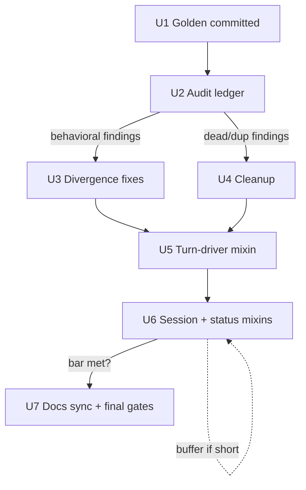

# Chat Sidebar Decomposition Verification and Completion - Plan

## Goal Capsule

- **Objective:** The sidebar-decomposition work (U15) is proven behavior-preserving by evidence that lives in the repository, every defect the evidence surfaces is fixed and pinned by a test, and `src/grc_agent/chat_sidebar.py` meets the decomposition bar of no module over 1,000 lines — so the next sidebar unit starts from verified ground instead of unverifiable claims.
- **Means:** Characterization-first remediation (KTD1): the behavioral golden is rebuilt as a committed test before any mutation, the extraction commits are audited mechanically, findings are fixed at the source, and the decomposition is completed along the established `chat/` mixin seams (KTD3).
- **Authority hierarchy:** AGENTS.md governs all work. The origin plan's sidebar-decomposition contract (`docs/plans/2026-09-02-0830-refactor-harness-lean-and-tool-contracts-plan.md`, "U15. Decompose the chat sidebar": R34, R37, KTD12, Approach, ten test scenarios, verification bar) defines intended behavior (see origin: docs/plans/2026-09-02-0830-refactor-harness-lean-and-tool-contracts-plan.md). This plan adds the review-and-remediation contract on top.
- **Stop conditions:** a remediation that would revert or re-land an already-pushed extraction commit, or that would change behavior U16 owns, stops and escalates to the user.
- **Execution profile:** `ce-work` on `main` per AGENTS.md; hermetic gates only (no LLM calls, no network in tests); no approval-gated surfaces touched.
- **Tail ownership:** this plan ends at final gates plus the docs truth-sync unit; each unit lands as its own conventionally-scoped commit.

---

## Product Contract

### Summary

Independently verify the sidebar-decomposition range `1fb1d19..20929be` — six extraction commits plus the changelog-recording range tip — and the three adjacent fix commits, using only repository-resident evidence; rebuild the lost behavioral golden as a committed test; fix every verified divergence and dead/duplicated fragment; finish the decomposition until `chat_sidebar.py` is under 1,000 lines; and bring CHANGELOG and AGENTS.md statements back in sync with verified facts.

### Problem Frame

The six extraction commits in `1fb1d19..20929be` moved six widget-owning mixins plus the constants and images leaf modules out of `chat_sidebar.py` (3,872 to 1,937 lines across the range; 4,173 was the size before U15's earlier pure-function split). Each commit message asserts a behavioral golden stayed byte-identical — but that golden was a hand-written script in an ephemeral scratchpad, never committed, so the central equivalence claim cannot be checked by anyone, ever. The commit messages also record that verification intensity varied between extractions ("lighter verification for this batch"), and one commit documents a caught monkeypatch-retarget bug alongside a claimed audit of "every other" target that nothing in the repo substantiates. CHANGELOG asserts "all of U15 except one of its own verification bars" — while one cited bar (the golden) is unverifiable rather than met, and the line-count bar is honestly recorded as unmet.

The review brief rules that no commit-message claim may be taken at face value: equivalence must be established from what is in the repository and runnable now. The review scope also includes the three fix commits that landed immediately before the range (`5b5f535` tool-status/copy unification, `6320c43` state consolidation, `e4b27eb` history-cleaning-at-source) — the report attributes them to the range, git places them just before it, and the origin plan's U15 Approach owns either way.

Research already verified some claims in code (one `_background_tasks` set with a single add/cancel path; history cleaning at the session-load and failure-recovery sites with the per-turn repair gone; both render paths reading the tool outcome field) and refuted or dented others: the streaming copy path appends thinking text bare while the history path wraps it in `<Thinking>` tags, so mid-stream and post-render copy text diverge for any reasoning turn — a direct violation of a U15 test scenario. The `'Copied!'` confirmation still has two implementations with different timeouts, the near-bottom scroll formula is written out three times, and write-only active-graph state survives: the origin plan's U7 flagged it as write-only and removed only the unreachable tooltip block that fed it, while the state and its test asserts stayed.

### Requirements

Verification and evidence:

- R1. The six extraction commits' behavioral equivalence is established by repository-resident evidence (move-only diff audit, committed golden, scenario re-runs), independent of commit-message claims.
- R2. A committed behavioral-golden test renders a fixed recorded session through the real sidebar widget tree and pins the transcript structure, tool-status markers, and copy text; any divergence fails the test.
- R3. The same golden projection, run against the pre-split sidebar at `1fb1d19` in a throwaway checkout, reports byte-identical output or an itemized diff in which every item is triaged.
- R4. Every test monkeypatch or patch target reaching into `chat_sidebar` or `chat` modules is re-verified against its real call site; stale targets are corrected.
- R5. Each U15 test scenario from the origin plan passes as an automated test or carries an itemized, justified gap note; no scenario is silently uncovered.

Correctness findings:

- R6. Every verified behavioral divergence is fixed at its source and pinned by a test in the same unit. Known instance: the streaming/history thinking-transcript copy divergence.
- R7. Verified-dead and duplicated code found by the audit is deleted or consolidated, with the deletion evidence recorded. Known instances: write-only active-graph state, triplicated scroll formula, dual `'Copied!'` machinery, stale extraction docstrings.

Decomposition completion:

- R8. No module under `src/grc_agent/chat/` and `chat_sidebar.py` itself exceeds 1,000 lines.
- R9. Extractions follow the established `chat/` conventions: the mixin pattern with host-attribute docstring contracts, an empty package `__init__`, the GTK version-pin import idiom, and no compatibility re-exports.
- R10. The golden stays byte-identical across every extraction step of the completion work.

Truth in docs:

- R11. CHANGELOG.md and AGENTS.md match post-work facts: the golden-bar claim is substantiated by R2/R3 evidence or amended to state exactly what was proven; the line-count bar claim flips to met; the AGENTS.md xvfb list carries the golden test file; no version field changes anywhere.

### Key Decisions

- KD1. Remediation is full-scope: findings are fixed, and the decomposition is completed until the 1,000-line bar is met, rather than stopping at bug fixes with the bar recorded as a known gap. (session-settled: user-directed — chosen over bug-fixes-only: the review brief says "address what you find", not limited to the documented line-count gap.) Governs R6, R7, R8.
- KD2. Lost verification evidence is rebuilt as committed tests, not ephemeral scripts. (session-settled: user-directed — chosen over a verify-only review that leaves the test surface unchanged: the lost golden is the one U15 bar that cannot otherwise be re-checked.) Governs R2, R6, R10.

### Scope Boundaries

In scope: the six range commits (`f1b930f`, `482c745`, `132f5f8`, `40c7ecd`, `d2eeefa`, `b46c690`, `20929be`); the three adjacent U15 fix commits (`5b5f535`, `6320c43`, `e4b27eb`) as audit context; the tests and docs that pin them.

#### Deferred to Follow-Up Work

- U16-owned behavior stays untouched: `search_mode` substring sniffing in the tool-label helper, codex provider magic strings, the flush-throttle heuristic, the dual font scalers, and moving blocking DB/HTTP work off the loop. These are the origin plan's next unit, deliberately scoped there.
- The full test-tree split (U18's scope): the ~99 ad-hoc sidebar constructions and ~468 private-attribute reaches in `tests/test_chat_sidebar.py` stay, except where a unit must retarget a moved symbol or fix a stale patch target.
- The four surviving complexity suppressions (`_run_agent_turn`, `_flush_streaming`, `_render_history`, `_render_last_message_rich` behind `# noqa: C901`) stay unless a unit must touch those functions anyway.

#### Outside this plan's identity

- No version bumps in `pyproject.toml`, `CITATION.cff`, or `CHANGELOG.md` (AGENTS.md §4).
- No reverting or re-landing of extraction commits; findings fix forward.
- No new user-facing features.

### Success Criteria

- The golden test exists, is committed, and is green in both GTK-gate orders; the pre-split comparison reports byte-identical output or a fully triaged diff.
- The AGENTS.md §6 gates pass: fast unit, lint, and the GTK UI suite forward and in reverse declaration order.
- No module under `src/grc_agent/chat/` nor `chat_sidebar.py` itself exceeds 1,000 lines.
- Every origin U15 scenario resolves to a passing automated test or an itemized gap note.
- CHANGELOG and AGENTS.md statements each trace to a verified fact.

---

## Planning Contract

### Key Technical Decisions

- KTD1. Characterization-first sequencing: the golden (U1) and the audit (U2) land before any source mutation, and every later unit re-runs the golden and the gates. Rationale: the situation under review is mutation ahead of verifiable evidence; repeating that order would re-create it.
- KTD2. The golden is a committed test, built new — no repo convention for byte-fixture files or regeneration flags exists to inherit. A fixed pydantic-ai `ModelMessage` session (text, thinking, tool call, failed tool, tool return) is rendered through the real widget tree under `Gtk.OffscreenWindow`, serialized into a deterministic projection — widget class, CSS classes, label texts, tool-expander labels and status markers, and copy-text accumulators — and compared against a committed literal, following the U14 precedent of pinning structure and ordering rather than geometry. The test is the first consumer of the conftest `sidebar` fixture and joins the GTK-gated xvfb list in AGENTS.md §6.
- KTD3. Completion follows the established mixin seams, and `chat_sidebar.py` remains the composition root (`__init__` plus the `_build_*` widget-tree methods stay). Three extractions carry the bulk: the turn-driver cluster (~275 lines), the session-lifecycle cluster (~360), and the status/context cluster (~270); the scroll cluster (~112) is the named buffer if the bar is not yet met. The origin plan's end state keeps the turn loop and session persistence in `chat_sidebar.py`; at current sizes that end state cannot coexist with the origin's own 1,000-line bar, and KD1 resolves the conflict in favor of the bar. The docs-sync unit records this deviation from the origin end state.
- KTD4. Equivalence evidence is mechanical first: per extraction commit, verify the deleted lines reappear verbatim in the new module modulo reference adjustments (the move-only property); deviations become findings. The pre-split byte comparison (R3) runs in a throwaway read-only checkout outside the repository, never committed or pushed. Rejected alternative: trusting the commit messages' golden claims — unverifiable by definition.
- KTD5. Findings triage is rule-based: a finding is fixed in this plan when it violates a U15 scenario, an AGENTS.md invariant, is verified-dead, or is a verified deviation from pre-split behavior surfaced by the move-only audit or the baseline comparison — that last class is never deferred. Anything else is deferred with a written rationale under Scope Boundaries. U16-owned behavior is never fixed here.

### Assumptions

- The throwaway checkout for R3 is evidence gathering, not branch topology; AGENTS.md's single-branch rule governs the repository's own history and landing surface. If the user rules otherwise, R3 degrades to the move-only audit plus the golden at HEAD, and the CHANGELOG claim is amended to say exactly what was proven.
- The pre-split baseline for R3 is `1fb1d19`: the state and behavioral fixes landed before it are U15's intent, not part of the extraction delta under test.
- Reverse-order safety extends to the new golden file through the existing conftest timer-disarm sweep; no special handling is assumed.

### High-Level Technical Design

Every arrow crossing into a source-mutating unit re-runs the golden and the AGENTS.md §6 gates; the U2 ledger is the only gate through which findings enter U3/U4, and the U6 bar check (KTD3's line budget) is the only gate into U7.

Extraction budget at HEAD (`chat_sidebar.py` = 1,937 lines):

| Cluster | Lines (approx.) | Destination |
|---|---|---|
| Turn driver + satellites | 275 | new turn-driver mixin module |
| Session lifecycle + implement-plan | 360 | new session mixin module |
| Context label, status, indexing | 270 | new status mixin module |
| Scroll cluster (buffer) | 112 | shared scroll owner if needed |
| Stays: composition root | ~920 | `chat_sidebar.py` |

---

## Implementation Units

### U1. Rebuild the behavioral golden as a committed test

- **Goal:** the lost oracle exists as a repo-resident test that fails on any rendering divergence.
- **Requirements:** R2; KD2; KTD2.
- **Dependencies:** none.
- **Files:** `tests/test_chat_sidebar_golden.py` (new); `tests/conftest.py` (only if a fixture gap forces it); `AGENTS.md` (xvfb list).
- **Approach:** build the fixed recorded session from pydantic-ai message objects in the vocabulary the sidebar renders (user text, assistant text, thinking, tool call, failed tool, tool return); render through the real sidebar in an offscreen window; serialize the deterministic projection of KTD2; commit the projection as the expected literal. Include both a mid-stream capture and a post-render capture of the same turn in the projection — that pairing is what exposes copy-path divergence.
- **Execution note:** characterization-first — this unit lands before any source mutation.
- **Test scenarios:**
  - Rendering the recorded session on HEAD matches the committed literal.
  - Two consecutive fresh-sidebar renders produce identical projections (determinism).
  - The file passes in the reverse-order GTK run (order independence).
  - A deliberately altered tool-status marker in a scratch copy of the projection makes the golden fail (failure signal verified once, not committed).
- **Verification:** golden green forward and reverse; the new file appears in the AGENTS.md §6 xvfb list.

### U2. Independent audit of the range

- **Goal:** every commit-message claim about the range becomes a ledger entry backed by repo evidence, or is refuted.
- **Requirements:** R1, R3, R4, R5; KTD4.
- **Dependencies:** U1 (the golden is the comparison instrument).
- **Files:** read-only over `src/grc_agent/chat_sidebar.py`, `src/grc_agent/chat/`, `tests/`; one throwaway checkout outside the repository for the baseline comparison.
- **Approach:** four evidence passes. First, move-only verification per extraction commit: deleted lines reappear verbatim in the new module modulo reference adjustments; deviations become findings. Second, patch-target audit: enumerate every monkeypatch/patch/setattr in the tests that reaches into `chat_sidebar` or `chat` modules and verify each names the real call site — the bug `b46c690` itself caught (a stale target silently no-oping a test) is the failure template. Third, contract pass: run the origin plan's ten U15 scenarios against the current suite and record per-scenario verdicts. Fourth, baseline comparison per R3: run the U1 projection against `1fb1d19`'s sidebar and triage every difference.
- **Test scenarios:**
  - The scenario pass reports, for each of the ten origin scenarios, the passing test name or a gap note — no silent gaps.
  - The baseline comparison reports byte-identical output or an itemized diff in which every item maps to a finding.
  - The patch audit reports every target checked with its verdict; every stale target maps to a finding.
- **Verification:** a findings ledger exists with evidence citations; every finding maps to fix-now (U3/U4), deferred-with-rationale, or refuted-with-evidence.

### U3. Fix behavioral divergences at the source

- **Goal:** every verified behavioral finding is fixed where it originates and pinned by a test.
- **Requirements:** R6; KD1; KTD5.
- **Dependencies:** U2.
- **Files:** `src/grc_agent/chat/stream_view.py`, `src/grc_agent/chat/transcript_view.py`, `src/grc_agent/chat/format.py` as findings dictate; pins in `tests/test_chat_sidebar.py` or the golden file.
- **Approach:** the known finding is the thinking-transcript divergence: the streaming accumulator appends thinking text bare while the history renderer wraps the same text in explicit thinking tags, so copy text diverges between mid-stream and post-render for reasoning turns. Fix at the source per AGENTS.md §1: one fragment builder owns the wrapped form, shared by both paths — not a harmonization applied at copy time. Remaining ledger findings follow the same rule; each fix updates the golden literal in the same commit because the fix deliberately changes pinned output.
- **Test scenarios:**
  - A turn containing thinking produces identical copy text mid-stream and after re-render (the violated U15 scenario, now automated).
  - Each additional ledger finding has a pin that fails when the fix is reverted.
  - The golden is green with the updated literal after the last fix.
- **Verification:** golden green; GTK gate forward and reverse green; every fix's pin demonstrated red before the fix.

### U4. Dead code and duplication remediation

- **Goal:** code the audit verifies as dead or duplicated is removed or consolidated.
- **Requirements:** R7; KD1; KTD5.
- **Dependencies:** U2.
- **Files:** `src/grc_agent/chat_sidebar.py`; `src/grc_agent/desktop_app.py` (the setter's one production call site); the module owning the consolidated scroll helper; `src/grc_agent/ui/code_block.py` and `src/grc_agent/chat/transcript_view.py` for the copy-confirmation decision; tests asserting deleted state.
- **Approach:** each candidate is gated on U2's verification before acting. Write-only active-graph state: the origin plan's U7 flagged it write-only, only the tooltip block it fed was removed, and its only remaining readers are test assertions — delete the state, the setter, and the asserts together, and remove the setter's one production call site along with the now-dead name/path computation feeding it. Scroll formula: three near-identical near-bottom checks collapse into one helper beside the shared threshold constant. Copy confirmation: the sidebar's single implementation meets the origin scenario; unify the code-block variant with it or share one timeout constant, and record whichever residual divergence remains and why. Stale docstrings left narrating pre-split ownership are corrected. `notify_run_failure`'s unused parameter is documented design (the agent reads the log on demand) — keep, record why.
- **Test scenarios:**
  - Every deleted symbol returns nothing from a repo-wide grep over `src/` and `tests/`.
  - The scroll helper's three former call sites preserve stick threshold and anchor-compensation behavior (golden covers the render side).
  - The copy button's confirmation reverts after one timeout, from one implementation (origin scenario).
- **Verification:** ruff clean with no new noqa; golden green; fast and GTK gates green.

### U5. Extract the turn-driver mixin

- **Goal:** the turn loop and its satellites move into `chat/` with byte-identical behavior.
- **Requirements:** R8, R9, R10.
- **Dependencies:** U1, U3, U4 (oracle and fixes first, so the extraction diff stays move-only).
- **Files:** `src/grc_agent/chat/turn_driver.py` (new); `src/grc_agent/chat_sidebar.py`; tests importing moved module-level names, retargeted per the anti-shim precedent.
- **Approach:** move the turn driver (~212 lines) with its satellites: failure notification, fix-when-free dispatch, task-done callback, and failure recovery — recovery is history-cleaning adjacent and belongs with the driver that fails. Follow the mixin convention: host-attribute docstring contract, GTK version-pin idiom, empty package init untouched, no compatibility re-exports.
- **Test scenarios:**
  - Golden byte-identical after the move.
  - A `TestModel`-driven turn exercises the deferred-approval resume loop and all three exit paths (success, cancellation, error) through the new module.
  - Cancelling a turn mid-stream leaves one busy representation cleared and no orphaned task handle (origin scenario).
  - An aborted turn persists a history that needs no repair on the next send (origin scenario).
- **Verification:** line counts re-measured; fast and GTK gates forward and reverse green; ruff clean.

### U6. Extract session-lifecycle and status/context mixins; meet the bar

- **Goal:** the remaining movable clusters leave `chat_sidebar.py` and the 1,000-line bar is met.
- **Requirements:** R8, R9, R10; KD1.
- **Dependencies:** U5.
- **Files:** `src/grc_agent/chat/session.py` (new), `src/grc_agent/chat/status_view.py` (new, names directional); `src/grc_agent/chat_sidebar.py`; tests as needed.
- **Approach:** session-lifecycle cluster (~360 lines): recent-session open, save, clear, delete, and the implement-plan handoff. Status/context cluster (~270 lines): context label, status and model-wait, indexing poll. If the bar is still short after both, apply the named buffer — the scroll cluster moves to the module that owns sticky-scroll as shared infrastructure (KTD3). Module names are directional; the implementer may adjust within the convention.
- **Test scenarios:**
  - Golden byte-identical after each extraction step (two checkpoints).
  - Loading a saved session still cleans trailing unfulfilled tool calls at the load site (origin scenario survives the move).
  - An approval batch still resolves through the extracted gate, including denial and always-accept (origin scenario).
  - Zoom projection still clamps to the readable band and preserves stick-to-bottom (origin scenario).
- **Verification:** no module under `src/grc_agent/chat/` nor `chat_sidebar.py` exceeds 1,000 lines; full gates green forward and reverse; ruff clean.

### U7. Docs truth sync and final gates

- **Goal:** the recorded claims match verified facts, and the whole bar is green one last time.
- **Requirements:** R11.
- **Dependencies:** U6.
- **Files:** `CHANGELOG.md`; `AGENTS.md`.
- **Approach:** update the U15 CHANGELOG entry: the golden-bar claim now cites the committed golden and the baseline-comparison result; the line-count bar claim flips to met with the measured numbers; the AGENTS.md §6 list is current from U1; record that the completion work deviates from the origin end state (turn loop and session persistence moved out of the root file) because the bar forced it. No version field changes anywhere (AGENTS.md §4).
- **Test expectation:** none — documentation only; the gates below and fact-check reading verify it.
- **Verification:** fast gate, lint, and GTK gate forward and reverse green; deleted-symbol greps empty; each changed docs statement traces to a verified fact.

---

## Verification Contract

| Gate | Owner | Applies | Done signal |
|---|---|---|---|
| Fast unit | AGENTS.md §6 | every unit | zero failures; no network access |
| Lint | AGENTS.md §6 | every unit | clean; no new `# noqa` |
| GTK UI | AGENTS.md §6 | U1, U3–U7 | zero failures forward and under `--reverse` |
| Golden determinism | the U1 committed test | U1, U3–U6 | byte-identical against the committed literal |
| Module budget | line count over `src/grc_agent/chat/` and `chat_sidebar.py` | U5, U6 | no module over 1,000 lines |
| Deletion closure | repo-wide grep over `src/` and `tests/` | U4, U7 | zero hits for every deleted symbol |
| Pre-split baseline | throwaway-checkout comparison per R3 | U2 | byte-identical, or itemized diff with every item triaged |

---

## Definition of Done

**Global**

- All Verification Contract gates pass at the final unit.
- The fast gate makes no network request; no test was disabled or skipped without recorded rationale and evidence.
- No version number changed in `pyproject.toml`, `CITATION.cff`, or `CHANGELOG.md`.
- No abandoned or experimental code from a discarded approach remains in the diff.
- Every finding from U2's ledger is fixed-with-pin, deferred-with-rationale, or refuted-with-evidence; none is silent.

**Per unit**

- U1: golden committed, green in both GTK-gate orders, listed in AGENTS.md §6.
- U2: ledger complete; every origin U15 scenario has a verdict; baseline comparison triaged.
- U3: every fix's pin demonstrated red before the fix; golden literal updated only where the fix deliberately changes output.
- U4: deletion greps empty; residual divergences documented rather than hidden.
- U5: golden byte-identical; turn loop exercised through the new module end to end.
- U6: bar met — no module over 1,000 lines, measured not estimated.
- U7: every changed docs statement traces to a verified fact; final full gate green.

---

## Sources / Research

- Origin contract: `docs/plans/2026-09-02-0830-refactor-harness-lean-and-tool-contracts-plan.md`, section "U15. Decompose the chat sidebar" (Goal, R34/R37/KTD12, Approach, ten test scenarios, verification bar); adjacent units U16 and U18 own the deferred work.
- Claim inventory: commit messages `f1b930f`…`b46c690` (golden claims, varied verification intensity, the caught monkeypatch-retarget bug, the pre-range fixes referenced as landed); `CHANGELOG.md` [Unreleased] U15 entries (line-count gap recorded; golden claim asserted).
- Verified code anchors: busy-state one-set (`src/grc_agent/chat_sidebar.py` `_track_background_task`/`_cancel_background_tasks`); history cleaning at the load and recovery sites; outcome read on both render paths (`src/grc_agent/chat/stream_view.py`, `src/grc_agent/chat/transcript_view.py`); thinking-transcript divergence (streaming accumulator vs history renderer); scroll formula triplication; write-only active-graph state; conftest `sidebar` fixture and widget-walk helper (`tests/conftest.py`).
- Consolidated repo research: scoped scout report over the chat package, test suite, golden precedent, and docs claims (session artifact; key findings folded into the sections above).
