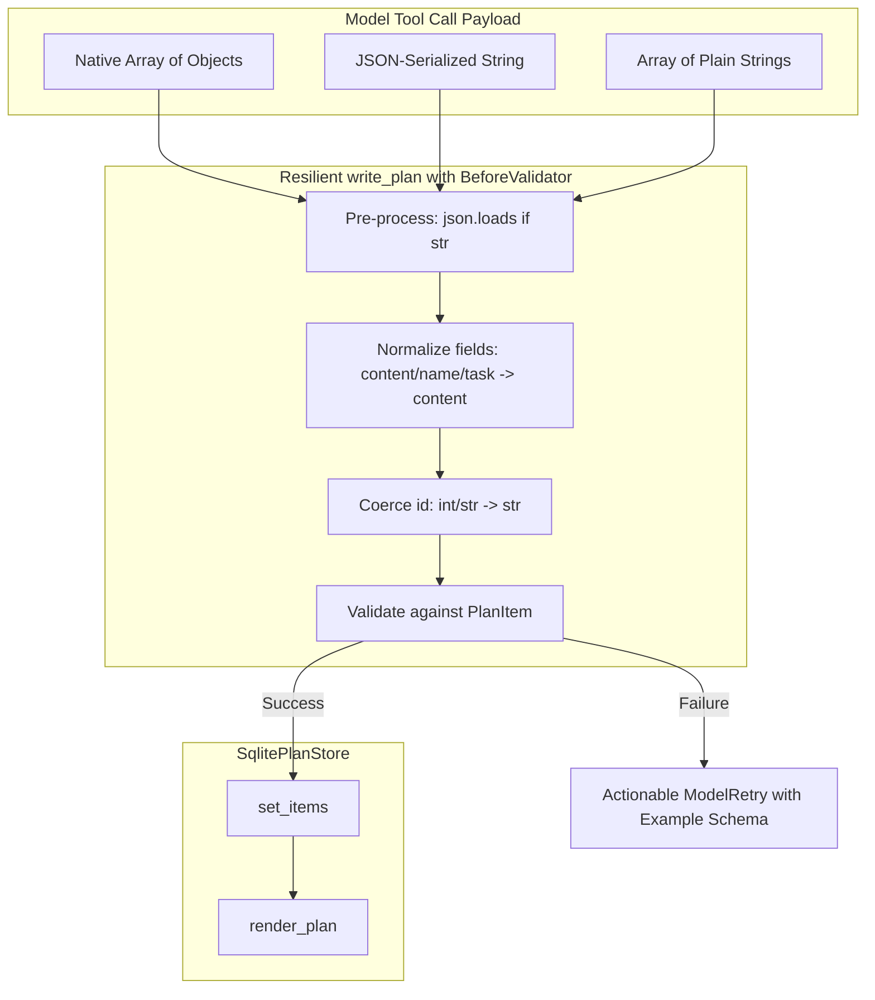
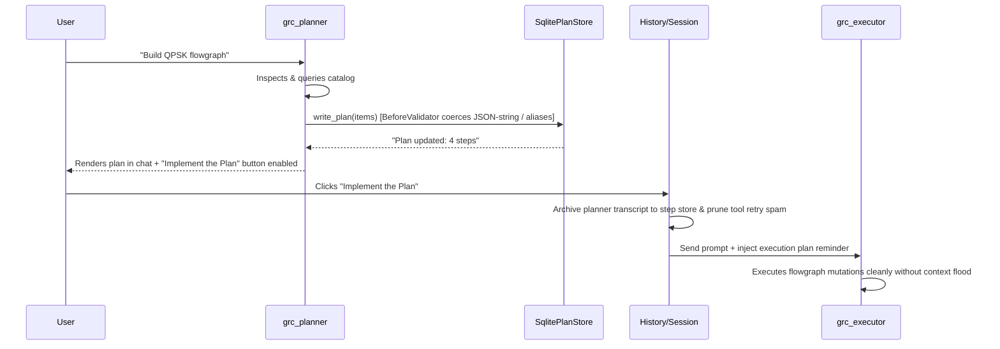

## Goal Capsule

- Objective: Eliminate session failure loops in `grc_planner` and `grc_executor` by making planning tool input parsing resilient to stringified JSON and field aliases, pruning planning tool debris on mode handoff, adding time-to-first-token transport timeouts, and providing text-plan fallback extraction.
- Means: Wrap `write_plan` with a standard Pydantic `BeforeValidator` and actionable `ModelRetry` feedback; sanitize `_message_history` when handing off from planner to executor while archiving full traces in `SqliteStepStore`; calibrate HTTP read timeouts from 1800s to 120s; and capture markdown-rendered plans into `SqlitePlanStore` when the model outputs text instead of calling tools.
- Authority Hierarchy:
  - System reliability and unblocked user workflow over rigid tool schema enforcement.
  - Standard Pydantic AI capabilities and GRC APIs over custom shadow implementations.
  - Transparent error reporting over silent truncation.
- Execution Profile: Direct test-driven implementation (`uv run pytest`).
- Stop Conditions: All non-integration tests pass, ruff passes clean, and simulated stringified/aliased tool calls validate successfully.
- Tail Ownership: Handed off directly to `ce-work` or interactive developer execution.

---

## Product Contract

### Summary

In GNU Radio Companion Agent sessions (empirically observed in session 162 with OpenRouter and `inclusionai/ling-3.0-flash-fin:free`), planner and executor workflows suffered multiple compounding failures:
1. `write_plan` was repeatedly called with escaped JSON strings (`"items": "[{\"id\": 1, \"name\": ...}]"`) and field aliases (`name` instead of `content`), which Pydantic AI rejected with a raw `list_type: Input should be a valid array` error, triggering repeated retries until exceeding `max_retries` (3) and crashing with `UnexpectedModelBehavior`.
2. When the model ultimately fell back to producing a high-quality plan in markdown prose, the harness failed to recognize or store it in `plan_items`, causing `load_plan_items` to return empty, hiding the "Implement the Plan" action button, and leaving `_execution_plan_reminder` blank for the executor.
3. When the user switched to executor mode, the executor received 29 messages and 91,082 characters of failed tool call errors and file chunk reads from the planner, flooding the context window.
4. The executor request hung indefinitely because `_HTTP_TIMEOUT["read"]` is set to 1800 seconds (30 minutes), leaving the UI frozen in "Thinking..." until the user aborted.

### Problem Frame

Modern LLM inference involves a wide spectrum of providers and open-weight models. Many models (especially Qwen, DeepSeek, GLM, Mistral, and smaller open-source models proxied through OpenRouter or Ollama) format nested JSON tool parameters as serialized strings rather than native JSON arrays/objects, or use natural synonyms like `name` or `task` instead of `content`. When the harness enforces brittle, single-type schemas without coercion, it triggers catastrophic failure loops over trivial syntax quirks. Furthermore, context is bloated with intermediate planning debris, and network timeouts are uncalibrated for interactive desktop use.

### Requirements

- R1. Permissive `write_plan` Ingestion: The `write_plan` tool must accept `items` as either a native list of objects, a JSON-encoded string representing a list of objects, or a list of plain strings, via a standard Pydantic v2 `BeforeValidator`.
- R2. Field Alias Normalization: Each plan item must accept `content`, `name`, `step`, `task`, `title`, or `description` as the item's textual content, and coerce integer or string IDs automatically.
- R3. Actionable Retry Feedback: If `write_plan` input cannot be parsed or validated, the `ModelRetry` message must explain the exact expected schema with an example, rather than returning raw Pydantic dictionary dump errors.
- R4. Clean Planner-to-Executor Context Handoff: When transitioning from Planner mode to Executor mode (or when invoking "Implement the Plan"), intermediate tool call attempts (such as failed `write_plan` retries and exploratory chunk reads) must be archived into the step store, and the active message history passed to the executor must focus strictly on the user goal and the approved plan.
- R5. Bounded Read Timeouts & Responsive Transport: The default HTTP read timeout of 1800s (30 minutes) must be replaced with a responsive timeout (e.g. 15s connect, 120s read) so dropped connections or overloaded endpoints fail fast with clear user feedback.
- R6. Text-Plan Fallback Capture: When the planner produces a structured plan in text without a successful `write_plan` call, the harness must parse and import the text plan into `SqlitePlanStore` so the "Implement the Plan" handoff and `_execution_plan_reminder` remain functional.

### Scope Boundaries

- In Scope:
  - `src/grc_agent/agent_factory.py`: `write_plan` wrapper, HTTP timeouts, and planner tool setup.
  - `src/grc_agent/chat/session.py`: Durable plan loading and executor transition.
  - `src/grc_agent/chat/history.py`: History cleaning and context hygiene across agent mode switches.
  - `tests/test_durable_planning.py` and `tests/test_separate_planner.py`: Comprehensive test coverage.
- Out of Scope:
  - Modifying upstream `pydantic-ai-harness` library internals directly (must be accomplished via wrappers and capability configurations in `grc_agent`).
  - Replacing the core SQLite schema in `chat_sessions.db`.

---

## Planning Contract

### Key Technical Decisions

- KTD1. Resilient `write_plan` Tool Wrapper with `BeforeValidator`: Use standard Pydantic v2 `BeforeValidator` (`Annotated[list[PlanItem], BeforeValidator(coerce_plan_items)]`) to automatically parse stringified JSON, map field aliases (`name`/`step`/`task` $\to$ `content`), and wrap plain strings into `PlanItem` instances before delegating to `_plan_store_resolver(ctx).set_items()`.
- KTD2. Explicit `ModelRetry` Feedback: In the validator, if input cannot be coerced into valid steps, raise `pydantic_ai.ModelRetry` with a clear template showing the expected structure: `Expected a list of plan steps, e.g. [{"content": "step description", "status": "pending"}].`
- KTD3. Context Archival and Sanitation at Mode Boundary: In `SessionMixin._implement_durable_plan`, archive the complete planner transcript to `SqliteStepStore` via `archive_transcript()`, and prune intermediate tool-failure cascades and file-chunk dumps from the active message history before handing over to the executor agent.
- KTD4. Adaptive HTTP Timeouts: Adjust `_HTTP_TIMEOUT` from `{"read": 1800.0}` to `{"connect": 15.0, "read": 120.0, "write": 60.0, "pool": 30.0}` so stalled provider connections fail within 2 minutes instead of 30 minutes, triggering Tenacity retries and notifying the user.
- KTD5. Text-Plan Fallback Parser: In `SessionMixin._show_implement_plan_if_ready`, if `load_plan_items(session_id)` is empty, parse numbered steps or markdown headings (`### Step \d+`) from the planner's final response, save them to `SqlitePlanStore`, and render the "Implement the Plan" action.

### High-Level Technical Design

### Implementation Flow: Planner to Executor Transition

### Assumptions

- The underlying `SqlitePlanStore` schema accepts standard `PlanItem` models with `id`, `content`, `status`.
- Reducing HTTP read timeout to 120s is sufficient for any normal generation and prevents indefinite app lockup.

---

## Implementation Units

### U1. Resilient `write_plan` Tool & Schema Normalization

- Goal: Make `write_plan` accept stringified JSON, list of strings, and field aliases without raising Pydantic validation errors.
- Files:
  - `src/grc_agent/agent_factory.py`
- Approach:
  - Define `coerce_plan_items(v: Any) -> list[Any]` and annotate:
    `CoercedPlanItems = Annotated[list[PlanItem], BeforeValidator(coerce_plan_items)]`.
  - In `coerce_plan_items`:
    - If `isinstance(v, str)`, parse with `json.loads(v)`.
    - If `isinstance(v, list)`, iterate through items: if string $\to$ `{"content": item, "status": "pending"}`; if dict $\to$ map `name`/`step`/`task`/`title`/`description` to `content`, coerce `id` to string.
    - If parsing completely fails, raise `pydantic_ai.ModelRetry` with a crystal-clear template: `Expected items as a list of steps, e.g. [{"content": "...", "status": "pending"}]. Please try again with this format.`
  - Register `write_plan` with parameter `items: CoercedPlanItems`.
- Test Scenarios:
  - Pass a JSON-encoded string: `'[{"id": 1, "name": "step 1"}]'` -> successfully stores `[PlanItem(id="1", content="step 1")]`.
  - Pass a list of strings: `["step A", "step B"]` -> successfully stores `[PlanItem(content="step A"), PlanItem(content="step B")]`.
  - Pass native objects with `task` or `description` -> successfully maps to `content`.
  - Pass malformed syntax -> returns actionable `ModelRetry`.

### U2. Bounded HTTP Read Timeout & Transport Health

- Goal: Prevent 30-minute GUI lockup when providers or models hang.
- Files:
  - `src/grc_agent/agent_factory.py`
- Approach:
  - Update `_HTTP_TIMEOUT = {"connect": 15.0, "read": 120.0, "write": 60.0, "pool": 30.0}`.
  - Ensure read timeouts surface as user-friendly error messages in `_format_turn_error`.
- Test Scenarios:
  - Verify `_retrying_http_client()` uses 120s read timeout instead of 1800s.
  - Timeout exceptions produce clear "Request timed out waiting for provider response. Check model status or network connection."

### U3. Planner-to-Executor History Sanitation

- Goal: Prevent 90KB+ of planner tool-trial debris from flooding the executor agent.
- Files:
  - `src/grc_agent/chat/session.py`
  - `src/grc_agent/chat/history.py`
- Approach:
  - In `session.py` (`_implement_durable_plan`), when transitioning to the executor:
    - Archive the complete planner conversation to `SqliteStepStore` via `archive_transcript()` with kind `"planner_handoff"`.
    - Clean `self._message_history` to retain the user's objective and the planner's final summary, removing failed tool retry loops and large file chunk reads.
  - Ensure the durable plan is injected fresh via `_execution_plan_reminder`.
- Test Scenarios:
  - When history contains 10 failed tool calls and directory listings from planner, `_implement_durable_plan` cleanses the history passed to executor.
  - The executor receives clean context without losing user intent.

### U4. Text-Plan Fallback Extraction

- Goal: When a planner model generates a structured markdown plan in prose but failed to call `write_plan`, allow the plan to be captured.
- Files:
  - `src/grc_agent/chat/session.py`
- Approach:
  - In `_show_implement_plan_if_ready`, if `items` is empty:
    - Inspect the last `ModelResponse` text for structured markdown steps (matching `### Step \d+ [-—–:] (.+)` or numbered lists `^\d+\.\s+(.+)`).
    - If $\ge 2$ steps are extracted, populate `SqlitePlanStore` via `store.set_items(...)`.
    - Render the "Implement the Plan" button so the handoff remains unblocked.
- Test Scenarios:
  - Model finishes turn with no `write_plan` tool call but has `### Step 1... ### Step 2...` in text -> fallback populates store and renders "Implement the Plan" button.

---

## Verification Contract

### Automated Tests

| Command | Target | Purpose |
|---|---|---|
| `uv run pytest tests/test_durable_planning.py` | Planning persistence | Verify resilient `write_plan` with stringified JSON and aliases |
| `uv run pytest tests/test_separate_planner.py` | Planner tool isolation | Verify planner and executor tool boundaries |
| `uv run pytest tests/test_chat_history.py` | History & compaction | Verify history cleaning and context pruning |
| `uv run pytest tests/test_agent_factory.py` | Agent & timeout config | Verify HTTP timeout settings and tool builders |
| `uv run ruff check` | Linting | Verify zero lint or format regressions |

---

## Definition of Done

- All stringified, aliased, or list-of-strings inputs to `write_plan` succeed cleanly.
- `UnexpectedModelBehavior` due to tool retry exhaustion on `write_plan` is eliminated.
- HTTP read timeout is bounded to 120s, eliminating the 30-minute uncancelable freeze.
- Planner-to-executor transition passes clean, focused context without 90KB+ tool debris.
- All automated unit tests pass with zero warnings or errors.
