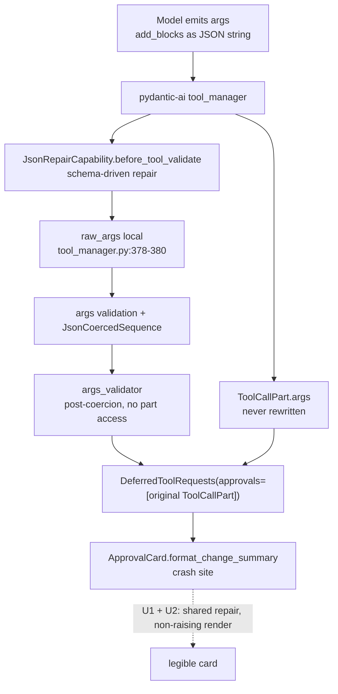
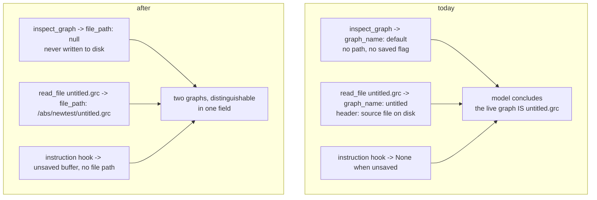

# Session-165 Harness Grounding - Plan

## Goal Capsule

- **Objective**: land the four harness defects that session 165 exposed, each with hermetic regression coverage, plus a durable audit doc that attributes every observed fault to the model or to the harness.
- **Authority**: AGENTS.md outranks this plan; user decisions recorded in Assumptions outrank inference; the session evidence in `.grc_agent/chat_sessions.db` outranks any recollection, this document included.
- **Execution profile**: evidence-first. Every unit's claim is already verified against installed code (pydantic-ai 2.37.0, pydantic-ai-harness 0.28.0); re-verify before changing behavior, never re-derive from memory.
- **Stop conditions**: a fix that would need new prompt folklore, a schema migration beyond the authorized `run_tools` drop, or a change to model/provider selection. Stop and ask.
- **Tail ownership**: the implementer runs the three AGENTS.md section 6 gates and writes the CHANGELOG entry; no version bump.

---

## Product Contract

### Summary

Session 165 (2026-09-08 16:43-16:49 UTC, OpenRouter `inclusionai/ling-3.0-flash-fin:free`, project `newtest`) ended in `Agent Error: 'str' object has no attribute 'get'` with zero graph mutations. The agent made real mistakes, but every one of them hit a guard that held. The turn died on the one path that has no guard at all, after the harness had withheld the single fact the agent most needed: that the live graph and `newtest/untitled.grc` are two different graphs.

This plan fixes the four harness faults, leaves the model faults alone, and records the attribution.

### Problem Frame

Three harness properties combined into the failure:

1. The approval card renders the model's raw, un-repaired arguments. The project already repairs JSON-stringified composites for validation, but pydantic-ai keeps that repair in a local and hands the card the original `ToolCallPart`. `change_graph` is the only approval-gated tool with nested list-of-dict args, so it is the only tool on that path.
2. Nothing in the model-facing surface distinguishes the live in-memory flowgraph from a same-named `.grc` on disk. `inspect_graph` returns no file identity, and the one instruction hook that would have said so returns `None` precisely when the graph is unsaved.
3. `read_file` accepts `offset`/`limit` on a `.grc` path, discards them without a word, and returns a byte-identical payload every time.

And one consequence rather than a cause: when the turn died, the failure-recovery path overwrote the only persisted copy of the response that carried the crash-triggering call, so the DB records a completed run and no failure at all.

### Requirements

**Attribution and record**

- R1. The post-mortem lands in `docs/investigation/` with per-claim `file:line` evidence, the model-vs-harness attribution table, and the corrections to the initial reading of the session.
- R2. The CHANGELOG records the fixes under the existing `## [Unreleased]` heading, with no version number touched anywhere.

**Approval-path integrity**

- R3. A JSON-stringified composite argument never raises out of approval-card rendering, and never renders one bullet per character.
- R4. The JSON-argument repair rule has exactly one implementation, shared by the validation hook and the card.
- R5. An argument element that is still not a mapping after repair is rendered literally rather than skipped, so the user sees exactly what the model proposed.

**Graph identity**

- R6. Every `inspect_graph` payload states the graph's file identity: an absolute path, or explicit null for a graph that has never been written to disk.
- R7. Both agents are told on every turn whether the active flowgraph is an unsaved buffer or a file on disk. The hook never returns nothing.
- R8. Both system prompts carry the live-graph-versus-file-on-disk contract, since it is unobservable from the tool schemas.

**Read honesty**

- R9. A `.grc` read that was given `offset` or `limit` discloses in its header that they did not apply.
- R10. `read_file`'s docstring and generated schema stop advertising `offset`/`limit` as unconditional.

**Observability**

- R11. A client-side turn failure is recorded in the step store with the same text the user saw.
- R12. The at-failure history is archived before the salvage drops a trailing unapproved tool call.
- R13. `sessions.grc_file_path` stops recording a fabricated absolute path for an unsaved tab.
- R14. The orphaned `run_tools` table is gone from the DB file.

### Scope Boundaries

**Out of scope**

- Making the QPSK/BER flowgraph work. The session was a deliberate stress test; the request is not the deliverable.
- Prompt changes aimed at the model faults (F5-F10 in the audit). The `.grc` write ban already exists verbatim in `prompts.py:60` and both guards fired; adding emphasis is folklore, which AGENTS.md section 1 forbids.
- Model, provider, or model-settings changes.

**Deferred to follow-up work**

- Making chats held on unsaved tabs reopenable (user decision: honesty fix only this pass). Those sessions stay unreachable from Recent because `get_recent_sessions` filters on `exists()` (`db.py:327`) and loading rejects a missing file (`chat/session.py:275`). R13 stops the fabrication; it does not restore reachability.
- File logging. The `_log.exception("agent run failure")` traceback that would have named the crashing tool went to the terminal, because `src/grc_agent/` configures no `basicConfig` and no `FileHandler` anywhere. R11 covers the user-visible message; the full traceback stays terminal-only.
- Two upstream reports, no local change: `tool_effects` rows stay at `status='started'` for `ModelRetry`-terminated calls because `pydantic_ai/tool_manager.py:469-470` re-raises without calling `on_tool_execute_error`; and `pydantic-ai`'s deferred-approval path hands out un-repaired args (the root cause behind U2).

### Sources

Evidence, all verified in-session rather than recalled:

- Session record: `.grc_agent/chat_sessions.db` - `sessions` row 165, 3 `runs`, 82 `events` (seq 1625-1706), 18 `snapshots` (seq 429-446), 22 `tool_effects`, 3 `plan_items`. Full dump preserved outside the repo during the investigation.
- Crash reproduced against the real module: `ui/approval_card.py:38` raises `AttributeError: 'str' object has no attribute 'get'` for `{"add_blocks": "[{...}]"}`; `:64` for `update_params`; `:106` for `update_states`; the three connection/block-list families render one bullet per character instead.
- pydantic-ai 2.37.0: repair is assigned to the local `raw_args` (`tool_manager.py:378-380`); the approval request carries the original part (`_tool_execution.py:942, 953, 977`; `result.py:1069-1083`); `args_validator` runs after coercion (`tool_manager.py:329-340`), so it cannot help the card. Context7-confirmed against the current `capabilities/custom.md` hook table: `before_tool_validate` is contractually return-value based.
- pydantic-ai-harness 0.28.0: snapshots are gated on `is_provider_valid` (`step_persistence/_capability.py:288, 544`), which is why the run's final response was never snapshotted; `run_completed` is emitted on the result path (`:298`), so it is honest; `StepStore.append_event` is public API and `EventKind` is a closed 9-value Literal whose docstring sanctions recording a correction as a follow-up event (`_types.py:11-27`, `_store.py:162`).

---

## Planning Contract

### Key Technical Decisions

- KTD1. **Repair the args in one shared pure function; do not write repaired args back onto the `ToolCallPart`.** Writing back is possible - `ToolCallPart` is a non-frozen dataclass (`pydantic_ai/messages.py:2287`) and `after_tool_validate` receives the part - but it would overwrite the model's literal output in the recorded history. This entire post-mortem depended on the DB holding `{"targets": "[\"samp_rate\"]"}` verbatim. The history stays the forensic record; the renderer normalizes what it renders.
- KTD2. **The card is the last line of defence before a human consents, so it must be structurally non-raising.** Repair first, then render any element that is still not a mapping as its literal value. Never omit it - silent omission of a proposed change is exactly the AGENTS.md section 3 failure the card exists to prevent.
- KTD3. **Source `inspect_graph`'s file identity from `flow_graph.grc_file_path`.** It is GRC's own field, kept current by every path that matters: GRC's load (`core/platform.py:87, 438`), GRC's save/save-as (`gui/Application.py:675, 692`), our save (`native_canvas.py:615`), our loader (`adapter/graph.py:223`), and the manual-edit re-baseline (`native_canvas.py:1142`). It is `''` for a never-saved graph. This keeps the fix inside the payload producer, needs no deps-protocol change, works for bare-`FlowGraph` test doubles, and - because `fs_tools`' `.grc` reads run through the same engine - makes the live payload and the on-disk payload self-distinguishing in the same field.
- KTD4. **Read the active path through the declared deps surface, not the private `_canvas_manager` probe.** `deps.py:11-20` states the Protocol exists so tools stop probing their dependency with `getattr`; `agent_factory.py:1009` does exactly that today. `FlowgraphDeps.__getattr__` forwards to the live `FlowGraph`, so `grc_file_path` is a declared access, and the "no flowgraph open" `RuntimeError` from `NativeFlowgraphProxy._get_target` is the one case where returning nothing is truthful.
- KTD5. **Disclose the dropped paging in the existing header rather than rejecting the call.** A `ModelRetry` would burn retry budget and withhold the payload the model actually needs. One uniform sentence for all `.grc` paths, appended to the header that already names the engine and source (`fs_tools.py:322-325`).
- KTD6. **Record the turn failure through `archive_transcript` plus one appended `run_failed` event.** `db.py:187-227` already registers a standalone run and snapshot for three kinds (compaction, handoff, truncated-thinking); a fourth kind is one uniform rule, needs no table and no schema change. Attaching the `run_failed` event to that archive run - rather than to the harness-owned agent run - keeps us from fabricating events on a run we do not own, and `EventKind` has no custom value to invent.
- KTD7. **Canonicalize the session path at the producer, not in `save_session`.** `db.py:496` `Path(...).resolve()`s whatever it is handed, which turns `chat_sidebar.py:698`'s non-path sentinel into a fabricated absolute path. The caller is the only layer that knows whether it holds a filesystem path, so it resolves; the store writes what it is given. No magic-string branch on `untitled:` anywhere.
- KTD8. **Drop `run_tools` with an idempotent `DROP TABLE IF EXISTS` in `init_db`.** There is no app-level schema-version mechanism to hang a migration on - `_meta.schema_version` belongs to the harness's `SqliteStepStore` and must not be touched. `IF EXISTS` is the guard, and the index dies with the table. User authorized discarding the rows.

### High-Level Technical Design

Where the model's arguments go, and where the repair currently stops:

The two identity channels the model reads, before and after:

### Assumptions

- User decision: the 140 `run_tools` rows may be discarded outright ("everything can be discarded, no data is needed").
- User decision: for unsaved tabs, stop fabricating the path only. Reopenability is deferred.
- The crash's exact trigger is inferred, not proven from the session record: the response carrying it was never snapshotted (`is_provider_valid` gate) and the failure-recovery salvage dropped it from `sessions.messages`. What is proven is that the shape reproduces verbatim on the installed code, that `change_graph` is the only approval-gated tool that can produce it, and that this model stringified every composite argument it sent all session. The audit doc must say exactly this and no more.

### Sequencing

U1 precedes U2 (shared function first). U3, U4, U5 are independent of each other and of U1/U2. U6, U7, U8, U9 are independent. U10 lands last, after the fixes it describes exist.

---

## Implementation Units

| U-ID | Title | Key files | Depends on |
|---|---|---|---|
| U1 | One home for the JSON-argument repair rule | `src/grc_agent/json_args.py`, `src/grc_agent/agent.py` | - |
| U2 | Approval card renders repaired args and cannot raise | `src/grc_agent/ui/approval_card.py` | U1 |
| U3 | `inspect_graph` states the graph's file identity | `src/grc_agent/adapter/graph.py` | - |
| U4 | The active-flowgraph instruction hook always speaks | `src/grc_agent/agent_factory.py` | - |
| U5 | Live-graph-versus-disk contract in both prompts | `src/grc_agent/prompts.py` | - |
| U6 | `.grc` reads disclose dropped paging arguments | `src/grc_agent/fs_tools.py` | - |
| U7 | Client-side turn failures are recorded | `src/grc_agent/db.py`, `src/grc_agent/chat/turn_driver.py` | - |
| U8 | Session paths stop being fabricated | `src/grc_agent/db.py`, `src/grc_agent/chat_sidebar.py` | - |
| U9 | Orphaned `run_tools` table dropped | `src/grc_agent/db.py` | - |
| U10 | Audit write-up and CHANGELOG | `docs/investigation/`, `CHANGELOG.md` | U1-U9 |

### U1. One home for the JSON-argument repair rule

- **Goal**: one importable, GTK-free implementation of "decode a JSON-stringified composite argument", usable by both the validation hook and any renderer.
- **Requirements**: R4
- **Dependencies**: none
- **Files**: `src/grc_agent/json_args.py` (new), `src/grc_agent/agent.py` (moves out `coerce_json_sequence`, the mapping coercer, `_is_composite_schema`; `JsonRepairCapability.before_tool_validate` delegates), `tests/test_agent_factory.py` or a new `tests/test_json_args.py`
- **Approach**: move the existing pure pieces verbatim into the new module and add `repair_json_args(args, properties=None)` carrying the per-key loop that `before_tool_validate` (`agent.py:264-290`) holds today. With `properties`, behavior is byte-identical to today's schema-driven gate via `_is_composite_schema`. With `properties=None`, the same bracket-matching rule applies to every key - one rule, no per-field list, no magic-string branch. The capability stays in `agent.py`; only the rule moves. Keep the top-level-string branch (`args` arriving as a whole JSON string) inside the shared function so both callers get it.
  A new module rather than an import edge from `ui/` into `agent.py`: `agent.py` pulls `adapter` and thus GRC's platform, and `ui/approval_card.py` is imported directly by `tests/test_chat_sidebar.py`. The rule is a shared kernel with no dependencies of its own.
- **Patterns to follow**: the existing `BeforeValidator` shape (`agent.py:100`) and the omission-honesty convention in `adapter/graph.py`.
- **Test scenarios**:
  - Schema-driven mode is unchanged: a composite-typed key holding `"[{\"a\": 1}]"` is decoded; a `string`-typed key holding the same text is left alone.
  - Schema-free mode decodes every bracket-matching string value and leaves scalars, non-bracketed strings, and already-decoded lists untouched.
  - A malformed JSON string (the session's real `write_plan` payload shape - a valid array followed by `, "warnings": []}`) is returned unchanged rather than raising, so the caller's own validation reports it.
  - Nested one level: a list whose elements are themselves JSON strings is decoded elementwise.
  - `args` arriving as a whole JSON string is parsed, and a non-dict result is returned as-is.
  - `repair_json_args` does not mutate its input argument in place (the caller's dict is the recorded history).
- **Verification**: `agent.py` imports the rule and defines none of it; the existing `change_graph`/`write_plan` coercion tests still pass unchanged.

### U2. Approval card renders repaired args and cannot raise

- **Goal**: a legible approval card for every argument shape the session's model actually emitted, and no path from card rendering to a dead turn.
- **Requirements**: R3, R5
- **Dependencies**: U1
- **Files**: `src/grc_agent/ui/approval_card.py`, `tests/test_chat_sidebar.py`
- **Approach**: apply `repair_json_args` where model args enter the renderer - the `call.args_as_dict()` read in `ApprovalCard.__init__` (`:190`) and the `format_tool_summary` entry point, so both the widget and the pure formatter are covered. Then make the three field-aware renderers tolerate a non-mapping element: `_add_blocks_lines` (`:34-51`), `_update_params_lines` (`:54-67`), and the `update_states` comprehension (`:104-110`) render such an element as its literal value on one bullet instead of calling `.get()` on it. The connection and block-name groups already stringify, so they only needed the repair. Correct the comment at `:30-33`, which currently claims the card renders the tool's own `model_dump()` output - it renders pre-validation model args.
- **Patterns to follow**: the uniform per-field fallback at `:154-161`, which is already non-raising; keep its `str(value)` + 300-char cap shape for the literal case.
- **Test scenarios**:
  - Each of the six `change_graph` argument families arrives as a JSON string and renders real content: `add_blocks`, `update_params`, `update_states`, `add_connections`, `remove_connections`, `remove_blocks`. Assert no raise and assert on the rendered names/values.
  - `{"add_connections": "[\"a:0->b:0\"]"}` renders exactly one connection bullet with the arrow, not one bullet per character (regression for the garble).
  - A list containing a JSON-string element (`["{\"instance_name\": \"x\", ...}"]`) renders the block, not a literal.
  - An element that survives repair as a non-mapping (a bare `"src0"` in `add_blocks`) renders literally and is not dropped.
  - `ApprovalCard` construction with the reproduced crash payload does not raise (widget-level, under xvfb).
  - Existing assertions stay green: `tests/test_chat_sidebar.py:34` (`test_change_summary_formatter`, including `"?" not in text` at `:62`, the absent-`instance_name` case at `:129`, and `_No changes in this batch._` at `:130`), `:3480` dispatch, `:3503` per-tool card titles.
- **Verification**: feeding the exact reproduced payload through `ApprovalCard` yields a card whose summary names the blocks; nothing reaches `chat/errors.py:106`.

### U3. `inspect_graph` states the graph's file identity

- **Goal**: the model can tell an unsaved live graph from a same-named file in one payload field.
- **Requirements**: R6
- **Dependencies**: none
- **Files**: `src/grc_agent/adapter/graph.py`, `tests/test_adapter_graph.py`, `tests/test_fs_tools.py`
- **Approach**: add `file_path` to the payload the inspection builds (`adapter/graph.py:802-812`), sourced from `flow_graph.grc_file_path` and emitted as an absolute path or `null`. `null` means "never written to disk" - state that in the tool docstring so the meaning is not left to inference. Keep `graph_name` exactly as it is: it is truthfully the options block's `id` (`"default"` for a fresh page, from GRC's own `default_flow_graph.grc`), and the new field is what carries identity. This field is unconditional, unlike the `omitted_*_count` keys - a missing identity is precisely the failure being fixed.
- **Patterns to follow**: the payload assembly at `adapter/graph.py:802-812` and its deterministic ordering.
- **Test scenarios**:
  - A never-saved `FlowGraph` (`grc_file_path == ''`) inspects to `file_path: None`.
  - A flowgraph loaded from a file inspects to that file's absolute path.
  - The same graph saved to a new path reports the new path on the next inspection.
  - Targeted inspection (`targets=[...]`) carries the same `file_path`.
  - `fs_tools`' `.grc`-read payload for a non-active file carries that file's path, so a live payload and an on-disk payload of the same-named graph differ in this field (the session's exact collision).
  - Existing shape assertions stay green: `tests/test_adapter_graph.py:28`, `:40`, `:906` (deterministic payload), `:982-990` (no zero counters, no empty port lists).
- **Verification**: a fresh page and `newtest/untitled.grc` produce payloads that differ in `file_path`.

### U4. The active-flowgraph instruction hook always speaks

- **Goal**: silence stops being the harness's answer to "what is the active flowgraph".
- **Requirements**: R7
- **Dependencies**: none
- **Files**: `src/grc_agent/agent_factory.py`, `tests/test_agent_factory.py`
- **Approach**: rewrite `add_active_flowgraph_context` (`:1007-1015`) so it returns a line in both states: the file path when the graph has one, and an explicit "unsaved buffer, no file path - a `.grc` in the project directory is a different graph" when it does not. Read the path off the declared deps surface (`ctx.deps.grc_file_path`, forwarded to the live `FlowGraph`) instead of `getattr(ctx.deps, "_canvas_manager", None)`. Return `None` only for the genuinely-nothing case: `ctx.deps is None`, or the "No flowgraph is open" `RuntimeError` that `NativeFlowgraphProxy._get_target` raises when there is no page. Both agents keep the hook (`:1014-1015`).
- **Patterns to follow**: the source vocabulary already used by `fs_tools.py:317-321` - reuse its wording for the unsaved case so the two channels speak the same language.
- **Test scenarios**:
  - Unsaved graph (`grc_file_path == ''`): the hook returns a non-`None` line that names the unsaved-buffer state.
  - Saved graph: the hook returns the path, as today.
  - `ctx.deps is None`: returns `None`.
  - Deps that raise the no-flowgraph-open `RuntimeError`: returns `None`, does not propagate.
  - The hook is registered on both the executor and the planner (the planner is where the session's confusion started).
- **Verification**: this hook has no test coverage today (`grep` for `add_active_flowgraph_context` in `tests/` returns nothing); it has some after this unit.

### U5. Live-graph-versus-disk contract in both prompts

- **Goal**: state the one thing the tool schemas cannot express.
- **Requirements**: R8
- **Dependencies**: none
- **Files**: `src/grc_agent/prompts.py`
- **Approach**: one sentence in `build_system_prompt` and the same in `build_planner_prompt`: the active flowgraph lives in memory and may have no file at all; a `.grc` file in the project directory is a separate graph even when its name matches. This is an unobservable harness contract, which AGENTS.md section 4 sanctions - it does not enumerate tools and it does not restate a guard. Do not add a second `.grc`-write ban to the planner: the planner's allowlist (`agent_factory.py:99-111`) makes writing structurally impossible, so a ban there would be folklore.
- **Test scenarios**: `Test expectation: none - prose-only change.` Covered indirectly by the prompt-size assertions if any exist; otherwise verified by reading the built prompt.
- **Verification**: both built prompts contain the sentence; the executor prompt keeps `prompts.py:60` unchanged.

### U6. `.grc` reads disclose dropped paging arguments

- **Goal**: a model that asks for fewer lines of a `.grc` learns why it got the same payload again.
- **Requirements**: R9, R10
- **Dependencies**: none
- **Files**: `src/grc_agent/fs_tools.py`, `tests/test_fs_tools.py`
- **Approach**: `read_file` (`:274-308`) tells `_inspect_grc_file` (`:310`) whether paging arguments were supplied, and the header (`:322-325`) gains one clause when they were: they did not apply, because a structural view has no lines. Same clause for all three source labels - one rule. Then fix the schema the model reads: the docstring's unconditional `offset`/`limit` lines (`:290-293`) say that `.grc` paths return a structural view where neither applies, and point at `inspect_graph(targets=[...])` for a narrower view of the active graph. Do not raise: the payload is what the model wanted, and a `ModelRetry` would spend budget to deliver less.
- **Patterns to follow**: the harness's own explicit paging notice (`filesystem/_toolset.py:137`) and the existing `output_truncated` honesty convention.
- **Test scenarios**:
  - `read_file("x.grc", limit=5)` returns a header naming the ignored paging; `read_file("x.grc")` returns the header unchanged from today.
  - `offset` alone, `limit` alone, and both together all disclose.
  - The disclosure appears for all three source labels (live in-memory, active file on disk, other file on disk).
  - The payload body is byte-identical with and without paging arguments - the disclosure is the only difference.
  - A non-`.grc` text read is untouched: `tests/test_fs_tools.py:94-108` (`Use offset=5`, the 1000-line cap, the `[notes.txt | 3 lines | hash:` header) still passes.
  - Existing `.grc` header assertions stay green: `:146-148`, `:172`, `:178`, `:184`.
- **Verification**: three reads at `limit=50/10/5` - the session's exact sequence - each disclose, instead of returning three identical payloads in silence.

### U7. Client-side turn failures are recorded

- **Goal**: when the user sees `Agent Error`, the database says so too, and the messages that caused it survive.
- **Requirements**: R11, R12
- **Dependencies**: none
- **Files**: `src/grc_agent/db.py`, `src/grc_agent/chat/turn_driver.py`, `tests/test_session_persistence_advanced.py` (or `tests/test_db_sessions.py`)
- **Approach**: add one `db.py` helper beside `archive_transcript` (`:187-227`) that archives a list of messages as a `turn_failure_transcript` run and appends a `StepEvent(kind='run_failed', error=<the text the user saw>)` to that archive run, with the failing agent name in `metadata`. `kind` comes from the closed `EventKind` Literal - there is no custom kind to invent, and the type's own docstring sanctions recording a correction as a follow-up event. The archive run is ours, so no event is fabricated on a harness-owned run, and the shared `conversation_id` means the existing per-conversation sweep already prunes it.
  Call it from the `except Exception` path in `_run_agent_turn` (`turn_driver.py:332-350`), with the pre-clean `active_run.all_messages()` - before `_recover_history_after_failure` (`:335`) runs `_clean_message_history_for_new_turn`, which pops the trailing response carrying the unapproved call. That pop's own comment says the calls "stay recoverable in the step-store snapshots"; for this failure shape they are not, because every snapshot is gated on `is_provider_valid` (`step_persistence/_capability.py:288, 544`) and a history ending in an unresolved tool call is not provider-valid. Correct that comment too. The recording must never mask the original error: wrap it, log on failure, and let the user-facing error text through unchanged.
- **Patterns to follow**: `_archive_truncated_thinking` (`chat_sidebar.py:700-719`) - same archive call, same swallow-and-log posture, same `conversation_id_for_session` grouping.
- **Test scenarios**:
  - A turn whose approval step raises records exactly one `run_failed` event whose `error` matches what `_format_turn_error` produced, under the session's `conversation_id`.
  - The archived snapshot retains the trailing `ModelResponse` with its unapproved `ToolCallPart`, including the raw un-repaired args (the forensic requirement from KTD1).
  - The active history still gets cleaned and saved, so the next turn starts legally - existing behavior unchanged.
  - A store failure during recording does not change the error the user sees and does not raise out of the failure path.
  - `_clean_message_history_for_new_turn` behavior itself is unchanged (`tests/test_chat_history.py`).
- **Verification**: replaying the session-165 shape leaves a `run_failed` event and a `turn_failure_transcript` run carrying the crash-triggering args, where today the DB shows `run_completed` and nothing else.

### U8. Session paths stop being fabricated

- **Goal**: the `sessions` table records a path that exists or a sentinel that is honest - never a resolved fiction.
- **Requirements**: R13
- **Dependencies**: none
- **Files**: `src/grc_agent/db.py`, `src/grc_agent/chat_sidebar.py`, `tests/test_db_sessions.py`
- **Approach**: move canonicalization to the only layer that knows it holds a filesystem path. `_get_effective_path` (`chat_sidebar.py:689-698`) resolves `cm.path` and returns the `untitled:<title>` sentinel verbatim; `save_session` (`db.py:496`) stores what it is given. No branch on the sentinel's spelling anywhere - the producer decides, the store obeys.
- **Test scenarios**:
  - An unsaved tab's session row stores `untitled:<title>` exactly, with no directory prefix and no `resolve()` applied.
  - A saved tab's session row stores the resolved absolute path, as today.
  - `get_recent_sessions` still filters the sentinel row out (unchanged behavior, per the deferred decision) and still lists real paths.
  - The existing sentinel-format assertions stay green: `tests/test_chat_sidebar.py:1733`, `tests/test_session_persistence_advanced.py:689-690`.
  - `tests/test_db_sessions.py:26-45` recency/lookup assertions still pass; update only the assertions that were asserting store-side resolution rather than ordering.
- **Verification**: a new session on an unsaved tab writes no absolute path that does not exist.

### U9. Orphaned `run_tools` table dropped

- **Goal**: no table in the DB file that nothing writes, nothing reads, and no sweep prunes.
- **Requirements**: R14
- **Dependencies**: none
- **Files**: `src/grc_agent/db.py`, `tests/test_session_persistence.py`
- **Approach**: one idempotent `DROP TABLE IF EXISTS run_tools` in `init_db` (`:108-152`), beside the existing sweeps. There is no app-level schema-version to bump - `_meta.schema_version` belongs to the harness's `SqliteStepStore` and stays untouched - so `IF EXISTS` is the guard and the index drops with the table. Verified dead: no writer in `src/`, nothing in `git log -S"run_tools"`, and a fresh `SqliteStepStore` on harness 0.28.0 creates only `runs`, `events`, `snapshots`, `tool_effects`.
- **Test scenarios**:
  - `init_db` on a DB seeded with a `run_tools` table and rows leaves no such table.
  - `init_db` on a fresh DB is a no-op for this statement and creates no `run_tools`.
  - `init_db` is still idempotent across repeated calls.
  - Extend `tests/test_session_persistence.py:304`, which asserts only that the four harness tables are present, to also assert `run_tools` is absent.
- **Verification**: the live DB has no `run_tools` after the app next opens it.

### U10. Audit write-up and CHANGELOG

- **Goal**: the attribution survives this session, with enough evidence for a reader to re-derive it.
- **Requirements**: R1, R2
- **Dependencies**: U1-U9
- **Files**: `docs/investigation/audit-session-165-approval-crash-and-graph-identity.md` (new), `CHANGELOG.md`
- **Approach**: follow the existing convention in that directory (`audit-a-lost-details-lean.md`, `grounding-fix-options-sessions-150-151.md`): an executive summary table, a verified-facts section where every claim carries `file:line` or a DB table and seq, then the attribution table splitting harness faults from model faults, then the three corrections to the initial reading of the session:
  1. `save_graph` handled the name collision correctly and was never called this session - `resolve_save_target` (`adapter/graph.py:891-930`) walks to `untitled(1).grc`, regression-tested at `tests/test_save_graph_tools.py:328-355`. The 14,759-byte file was never at risk. What went wrong was reasoning, not writing.
  2. The `.grc` reroute is not silent - the header names the engine and the source. Only the dropped `offset`/`limit` were silent.
  3. `run_completed` is honest: `DeferredToolRequests` is a declared final output (`agent_factory.py:945`), so the run really did complete. What is missing is any record of the turn failure that followed.
  Also correct, against the record: the model reached for `write_file` both times, not `edit_file` (both are denied identically, `fs_tools.py:262-263` via `:363-365` and `:407-409`); nothing in the prompts warns about `^` versus `**`, so the invented `10^(-esn0_db/10)` was unguarded rather than warned-against; and the crash-triggering `change_graph` args are absent from the DB, so the trigger is a reproduction, not a recovered artifact.
  Then the CHANGELOG entry under `## [Unreleased]`, `### Fixed`, linking this plan. No version number anywhere.
- **Test scenarios**: `Test expectation: none - documentation.`
- **Verification**: every `file:line` in the doc resolves in the post-fix tree, or is explicitly marked as a pre-fix citation.

---

## Verification Contract

| Gate | Command | Applies to |
|---|---|---|
| Fast unit gate (hermetic: no LLM, no network) | `uv run pytest tests/ --ignore=tests/test_integration.py --ignore=tests/test_button_integration.py` | every unit |
| Lint | `uv run ruff check` | every unit |
| Display-dependent GTK suites | `xvfb-run -a uv run pytest tests/test_chat_sidebar.py tests/test_chat_sidebar_golden.py tests/test_native_canvas.py tests/test_desktop_app.py tests/test_session_persistence_advanced.py tests/test_context_compaction.py` | U2, U7, U8 |
| Reproduction closed | The exact `{"add_blocks": "[{...}]"}` payload renders a legible card instead of raising `AttributeError` | U2 |
| Identity check | A fresh page and `playground/experiment_read_files/newtest/untitled.grc` produce `inspect_graph`/`read_file` payloads that differ in `file_path`, and the instruction hook names the unsaved buffer | U3, U4 |

The golden transcript (`tests/test_chat_sidebar_golden.py`) pins committed literals; if U2 or U7 moves them, the change must be deliberate and explained in the CHANGELOG rather than re-baselined silently.

Live-model checks, if any are run at all, go to Ollama Cloud only - never a local Ollama endpoint.

---

## Definition of Done

- All three AGENTS.md section 6 gates pass with zero failures and zero lint errors; no test disabled or skipped without written rationale.
- R1-R14 are each satisfied by code plus at least one hermetic test, except R2 and R8 (documentation and prose).
- The reproduced crash payload renders a card; the six `change_graph` argument families each render real content when stringified.
- `inspect_graph` carries `file_path`; the instruction hook returns a line in every state a real canvas can be in; both prompts carry the live-versus-disk sentence.
- A `.grc` read given `offset` or `limit` says so; the docstring no longer advertises them unconditionally for `.grc`.
- A client-side turn failure leaves a `run_failed` event and an archived transcript retaining the unapproved call's raw args.
- No `sessions` row records a resolved non-path; no `run_tools` table remains after `init_db`.
- The audit doc exists with per-claim evidence and the attribution table; the CHANGELOG entry links this plan; no version number changed in `pyproject.toml`, `CITATION.cff`, or `CHANGELOG.md`.
- No dead-end or experimental code left behind: the investigation's scratch reproductions stay outside the repo.
