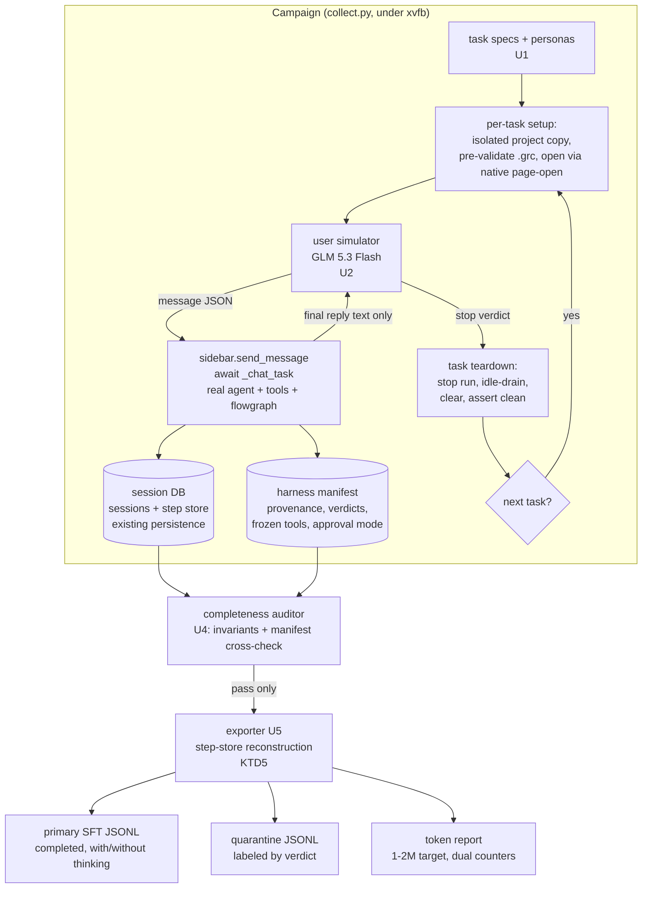
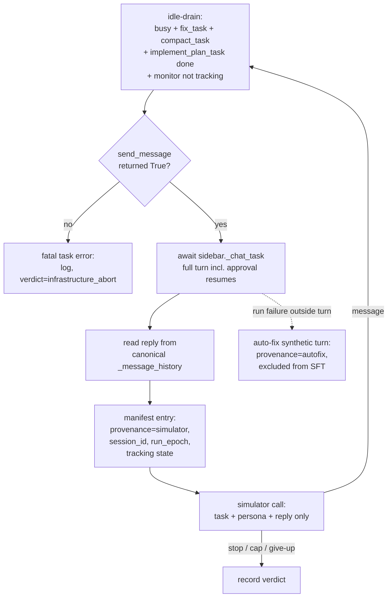

# GRC Agent Fine-Tuning Dataset Collection Harness - Plan

## Goal Capsule

- **Objective:** Anyone on the team can produce a verified fine-tuning dataset of complete GRC-agent conversation traces (system instructions, user turns, assistant replies, thinking, tool calls with arguments and outputs, approvals, usage) by running one campaign command — with recording completeness proven by an auditor, not assumed, and the export directly loadable by Unsloth with no reformatting.
- **Means:** An `experiments/`-based harness drives the real desktop app end-to-end under a virtual display; an Ollama Cloud GLM 5.3 Flash LLM role-plays the user for ~15 seeded tasks (KTD1, KTD6).
- **Authority hierarchy:** `AGENTS.md` invariants > this plan's KTDs > unit approaches. Repo test gate (`AGENTS.md` §6) applies unchanged.
- **Stop conditions:** All units complete; the fault-injected dry run is caught by the auditor end-to-end; the real-DB validation mode passes; exported JSONL re-parses losslessly. The full 1–2M-token campaign additionally requires the Ollama Cloud API key and passes the campaign audit.
- **Execution profile:** One implementer, sequential U1→U6. The full campaign run is operator-triggered after the API key lands; everything up to the dry run is hermetic (no LLM spend).
- **Tail ownership:** All new code lives under `experiments/dataset_collection/`. No `src/grc_agent/` changes are expected (KTD10).

---

## Product Contract

### Summary

Build a dataset-collection harness that runs ~15 defined GNU Radio tasks against the real GRC agent desktop app with an LLM-simulated user, records every layer of the resulting sessions into the existing session DB plus a harness-owned manifest, proves recording completeness with a three-legged auditor, and exports Unsloth-ready OpenAI-messages JSONL (with and without thinking traces) sized for a 1–2M-token fine-tune. The fine-tuning runs themselves are out of scope; the dataset is the deliverable.

### Problem Frame

The GRC agent is a working Pydantic AI desktop application whose quality depends on tool-calling and DSP grounding behavior. Fine-tuning it requires agentic SFT data: multi-turn conversations with real tool calls, real tool outputs, thinking traces, and faithful system prompts. Hand-writing such data is impossible and hand-collecting it does not scale, and the user will not operate the GUI for collection. The existing persistence layer already records most of what is needed (full `ModelMessage` serialization including `ThinkingPart`, tool parts, usage; a step store with runs/events/snapshots/tool_effects), but nothing verifies completeness end-to-end, nothing reconstructs what the model actually saw across compaction, and no export to any fine-tuning format exists. Collecting in the wrong format would force a full re-processing pass later (pre-baked chat templates are the documented Unsloth trap), and collecting with gaps (auto-fix synthetic turns, compacted-away tool outputs, salvaged failed turns) would silently poison the training signal.

### Key Decisions

- **The user side of every conversation is LLM-simulated, never hand-written.** The operator never types during collection; a persona-conditioned simulator drives all user turns. Governs R3, R4.
- **The dataset must be complete-first, clean-second:** everything is recorded; anything not fit for SFT is quarantined with an explicit reason, never silently dropped. Governs R6, R13.
- **1–2M tokens across ~15 deep tasks, not many shallow ones.** A real stress session (session 165) yielded ~60k tokens; ~15 tasks of 20–30 simulator turns each land in the target range. Governs R1, R14.

### Requirements

**Task definitions**

- R1. Define at least 12 (target 15) task specs covering: build-from-scratch (e.g. dial tone, FM receiver, QPSK with BER), debug/repair of broken seed graphs, parameter/type fixes, custom `epy_block` logic, run-and-verify with probes, knowledge-grounded Q&A, `save_block`, and file operations. Each spec declares: persona id, natural-language goal, seed `.grc` (or "new graph"), `generate_options`, simulator turn budget, and give-up threshold.
- R2. Every task injects its persona and goal into the simulator prompt so the simulator knows what it wants but never how to build it.

**User simulation**

- R3. The simulator behaves like a real user: 1–3 sentence messages, casual register, progressive disclosure of requirements, never provides code, block names-as-solutions, or long technical paragraphs.
- R4. Each simulated task ends with an explicit stop decision: simulator STOP only after the agent confirms completion of every requested action, hard turn cap, or give-up after the task's unproductive-turn threshold. Stop reason is always recorded.

**Collection**

- R5. Tasks run against the real desktop app end-to-end under a virtual display: real agent loop, real GRC tools, real flowgraph execution, native approval flow driven unattended.
- R6. Every layer of each session is durably recorded: system instructions per request, user messages, assistant replies, thinking parts, tool calls with arguments, tool outputs, approval decisions, token usage, and per-turn provenance (simulator vs synthetic vs system).
- R7. Unattended runs operate inside a documented safety envelope: isolated per-task project-directory copies, pinned shell denylist and timeout (the denylist matches executable names only and is not a security boundary — the envelope is containment-plus-detection, not prevention of arbitrary commands), empty isolated campaign DB, a post-task secret-pattern scan of new session rows, and a leaked-process/run sweep plus filesystem containment check at task teardown.

**Verification**

- R8. A completeness auditor validates every collected session against structural invariants (tool calls matched by returns, thinking present where the teacher emits it, instructions recorded, step-store consistency, no silent truncation) and cross-checks the harness manifest.
- R9. The auditor is itself validated against the known real session DB (5 real sessions, 125 runs) before it gates any campaign output.
- R10. A fault-injected dry run proves the auditor catches the failure classes that poison datasets: synthetic auto-fix turns present, compaction placeholders unreconstructed, salvaged failed turns, flowgraph still running at task stop.

**Export**

- R11. The exporter emits Unsloth-ready OpenAI `messages` JSONL from the campaign DB with native structured `tool_calls` and `role:"tool"` messages, a per-row `tools` array frozen at campaign start, and a `system` field from the recorded per-request instructions — loadable by Unsloth (library or Studio) with zero reformatting.
- R12. Two corpus variants are emitted from the same source: with thinking (parallel field on assistant messages) and without.
- R13. Only verdict-`completed` tasks enter the primary SFT file; every other session is exported to a labeled quarantine file with its stop reason. Nothing recorded is silently dropped.
- R14. A token report gives per-task and total counts using two named counters (model-reported usage; export-time tokenizer estimate) and verifies the campaign lands in the 1–2M-token target.

### Actors

- A1. **Campaign operator** — runs the harness, provides the Ollama Cloud API key, reviews audit reports.
- A2. **User simulator** — Ollama Cloud GLM 5.3 Flash, persona-conditioned, sees only the agent's final reply text per turn (strict information asymmetry).
- A3. **GRC agent (teacher)** — the production-configured model from app settings, driving the real tool surface.
- A4. **Harness** — runner, manifest, auditor, exporter; owns all new schema.

### Success Criteria

- The auditor's three-legged proof passes: real-DB validation (R9), fault-injected dry run with 100% detection (R10), and clean campaign audit (R8).
- Exported JSONL re-parses; every exported row reconstructs its session from the durable union (KTD5), with compacted sessions quarantined by default; the dataset card documents fidelity limits honestly.
- The campaign corpus lands in the 1–2M-token range (R14) with ≥12 completed tasks (R1); shortfalls are reported with reasons, never padded.

### Scope Boundaries

Out of scope (this product's identity):

- Running the actual fine-tune (Unsloth training jobs) — the JSONL is the terminal deliverable.
- Productizing the harness into the shipped GUI or any CLI entry point (`AGENTS.md` §4 GUI-only invariant holds).
- Planner-mode sessions; multi-file tasks (one `.grc` per task in V1); `no_gui`-stratum turns in the primary SFT set.
- Changes to `src/grc_agent/` behavior. If implementation discovers a genuine recording defect in `src/`, it stops and reports rather than patching around it silently.

#### Deferred to Follow-Up Work

- DPO/negative-pair mining from quarantined sessions (failed turns, give-ups).
- Multi-file task session linkage.
- Fine-tuning the simulator on real user utterances (distribution-mismatch mitigation, Hermes finding).
- Choosing the fine-tune target base model (does not block: chat-template rendering happens at training time, KTD4).

---

## Planning Contract

### Key Technical Decisions

- KTD1. **Drive the real desktop app under xvfb via `build_app()` + `sidebar.send_message()`, awaiting `sidebar._chat_task` per turn** — not a headless `Agent`-only loop. Only the sidebar path exercises session persistence, StepPersistence, compaction archives, and the approval-resume loop, which are exactly the surfaces the dataset must capture; flowgraph execution requires the live GRC window anyway. (session-settled: user-approved — chosen over a headless agent harness: the recording path and execution fidelity are the point of the dataset)
- KTD2. **Unattended approvals via the existing `GRC_AGENT_APPROVE_CHANGES=yolo` mode**, with approval provenance recorded in the harness manifest. This is the app's own mechanism (no new injection point), deterministic, and unattended; the manifest restores the decision trail the app does not persist. (session-settled: user-approved — chosen over routing approvals to the simulator LLM: deterministic, no extra LLM cost, decisions recorded harness-side)
- KTD3. **Campaign isolation:** each campaign runs with `GRC_AGENT_ENV` pointing at a fresh env file (empty, dedicated `chat_sessions.db`), and each task runs against an isolated copy of its seed project directory. Guards: refuse non-empty campaign DB; assert session count per task boundary (prune guard against `_MAX_SESSIONS=200`); never touch the real user DB or live `playground/`.
- KTD4. **Export format: OpenAI `messages` JSONL with native structured tool calls; thinking as a parallel assistant field; the per-row `tools` array frozen at campaign start; chat-template rendering deferred to training time.** Unsloth accepts this shape directly (`chatml` selector in Studio, `apply_chat_template` in the library); pre-baked template strings (Hermes-style tool syntax, `<think>` inline tags) are the documented re-processing trap. Reasoning belongs in a separate field so the with/without variants are a field-level split, not a re-parse. Tools are passed to `apply_chat_template(tools=...)` at training time, never baked into the corpus.
- KTD5. **Export reconstruction orders runs by time, not `step_index`, over the full durable union.** `step_index` resets per run (`after_run` and archive runs stamp `0`), so it cannot order across runs; ordering is `runs.started_at` then per-run snapshot/event `seq`. Snapshots are prefixes up to the last settled tool boundary — the exporter slices the longest prefix at `ModelRequest` boundaries and validates request counts against `model_request_started/completed` events. The source union is: all snapshots (`include_interrupted=True`) + all archive kinds (`pre_compaction_transcript`, `manual_compaction_transcript`, `turn_failure`, `truncated_thinking_transcript`, `handoff`) + the `sessions.messages` blob; `turn_failure` archives are required for approval-boundary trailing calls, which are never snapshotted (`is_provider_valid` gating). A task with a missing archive for a compacted window fails audit. Fidelity limit: the exact post-compaction wire payload (placeholders/summaries actually sent) is not durably captured anywhere — sessions with a compaction archive are quarantined out of the primary SFT file by default, and the dataset card documents fuller-than-wire for any compacted rows exported later.
- KTD6. **Simulator contract (research-grounded):** persona axes + goal + style parameters (never utterance exemplars, which collapse diversity); hard anti-solution rule; strict information asymmetry (never sees tool outputs, thinking, or the task's solution knowledge); structured `{message, stop}` JSON output; explicit override of the model's cooperative RLHF prior; STOP only after the agent confirms completion; hard turn cap plus persona give-up; per-turn repetition detection at the harness level. Backend: Ollama Cloud `glm-5.3-flash` (already the default model in `experiments/llm_review/ollama_client.py`). Same-base self-play risk (if the fine-tune target is GLM-family) is mitigated by the persona population and the auditor's verifier role.
- KTD7. **Verdict taxonomy and export gating:** `completed` / `failed_acceptance` / `agent_gave_up` / `budget_exhausted` / `simulator_aborted` / `agent_error` / `infrastructure_abort`. `completed` requires BOTH the simulator's STOP decision AND the task's machine-checkable acceptance predicate passing at teardown — the simulator judges user satisfaction, the predicate judges mechanical correctness, and neither substitutes for the other. Primary SFT file takes `completed` only; all other verdicts go to a labeled quarantine file (available for negative-example experiments later). Turn-level: only simulator-requested turns are training turns; auto-fix synthetic turns are provenance-tagged and excluded from SFT context assembly. `no_gui`-stratum tasks stay out of the primary SFT files.
- KTD8. **Bulletproof verification is a three-legged proof:** (1) structural-invariants auditor per session; (2) validation of the auditor itself against the known real DB (which contains the awkward shapes: archive runs without `run_started` events, `interrupted` snapshots, `run_failed` events); (3) a fault-injected dry run where each poison class is deliberately created and must be caught. No single leg is sufficient.
- KTD9. **System-prompt fidelity is best-effort-reconstructed and audited, not claimed byte-exact.** The `system` field is the recorded per-request `ModelRequest.instructions` string (pydantic-ai 2.37 stamps the rendered instructions onto agent-created requests in history). Two known limits are audited and documented in the dataset card: prompted-output instructions are appended in `Model.prepare_request` after hook capture (gap exists only for teacher profiles resolving to `prompted` output mode — verified empirically per teacher at dry run); tool schemas are reconstructed from the frozen campaign toolset, not per-request wire capture.
- KTD10. **Zero `src/` changes.** The harness closes recording gaps the app does not persist (provenance, verdicts, approval mode, simulator metadata, frozen tool schemas) in its own manifest and files under `experiments/dataset_collection/`. Any apparent need to edit `src/grc_agent/` is a stop-and-report event.
- KTD11. **Teacher model = whatever `load_settings()` resolves at collection time**, recorded per run in `runs.metadata` (provider/model/base_url, already persisted). Mixing teachers within one campaign is forbidden; the frozen toolset and dataset card record the teacher identity. (session-settled: user-approved — chosen over pinning a specific named model: matches production behavior; identity is recorded per run either way)

### High-Level Technical Design

End-to-end pipeline:

Per-turn loop with the race guards the runner contract owns (the flow analysis showed these are where datasets get poisoned):

### Risks and Dependencies

- **Teacher cost/availability** (external API): mitigated by resumable campaign design (per-task sessions are independent; a crashed campaign audits what exists and resumes at the next task).
- **Simulator collapse / sycophancy** (Hermes finding: RLHF prior biases simulators cooperative): mitigated by KTD6 overrides + harness repetition detection; residual risk accepted and visible in audit reports.
- **Long-campaign GTK stability**: one `build_app()` process for the whole campaign, one sidebar, explicit teardown per task; timers are armed once and live for the process lifetime. Dry run exercises a multi-task sequence before the real campaign.
- **DB growth**: `max_snapshots_per_run=None` keeps every snapshot; a 15-task campaign at ~25 turns produces a multi-GB WAL DB. Size is reported in the audit; the DB is disposable after export.
- **Dependency: Ollama Cloud API key** (user-provided after implementation) gates the full campaign only; dry run uses scripted simulator stubs, not live LLM calls.
- **Dependency: known real DB** (`.grc_agent/chat_sessions.db`) must remain untouched for R9 validation; isolation (KTD3) protects it.

---

## Implementation Units

### U1. Task specs, persona library, and isolated fixtures

- **Goal:** A validated library of ≥12 (target 15) task specs with personas and per-task isolated project-directory fixtures, ready for unattended collection.
- **Requirements:** R1, R2
- **Dependencies:** none
- **Files:** `experiments/dataset_collection/tasks/*.json` (task specs), `experiments/dataset_collection/tasks/personas.json`, `experiments/dataset_collection/fixtures/` (per-task project copies generated from `playground/` seeds), `experiments/dataset_collection/task_spec.py` (schema, loader, validator)
- **Approach:**
  1. Define the task-spec JSON schema: `id`, `persona_id`, `goal` (natural language, solution-free), `seed_grc` (path or `null` for new graph), `generate_options` (carries the run-mode stratum — a `no_gui` value marks the task's turns as the excluded stratum per KTD7), `acceptance` (machine-checkable completion predicate: headless graph validity, run success, or expected probe/log value), `max_simulator_turns` (20–30 for depth), `give_up_after_unproductive` (5–8), `expected_capabilities` (documentation only).
  2. Define the persona library on research axes (occupation, technical proficiency, personality, patience), each with style parameters (message length, formality) — parameters, never message exemplars.
  3. Seed tasks from real material: first messages from the real session DB (read-only), `playground/*.grc` (including `broken_unconnected_sink.grc` for repair tasks), and the session-165 stress-task shape. Cover the R1 type list.
  4. Fixture generation: copy the seed project directory per task under `fixtures/`, pre-validate every `.grc` with the headless `load_flow_graph` parser, and record the expected absolute `file_path` per task.
  5. Acceptance predicates are evaluated headlessly at teardown (U3): graph validity via the same native validation the app uses; run/probe predicates via the recorded run log.
- **Execution note:** Size turn budgets from the session-165 calibration (~60k tokens for one deep session): the 15-task set should plan for 60–130k tokens per task to land in the 1–2M target without padding.
- **Patterns to follow:** `experiments/inspect_eval/prompts.py` (prompt-as-data pattern); `tests/scenarios/harness.py` `fresh_agent` fixture-copy pattern.
- **Test scenarios:**
  - Happy: every task spec loads, validates against the schema, and its seed `.grc` parses headlessly; persona ids all resolve.
  - Edge: a `null`-seed task (new graph) validates without a fixture file; two tasks sharing one seed graph get distinct fixture copies.
  - Error: a spec referencing a missing persona or unparsable `.grc` fails validation with the offending field named.
  - Integration: fixture copies contain no `.env`, no `.grc_agent/`, and no absolute paths from the source tree.
- **Verification:** `task_spec.py --validate` exits 0 over the whole library with a per-task summary; the R1 type coverage matrix prints complete.

### U2. User-simulator client

- **Goal:** An Ollama Cloud client that plays persona-conditioned users emitting structured `{message, stop}` decisions, with anti-collapse guards and full per-turn logging.
- **Requirements:** R3, R4 (with U3 for provenance)
- **Dependencies:** U1 (spec/persona shape)
- **Files:** `experiments/dataset_collection/simulator.py`, `experiments/dataset_collection/simulator_prompt.py`
- **Approach:**
  1. Reuse the `experiments/llm_review/ollama_client.py` skeleton (endpoint, key resolution via the app's `resolve_key` rule, model `glm-5.3-flash`), extended to multi-turn: system prompt = persona + goal + style parameters + behavioral policies; conversation = only prior simulator messages and the agent's final reply texts.
  2. Structured output contract: JSON `{message: string, stop: boolean, reason: string}`; STOP semantics per KTD6 (only after the agent confirms every requested action; "yes please" is not completion; the simulator judges satisfaction as a user would from the reply text — mechanical correctness is the acceptance predicate's job, not the simulator's). Invalid JSON gets one repair retry, then the task verdict becomes `simulator_aborted`. Secret-shaped strings are filtered from agent reply text before every simulator call (the reply egresses to Ollama Cloud).
  3. Anti-collapse: explicit policy lines overriding cooperative priors (no thanking-every-turn, no solution hints, paraphrase the goal never quote it, treat unknown facts as unknown); harness-side repetition detector flags ≥3 near-identical consecutive simulator messages as a collapse signal in the manifest.
  4. Every simulator call logs its raw request/response JSON to the manifest turn record (R6 simulator-side metadata).
- **Execution note:** Build against a scripted stub first (deterministic canned `{message, stop}` sequences); the live client is only exercised in the gated campaign.
- **Patterns to follow:** `experiments/llm_review/ollama_client.py`; `resolve_key` from `src/grc_agent/settings.py` (import, do not re-implement).
- **Test scenarios:**
  - Happy: stub-driven client returns valid `{message, stop}`; prompt assembly contains persona, goal, style parameters, and prior turns; it never contains tool outputs or thinking text.
  - Edge: agent reply text is empty (turn failed) — simulator receives a neutral system note, not the error bubble internals.
  - Error: HTTP 429/timeout — bounded retry with backoff, then `simulator_aborted` verdict, never a hang; malformed JSON twice — `simulator_aborted`.
  - Integration: repetition detector fires on a canned 3-identical-message stub sequence and marks the manifest.
- **Verification:** Stub-driven unit checks pass; information-asmetry assertion (no tool-output substring reaches the simulator prompt) holds over a scripted conversation.

### U3. Collection runner and manifest

- **Goal:** The campaign driver that boots the real app once, runs every task with the runner contract (idle-drain, teardown, guards), and writes the harness manifest that closes the app's recording gaps.
- **Requirements:** R5, R6 (provenance half), R7
- **Dependencies:** U1, U2
- **Files:** `experiments/dataset_collection/collect.py`, `experiments/dataset_collection/manifest.py`, `experiments/dataset_collection/runner_contract.py` (idle-drain/teardown/guard helpers)
- **Approach:**
  1. Campaign boot: fresh env file (minimal: required API keys via process environment only — never a copy of the real `.env`) + empty campaign DB (refuse non-empty), `GRC_AGENT_APPROVE_CHANGES=yolo`, pinned `GRC_SHELL_DENIED_COMMANDS` (refuse empty; name-only matching, not a security boundary) and `GRC_SHELL_TIMEOUT`, one `build_app()` for the whole campaign. Every task — including the first — opens its fixture through the native in-app page-open call (the same mechanism the recent-session path uses), not boot-time argv; assert the opened page's `file_path` after every open. Freeze the executor tool-schema snapshot at boot (from the built agent bundle) into the manifest; assert `_agent_mode == "executor"` and teacher identity.
  2. Runner contract per turn (the flow-analysis guards): **pre- and post-turn idle-drain** — before every send: `_busy` idle, `_fix_task`/`_compact_task`/`_implement_plan_task` done, monitor not tracking; after `await sidebar._chat_task`: gather `_background_tasks` (the cancel path fire-and-forgets `_save_history`) before reading the reply or the DB. `send_message() → False` triggers one re-drain: if an autofix-driven `_chat_task` appeared, tag it `autofix` and retry the simulator send after idle; persistent `False` with everything idle is a fatal `infrastructure_abort` (never blind-retry). Read the reply from canonical `_message_history`; write the manifest turn record (provenance `simulator|autofix|system`, session id, run epoch, tracking state, simulator raw JSON). Capture the first turn's `session_id` from `sidebar._active_session_id` in memory and validate the DB row by poll, not immediate read.
  3. Auto-fix synthetic turns (F6 flow): detect via `_fix_task` provenance and the known prompt prefix; tag `autofix`; they stay recorded but never count as simulator turns or budget.
  4. Task teardown order: stop any running flowgraph and await `not is_tracking`, record final run log reference, evaluate the task's `acceptance` predicate (verdict `completed` requires simulator STOP AND acceptance pass; otherwise `agent_gave_up` or a new `failed_acceptance` verdict, quarantined per KTD7); drain; `clear_messages()`; drain again (join cancelled workers and the resurrection-undo path, which can INSERT-then-DELETE after the clear); run the secret-pattern scan over the task's new session rows; then assert `_active_session_id is None`, empty history, session count == tasks-completed (prune guard), no leaked shell background tasks, live `playground/` tree unchanged (containment diff), and the real user DB checksum unchanged.
  5. Task setup: open the task's fixture via the native page-open call inside the single app process; assert the opened page's `file_path` matches the fixture's expected absolute path (no `untitled:` sentinels — hard fail), set the project directory to the isolated fixture copy, and record `generate_options` (stratum) in the manifest.
- **Execution note:** Prove the runner contract on the stub simulator (U2) with a 2-task mini-campaign before any live run; the fault classes it must survive are the dry-run's script (U6).
- **Patterns to follow:** `tests/test_session_persistence_advanced.py` end-to-end turn pattern; `tests/conftest.py` `isolated_env` env-var rule.
- **Test scenarios:**
  - Happy (stub, xvfb): 2-task mini-campaign — each task creates exactly one session row, manifest turn records carry provenance, teardown assertions hold, campaign DB ends with 2 sessions.
  - Edge: a mid-task turn failure (injected agent exception) — history salvage recorded, task continues or aborts per verdict rules, next task starts clean.
  - Error: `.grc` fails to open as the expected path — task aborts before any simulator turn; empty campaign DB refusal; empty denylist refusal.
  - Integration: a seeded background flowgraph still running at task stop — teardown stops it, `is_tracking` false before next task; a seeded `_fix_task` pending — idle-drain completes it before the next simulator send and tags it `autofix`.
- **Verification:** Mini-campaign manifest passes U4's auditor; zero writes to the real user DB (path assertion in the runner).

### U4. Recording-completeness auditor

- **Goal:** The bulletproof verifier: structural invariants over every collected session, manifest cross-checks, real-DB validation mode, and a self-test.
- **Requirements:** R6 (verification half), R8, R9
- **Dependencies:** manifest schema from U3 (invariant checks over the real DB are buildable independently)
- **Files:** `experiments/dataset_collection/audit.py`, `experiments/dataset_collection/invariants.py`
- **Approach:**
  1. Per-session invariants: session blob deserializes; every `ModelResponse` tool call is matched by a later return or a documented deferred boundary; `ThinkingPart` present when the recorded teacher emitted thinking (per `runs.metadata`); `ModelRequest.instructions` non-empty on the first request of each run; runs/events consistency (allowing the real shapes: archive runs without `run_started`, `interrupted` snapshots, `run_failed` on archive runs; model-request counts per run validated against `model_request_started/completed` events); `tool_effects` cover executed calls; media URIs restore; compaction windows have matching `pre_compaction_transcript` archives; no placeholder text in exported-facing history; verdict present for every task.
  2. Manifest cross-check: turn counts vs session user prompts; provenance tags vs history shapes; verdict vs last-turn state; token usage sums vs manifest.
  3. `--validate-real-db` mode: run invariants against `.grc_agent/chat_sessions.db` over a read-only immutable connection (SQLite URI `mode=ro`), never through helpers that trigger schema-init writes; expecting the known real counts/shapes; this mode proves the auditor handles reality before it gates a campaign. The import-helpers rule applies to the campaign-DB path only.
  4. `--selftest` mode: construct synthetic sessions (in-memory ModelMessages, no GUI) that each violate exactly one invariant; all must be caught.
  5. Instructions drift check (KTD9): diff recorded `instructions` strings against reconstruction from `build_system_prompt` + the dynamic-instruction hook; flag drift; document the prompted-output gap per teacher.
- **Execution note:** Build invariants against the real DB first (R9), then the campaign mode — the real DB is the richer teacher of actual shapes.
- **Patterns to follow:** `src/grc_agent/db.py` connection/read helpers (import, do not re-implement); `docs/investigation/audit-session-165-approval-crash-and-graph-identity.md` evidence discipline.
- **Test scenarios:**
  - Happy: a synthetic fully-valid session passes all invariants; real-DB mode reports the known 5-session structure without modification.
  - Edge: archive-run shapes (no `run_started`) pass the consistency check; `interrupted` snapshots pass; approval-boundary histories (trailing tool call + resume) pass.
  - Error: each selftest violation is caught with the invariant named — unmatched tool call, empty instructions, missing compaction archive, placeholder in history, missing verdict, media URI unrestored, untagged autofix turn.
  - Integration: a campaign-mode audit over the U3 mini-campaign DB + manifest passes; removing one manifest turn record fails the cross-check.
- **Verification:** `audit.py --selftest` and `audit.py --validate-real-db` both exit 0; real DB byte-identical before/after (checksum).

### U5. Dataset exporter

- **Goal:** Turn audited campaign sessions into Unsloth-ready JSONL: primary SFT + quarantine variants, with/without thinking, dataset card, and the dual-counter token report.
- **Requirements:** R11, R12, R13, R14
- **Dependencies:** U3 (campaign DB + manifest), U4 (audit gate)
- **Files:** `experiments/dataset_collection/export.py`, `experiments/dataset_collection/dataset_card_template.md`
- **Approach:**
  1. Refuse to export any session the auditor has not passed (audit report is an input file).
  2. Reconstruct per-request history via the KTD5 union: order runs by `started_at`, per-run snapshot/event `seq` (never cross-run `step_index`); include interrupted snapshots and all archive kinds; slice the longest prefix at `ModelRequest` boundaries, validating request counts against `model_request_started/completed` events; `turn_failure` archives produce quarantined labeled rows, never clean demonstrations; media restored; sessions carrying a compaction archive are quarantined out of the primary SFT file by default.
  3. Map to OpenAI messages: `system` = recorded per-request instructions (KTD9); user prompts from `UserPromptPart` text; assistant turns from `TextPart` + `ToolCallPart` → native `tool_calls` (name + JSON arguments); tool returns → `role:"tool"` with tool name and content; `ThinkingPart` → parallel `thinking` field in document order; autofix synthetic turns excluded from SFT rows (quarantine context preserves them). One JSON object per line, no outer array.
  4. Emit four files per campaign: `sft_with_thinking.jsonl`, `sft_no_thinking.jsonl` (same rows, field dropped), `quarantine.jsonl` (verdict-labeled, including `failed_acceptance`), and `dataset_card.md` (teacher identity, frozen toolset hash, verdict counts, token report, fidelity limits per KTD9, `no_gui` stratum note, third-party upload disclosure, redaction policy). Before emitting: a secret-pattern scan over all export rows — matches are redacted, affected rows quarantined for operator review, and the scan's counts disclosed in the card. Simulator raw request logs are excluded from export inputs. Rows from `no_gui`-stratum tasks stay out of the primary SFT files (KTD7).
  6. Conformance gate: before a campaign is accepted, one row of each emitted file must load through the documented Unsloth chat-template path (or a pinned shape check derived from it when the library is unavailable offline) — no self-referential-only gates.
  7. Token report: per-task and total, model-reported usage sums vs export-time tokenizer estimate (two named columns), against the 1–2M target; shortfall reported with reasons (R14).
- **Execution note:** The exporter must round-trip: re-parsing the JSONL and replaying it through the mapping inverse reconstructs the audited history — that round-trip is the export gate.
- **Patterns to follow:** `serialize_messages`/`ModelMessagesTypeAdapter` (library-sanctioned serialization, never hand-rolled JSON walking where the adapter applies).
- **Test scenarios:**
  - Happy: a synthetic audited session exports; re-parse yields identical message/role/tool-call structure; thinking variant retains and no-thinking variant drops exactly the `thinking` fields.
  - Edge: a session that underwent compaction exports the reconstructed (archive-joined) tool outputs, and the placeholder string appears nowhere in output.
  - Error: export attempt on an unaudited or audit-failed session refuses with the session id named; a missing archive for a compacted window refuses the task (KTD5).
  - Integration: end-to-end over the U3 mini-campaign — quarantine file contains the injected failed task with its verdict; token report totals match manifest usage sums.
- **Verification:** Round-trip check exits 0 over every exported row; JSONL lines parse independently; file sizes and counts appear in the report.

### U6. Dry-run fault injection, campaign runbook, and gated full campaign

- **Goal:** Prove the whole pipeline catches every poison class before spending LLM budget, then run the real campaign when the API key lands.
- **Requirements:** R10, R14 (campaign half), R8 (campaign audit)
- **Dependencies:** U1–U5
- **Files:** `experiments/dataset_collection/dryrun.py`, `experiments/dataset_collection/README.md` (runbook)
- **Approach:**
  1. Fault-injection dry run (stub simulator, xvfb, no LLM spend): script a multi-task sequence that deliberately creates each poison class — an autofix turn, a compaction event on a long task, a failed turn, a still-running flowgraph at stop, a `simulator_aborted` task — and assert the auditor flags exactly those and the exporter quarantines them; assert zero poisons in the primary SFT file.
  2. Runbook (`README.md`): prerequisites (xvfb, settings-configured teacher, minimal API keys via process environment — never a copy of the real `.env`), campaign command, resume-after-crash procedure (audits what exists, resumes at next task), audit/export commands, the report-review checklist, and an explicit residual-egress-risk acceptance note (name-only shell denylist; content uploaded to the configured teacher provider and, at export time, to Unsloth; operator confirms SDR-hardware safety before unattended flowgraph runs).
  3. Full campaign (operator-triggered, gated on `OLLAMA_API_KEY`/`OLLAMA_CLOUD_API_KEY` presence): run all tasks, audit, export, review token report against the 1–2M target; shortfalls trigger task-spec revisions (turn budgets), never padding. A mid-campaign checkpoint after 3 tasks recomputes per-type token yield and observed compaction rate from real data and adjusts remaining turn budgets/task count to hold the target while keeping expected compaction (quarantine risk) low (KTD5 quarantine stays the default; the checkpoint sizes budgets against the observed rate rather than re-litigating it).
- **Execution note:** The dry run is the implementation's own acceptance test — do not start the live campaign until it catches 100% of injected faults.
- **Patterns to follow:** `experiments/README.md` structure (one-off, not packaged, not CI).
- **Test scenarios:**
  - Happy: dry run completes; every injected fault is detected and named in the audit report; primary SFT output contains only clean completed-task rows.
  - Edge: dry-run resume after a simulated mid-campaign crash picks up at the next task with the partial campaign intact and audited.
  - Error: an injected fault the auditor misses fails the dry run loudly (this is the test of the test).
  - Integration (gated): full campaign on the live teacher + simulator produces the four export files and a passing campaign audit.
- **Verification:** Dry-run report shows 100% detection; campaign audit exits 0; token report in range (or shortfall documented with per-task reasons).

---

## Verification Contract

| Gate | Command | Applies to |
| --- | --- | --- |
| Lint | `uv run ruff check` | All units |
| Fast test gate (no regressions; harness is experiments-only) | `uv run pytest tests/ --ignore=tests/test_integration.py --ignore=tests/test_button_integration.py` | All units |
| Auditor self-test | `uv run python experiments/dataset_collection/audit.py --selftest` | U4 |
| Real-DB validation (read-only) | `uv run python experiments/dataset_collection/audit.py --validate-real-db` | U4 |
| Fault-injected dry run | `uv run python experiments/dataset_collection/dryrun.py` under `xvfb-run -a` | U6 |
| Export round-trip | `uv run python experiments/dataset_collection/export.py --roundtrip-check <campaign>` | U5 |
| Full campaign (gated on API key + configured teacher) | runbook in `experiments/dataset_collection/README.md` under `xvfb-run -a` | U6 |

The real user DB (`.grc_agent/chat_sessions.db`) is read-only for this work; any write to it is a defect. The campaign runs in an isolated env (KTD3).

## Definition of Done

- Global: all six units complete; every verification gate above green (campaign gate pending only on the API key); zero changes under `src/` and `tests/` unless a discovered recording defect forced one, in which case the defect, fix, and fast-gate coverage are documented in the handoff.
- Per-unit done signals: U1 — validated task library with coverage matrix; U2 — stub-driven checks green, live client wired; U3 — stub mini-campaign passes audit; U4 — selftest + real-DB validation green; U5 — round-trip green over mini-campaign; U6 — dry run 100% detection, runbook complete, campaign run executed or cleanly gated on the key.
- Cleanup: no dead experiment scripts, no leftover dry-run scratch directories, no debug prints; abandoned approaches deleted rather than commented out.

---

## Appendix

### A. Unsloth format research (Hermes, 2026-09-08) — load-bearing for KTD4

Decision: collect OpenAI `messages` JSONL with native structured tool calls; reasoning in a parallel field; render to the target model's chat template at training time only. ShareGPT is a legacy converter into role/content; Alpaca cannot express tool calls. `train_on_responses_only` masks system/user/tool spans automatically from rendered tokens. Known pitfalls encoded in U5/U6: no pre-baked template strings; `max_seq_length` truncation can all-mask a row (size for full sessions); one JSON object per line; EOS handling is training-time. Sources: unsloth.ai/docs/get-started/fine-tuning-llms-guide/datasets-guide, unsloth.ai/docs/basics/chat-templates, unsloth.ai/docs/new/studio/start (50MB Studio upload cap → split files), github.com/unslothai/unsloth/blob/main/unsloth/chat_templates.py.

### B. User-simulator research (Hermes, 2026-09-08) — load-bearing for KTD6

Persona axes + style parameters (exemplars collapse diversity — PersonaForge, arxiv.org/html/2608.28378); hard anti-solution/role-lock constraints suppress role drift (arxiv.org/abs/2606.11520); override the cooperative RLHF prior (proceedings.neurips.cc/paper_files/paper/2025/file/4c91443877f8388d8190c938ac5a4d4d); structured stop separate from message text (Bedrock AgentCore pattern); STOP only after the agent confirms every required action (τ²-bench guidelines, arxiv.org/html/2609.04611v1); harness-enforced hard cap + give-up; information asymmetry — the simulator must never see tool outputs or carry solution knowledge (hint leakage shifts assistant accuracy ±15pp, arxiv.org/pdf/2506.10297); seed tasks/openings from real logs to mitigate distribution mismatch (arxiv.org/pdf/2605.09808); train only on assistant tokens (masking is training-time).

### C. Recording surface map (verified against installed pydantic-ai 2.37.0 / pydantic-ai-harness 0.28.0)

Recorded today: full `ModelMessage` list per session (`serialize_messages` preserves `ThinkingPart`, `ToolCallPart`, `ToolReturnPart`, usage incl. `reasoning_tokens`, run/conversation ids); rendered instructions string on agent-created `ModelRequest.instructions`; step store (`runs` with provider/model/base_url metadata, 9 boundary event kinds, snapshots at settled tool boundaries and run end, `tool_effects`, content-addressed `media`); archive runs (`pre_compaction_transcript`, `turn_failure`, truncated-thinking, handoff) preserving replaced history. Snapshot semantics (verified): a snapshot is a prefix up to the last settled `CallToolsNode` with the folded tool-return request — the upcoming model request is not in it; `step_index` resets per run. Gaps closed harness-side (KTD10): per-turn provenance, verdicts, approval mode, simulator prompts/outputs, frozen tool schemas, campaign identity. Known fidelity limits (KTD9/KTD5): prompted-output instructions appended after hook capture (per-teacher empirical check); tool schemas reconstructed from the frozen toolset, not per-request wire capture; the exact post-compaction wire payload is not durably captured — hence quarantine-by-default for compacted sessions.

### D. Flow-analysis gap → unit mapping (21 findings, 2026-09-08)

| Finding | Closed by |
| --- | --- |
| C1 autofix turns poison persona | U3 provenance + U5 exclusion |
| C2 compacted blob is lossy | KTD5, U5 reconstruction |
| C3 `_MAX_SESSIONS` prune | KTD3 guards, U3 assertions |
| C4 yolo + denylist shell safety | KTD3 envelope, U3 refusal guards |
| C5 busy/fix-task races | U3 runner contract (idle-drain, False-fatal) |
| C6 task-switch contamination | U3 teardown + clean-state asserts |
| C7 argv-open failure/file identity | U1 pre-validation, U3 path assert |
| I1–I2 simulator abort / salvaged turns | KTD7 verdicts, U4 whitelisted shapes, U5 quarantine |
| I3 stale run logs at stop | U3 teardown (`not is_tracking`) |
| I4 `no_gui` blindness | U1 declared per task, KTD7 stratum exclusion |
| I5 instructions fidelity | KTD9 audit + card |
| I6 toolset time-specificity | U3 frozen snapshot |
| I7 thinking contract | U5 field mapping rules |
| I8 multi-file split sessions | Scope: single-file V1 |
| I9 turn accounting | U3 manifest provenance |
| M1–M5 hygiene (timers, untitled, planner/compact, status-bar, tokenizers) | U3 asserts/teardown, U5 dual counters, KTD7 |
