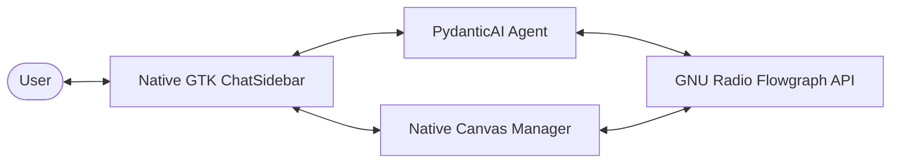

# GRC-Agent: Technical Overview

GRC-Agent is an agentic companion designed for digital signal processing (DSP) and software-defined radio (SDR) design, bridging natural language interaction with visual GNU Radio Companion (.grc) flowgraphs. 

This document details the system's architecture, including its model-facing tools, RAG search setup, transactional mutation engine, and integration scenarios benchmark.

---

## System Architecture

GRC-Agent runs as a single-process, single-threaded native GTK3 desktop application. It unifies GNU Radio Companion's UI, the canvas drawing area, and the async agentic loop on a single event loop via `gbulb`, eliminating the need for separate server/virtualization layers.

- **Native Chat Sidebar**: A custom PyGObject `Gtk.Box` widget (`ChatSidebar`) integrated directly inside GRC's main window. It hosts the streaming message history list, settings menu, and controls.
- **Native Canvas Manager**: A coordination layer (`NativeCanvasManager`) that connects to GRC's notebooks and drawing area. It tracks page selection, handles manual edits via file hashing, and hooks GRC's built-in actions.
- **Flowgraph Proxy**: A transparent proxy layer (`NativeFlowgraphProxy`) that forwards agent tool queries and updates directly to GRC's active tab `FlowGraph` instance in-place.
- **Agent Reasoning Core**: A PydanticAI Agent that registers system prompts, model-facing tools, and custom execution capabilities.

---

## Desktop Application & Layout Integration

The application merges the GNU Radio Companion desktop canvas with the AI sidebar widget seamlessly:

### 1. Unified Event Loop
- **Gbulb Integration**: The application initializes the asyncio event loop using `gbulb.install(gtk=True)`. This bridges Python's async task execution with the GLib main loop, allowing agent completions and GRC drawing events to coexist safely on the same thread without cross-thread marshalling.
- **Obsolete Future Protection**: Obsolete event loop transport assertions are bypassed cleanly to ensure terminal execution output remains noise-free.

### 2. Panel & Layout Synchronization
- **Pane Layout**: GRC's main window horizontal pane (`window.main`) is wrapped in an outer horizontal paned layout (`Gtk.Paned`), placing the GRC canvas and panels in the left pane and the Chat Sidebar in the right pane.
- **Block Library Toggling**: GRC's native Block Library panel (`BlockTreeWindow`) is packed inside the main widget. The sidebar's toggle arrow connects directly to GRC's native `Actions.TOGGLE_BLOCKS_WINDOW` action to slide the block panel into view or collapse it dynamically.
- **Divider Auto-Positioning**: When expanding/collapsing the block library panel via the sidebar toggle, the main widget pane positions are updated dynamically (collapsed to 100% of width, or expanded to 78%) to ensure GRC's block menu renders with adequate width.
- **Safe Markdown Rendering**: Assistant responses are parsed to HTML with custom safe Pango markup formatting, falling back to raw text layout dynamically if malformed markdown syntax is emitted by the LLM.

---

## Genius Tool Design

The agent interacts with the flowgraph through three highly specialized tools:

### 1. Context-Efficient Graph Inspection (`inspect_graph`)

To preserve context window limits and optimize reasoning tokens, visual and schema metadata is pruned using a two-stage process:

- **Stage A (Visual & Structural Layout Pruning)**: Excludes layout-specific variables (e.g. GUI hints, coordinates) and non-DSP nodes (such as imports, snippets).
- **Stage B (Parameter Visibility Pruning)**: Omits default configuration values, advanced parameters, and unconnected optional ports. The LLM receives a clean, semantic JSON representation of the active DSP topology.

### 2. Local SQLite Vector RAG (`query_knowledge`)

Knowledge grounding is enforced through a local SQLite vector database (`sqlite-vec`) built lazily upon first use. The database splits search queries into two separate domains:

- **Catalog Domain**: Queries GNU Radio block metadata, block IDs, category mappings, parameter options, and port structures.
- **Docs Domain**: Queries wiki pages, tutorials, and conceptual documentation parsed and heading-chunked.
- **Embedding Provider Fallback**: Embeddings are generated using local Ollama (`embeddinggemma:latest`) or OpenRouter (`perplexity/pplx-embed-v1-0.6b`) backends, checking for model or dimensionality changes on startup.

### 3. Transactional Mutation Engine (`change_graph`)

Graph editing executes a batch of updates in a strict 7-phase transactional sequence, guaranteeing that the flowgraph is not left in a partially mutated or corrupted state:

1. **`remove_connections`**: Drops specified connections.
2. **`remove_blocks`**: Deletes block instances from the graph.
3. **`add_blocks`**: Instantiates new blocks, placing them using a grid-spaced spiral collision-avoidance search algorithm.
4. **`update_params`**: Updates block parameters (e.g. sample rates, thresholds).
5. **`auto_resolve_types`**: Dynamically propagates type selections (`dtype`) for parameters set to `"auto"` based on neighboring ports.
6. **`update_states`**: Configures block execution states (enabled, disabled, or bypass).
7. **`add_connections`**: Wires ports together to re-establish the DSP signal chain.

#### Grid-Spaced Spiral Coordinate Resolution
Since the LLM lacks spatial awareness, block positioning is resolved programmatically. Coordinates are snapped to grid boundaries (`BLOCK_FOOTPRINT_W=300`, `BLOCK_FOOTPRINT_H=220`, and `BLOCK_SPACING=60`), searching outward in concentric Chebyshev rings near connected neighbors to prevent overlaps on the visual canvas.

#### Self-Correction & Native Validation
At the end of a transaction, GNU Radio's native validation compiles and validates the new state. If validation fails, changes are rolled back, the prior state is restored, and a `ModelRetry` exception containing the exact compiler feedback is raised, enabling self-correction for up to 3 attempts.

---

## Agent Lifecycle

The diagram below tracks the execution lifecycle of a single user prompt:

---

## Integration Scenarios Benchmark

The integration test suite executes 11 distinct scenarios mapping real-world editing workflows. All scenarios pass successfully across both local and cloud LLM backends:

| Scenario Name | qwen3.6:35b (Ollama Local) | deepseek-v4-flash (Ollama Cloud) | Verification Objective |
| :--- | :---: | :---: | :--- |
| `01_add_throttle` | Pass | Pass | Inserts a throttle block inline inside the dial tone mixer path. |
| `02_update_sample_rate` | Pass | Pass | Modifies the `samp_rate` variable parameter value to 48000. |
| `03_disable_and_enable` | Pass | Pass | Disables then re-enables a noise source block. |
| `04_add_and_remove_variable` | Pass | Pass | Adds `gain_value` variable and references it in a tone source's amplitude. |
| `05_full_rewire` | Pass | Pass | Deletes a noise block and connects a new DC offset block to the adder. |
| `06_query_knowledge_multiply` | Pass | Pass | Replaces an adder block with a multiplier block located via catalog search. |
| `09_docs_stream_tags_concept` | Pass | Pass | Queries documentation domain regarding stream tags concepts without mutations. |
| `10_bypass_source_block` | Pass | Pass | Transitions a signal source block into bypass state. |
| `11_scoped_inspect_and_update` | Pass | Pass | Inspects specific target blocks and modifies sample rate. |
| `14_build_chain_from_scratch` | Pass | Pass | Constructs a signal source -> throttle -> sink chain on an empty flowgraph. |
| `22_fm_rx_filter_squelch` | Pass | Pass | Inserts a low-pass filter and simple squelch block inline inside an FM receiver chain. |
