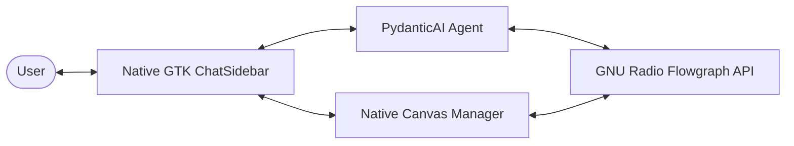
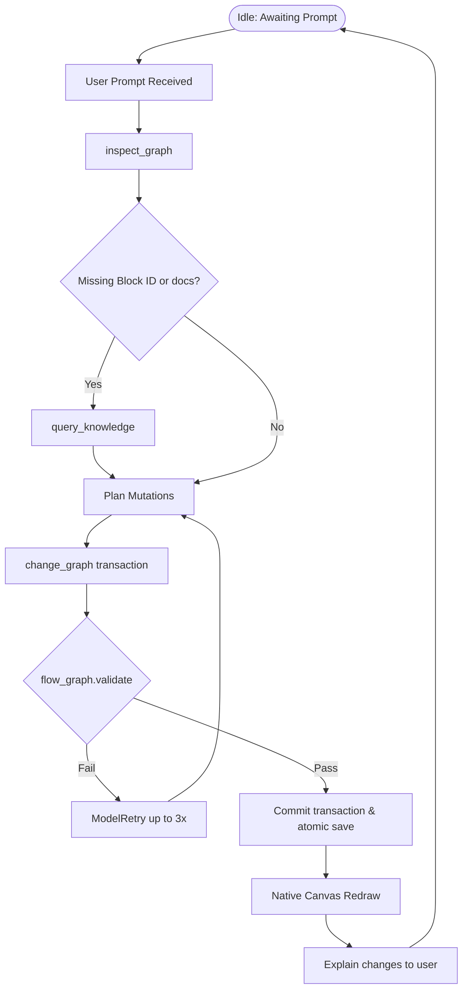

# GRC-Agent: Technical Overview

GRC-Agent is an agentic companion designed for digital signal processing (DSP) and software-defined radio (SDR) design, bridging natural language interaction with visual GNU Radio Companion (.grc) flowgraphs. 

This document details the system's architecture, including its model-facing tools, RAG search setup, transactional mutation engine, and integration scenarios benchmark.

---

## System Architecture

GRC-Agent runs as a single-process, single-threaded native GTK3 desktop application. It unifies GNU Radio Companion's UI, the canvas drawing area, and the async agentic loop on a single event loop via PyGObject's `gi.events` (or `gbulb` on PyGObject < 3.50), eliminating the need for separate server/virtualization layers.

```mermaid
flowchart LR
    User([User]) <--> ChatSidebar[Native GTK ChatSidebar]
    ChatSidebar <--> Agent[PydanticAI Agent]
    Agent <--> Flowgraph[GNU Radio Flowgraph API]
    ChatSidebar <--> CanvasManager[Native Canvas Manager]
    CanvasManager <--> Flowgraph
```

- **Native Chat Sidebar**: A custom PyGObject `Gtk.Box` widget (`ChatSidebar`) integrated directly inside GRC's main window. It hosts the streaming message history list, settings menu, and controls.
- **Native Canvas Manager**: A coordination layer (`NativeCanvasManager`) that connects to GRC's notebooks and drawing area. It tracks page selection, handles manual edits via file hashing, and hooks GRC's built-in actions.
- **Flowgraph Proxy**: A transparent proxy layer (`NativeFlowgraphProxy`) that forwards agent tool queries and updates directly to GRC's active tab `FlowGraph` instance in-place.
- **Agent Reasoning Core**: A PydanticAI Agent that registers system prompts, model-facing tools, and custom execution capabilities.

---

## Desktop Application & Layout Integration

The application merges the GNU Radio Companion desktop canvas with the AI sidebar widget seamlessly:

### 1. Unified Event Loop
- **Event Loop Unification**: The application initializes the asyncio event loop via `event_loop.install()`, which selects PyGObject's in-tree `gi.events` policy when available (PyGObject >= 3.50, and the only option on Python 3.14) and falls back to `gbulb` otherwise. This bridges Python's async task execution with the GLib main loop, allowing agent completions and GRC drawing events to coexist safely on the same thread without cross-thread marshalling.
- **Obsolete Future Protection**: Obsolete event loop transport assertions are bypassed cleanly to ensure terminal execution output remains noise-free.

### 2. Panel & Layout Synchronization
- **Pane Layout**: GRC's main window horizontal pane (`window.main`) is wrapped in an outer horizontal paned layout (`Gtk.Paned`), placing the GRC canvas and panels in the left pane and the Chat Sidebar in the right pane.
- **Block Library Toggling**: GRC's native Block Library panel (`BlockTreeWindow`) is packed inside the main widget. The sidebar's toggle arrow connects directly to GRC's native `Actions.TOGGLE_BLOCKS_WINDOW` action to slide the block panel into view or collapse it dynamically.
- **Divider Auto-Positioning**: When expanding/collapsing the block library panel via the sidebar toggle, the main widget pane positions are updated dynamically (collapsed to 100% of width, or expanded to 78%) to ensure GRC's block menu renders with adequate width.
- **Safe Markdown Rendering**: Assistant responses are parsed to HTML with custom safe Pango markup formatting, falling back to raw text layout dynamically if malformed markdown syntax is emitted by the LLM.

---

## Genius Tool Design

The agent interacts with the flowgraph through six highly specialized tools:

### 1. Context-Efficient Graph Inspection (`inspect_graph`)

To preserve context window limits and optimize reasoning tokens, visual and schema metadata is pruned using a two-stage process:

- **Stage A (Visual & Structural Layout Pruning)**: Excludes layout-specific variables (e.g. GUI hints, coordinates) and schema plumbing (block `id`, `showports`, `bus_structure_*`); imports/snippets stay in the listing, tagged by a `role` field.
- **Stage B (Parameter Visibility Pruning)**: Omits default configuration values, advanced parameters, and unconnected optional ports. The LLM receives a clean, semantic JSON representation of the active DSP topology.

### 2. Local SQLite Vector RAG (`query_knowledge`)

Knowledge grounding is enforced through a local SQLite vector database (`sqlite-vec`) built lazily upon first use. The database splits search queries into two separate domains:

- **Catalog Domain**: Queries GNU Radio block metadata, block IDs, category mappings, parameter options, and port structures.
- **Docs Domain**: Queries wiki pages, tutorials, and conceptual documentation parsed and heading-chunked.
- **Embedding Backend Selection**: The embeddings backend is chosen independently of the chat provider (`GRC_EMBED_BACKEND`: `auto` (follow chat provider) | `ollama` | `llamacpp` (the bundled local runtime serving EmbeddingGemma) | `openai_compatible`); the vector-DB filename is keyed on the backend so switching never mixes one model's vectors with another's index. Staleness is checked on first use — an embedding-model or corpus change triggers a rebuild.
- **Lexical Fallback**: Vector search is primary. If the embedding call itself fails (backend unreachable, model not pulled), `query_knowledge` transparently falls back to a local SQLite FTS5 (BM25) keyword search over the same catalog/docs corpus — including on a cold cache where the embedding backend was never reachable, in which case the DB is built lexical-only (no vector index) rather than failing the whole ingest. The tool result always tags which path served it (`"search_mode": "vector" | "lexical"`), so a fallback is never silent to the caller.

### 3. Python Code Preview (`generate_python`)

Read-only codegen that renders the flowgraph's generated Python source via GNU Radio's own `Generator` in-memory (never writes to disk). Returns the main script plus any Embedded Python Block/Module source files. A failure (invalid graph, hierarchical block, C++ output) raises `ModelRetry` so the agent can self-correct.

### 4. Runtime Log Access (`get_run_log`)

Reads the captured console output (stdout + stderr) from the most recent flowgraph execution, whether it succeeded or failed. The log is retained by the `exec_monitor` until the next run, so the agent can re-read it on demand at any point in a conversation. When a run fails (non-zero, non-SIGTERM return code), the agent is **automatically notified** with the return code via a short chat message — it then calls `get_run_log` to read the full output and diagnose the error, with no user interaction needed. This replaces the old Yes/No fix-error bubble that injected the full log as a raw prompt blob.

### 5. Transactional Mutation Engine (`change_graph`)

Graph editing executes a batch of updates in a strict 7-phase transactional sequence, guaranteeing that the flowgraph is not left in a partially mutated or corrupted state:

1. **`remove_connections`**: Drops specified connections.
2. **`remove_blocks`**: Deletes block instances from the graph.
3. **`add_blocks`**: Instantiates new blocks, then relays out the *entire* flowgraph via the header-band/flow-band algorithm described below.
4. **`update_params`**: Updates block parameters (e.g. sample rates, thresholds).
5. **`auto_resolve_types`**: Dynamically propagates type selections (`dtype`) for parameters set to `"auto"` based on neighboring ports.
6. **`update_states`**: Configures block execution states (enabled, disabled, or bypass).
7. **`add_connections`**: Wires ports together to re-establish the DSP signal chain.

#### Header-Band / Flow-Band Full Relayout
Since the LLM lacks spatial awareness, block positioning is resolved programmatically — and, whenever a batch adds at least one block, the *whole* flowgraph (not just the new block) is relaid out from scratch. Every block is classified into a header band (variables, the options block, imports, snippets — packed left-to-right in fixed-width rows, alphabetically sorted, the options block always pinned first) or a flow band (everything else, laid out left-to-right by topological rank via `grandalf`, one grid cell per block, with a barycenter heuristic ordering same-rank blocks by their upstream position). Coordinates snap to a shared grid (`BLOCK_FOOTPRINT_W=300`, `BLOCK_FOOTPRINT_H=220`, `BLOCK_SPACING=60`) so overlap detection stays consistent across both bands. This only ever runs from `change_graph`'s own mutation — a user's manual canvas edits are never touched by it.

#### Self-Correction & Native Validation
At the end of a transaction, GNU Radio's native validation compiles and validates the new state. If validation fails, changes are rolled back, the prior state is restored, and a `ModelRetry` exception containing the exact compiler feedback is raised, enabling self-correction for up to 3 attempts.

### 6. Reusable Block Library (`save_block`)

Exports an existing Embedded Python Block (`epy_block`) instance's source into GNU Radio's own native hier-block library (`~/.grc_gnuradio`) as a standalone, reusable catalog block — available to `change_graph` in this flowgraph or any other, without recreating the same logic from scratch each time. This is distinct from an out-of-tree (OOT) module (`gr-modtool`, a separate, heavier build toolchain the agent still has no access to); it's GNU Radio's own lighter mechanism for a loose, reusable block file. The current flowgraph's own `epy_block` instance is left untouched — the exported block is a new, separately-named catalog entry for future use only. Validation never calls GNU Radio's own `Platform.build_library()` on a disposable instance (that would corrupt the shared, process-wide block registry — see `AGENTS.md`); instead it builds and instantiates the candidate block class directly via `Platform.new_block_class()`, a pure function with no such side effect.

---

## Agent Lifecycle

The diagram below tracks the execution lifecycle of a single user prompt:

```mermaid
flowchart TD
    Idle([Idle: Awaiting Prompt]) --> Input[User Prompt Received]
    Input --> Inspect[inspect_graph]
    Inspect --> DecisionRAG{Missing Block ID or docs?}
    DecisionRAG -- Yes --> RAG[query_knowledge]
    RAG --> Plan[Plan Mutations]
    DecisionRAG -- No --> Plan
    Plan --> Mutate[change_graph transaction]
    Mutate --> Validate{flow_graph.validate}
    Validate -- Fail --> Retry[ModelRetry up to 3x]
    Retry --> Plan
    Validate -- Pass --> Commit[Commit transaction & atomic save]
    Commit --> Sync[Native Canvas Redraw]
    Sync --> Explained[Explain changes to user]
    Explained --> Idle
```

### Run Failure Auto-Diagnosis

When a flowgraph execution fails, the agent is notified automatically — no user intervention needed:

```mermaid
flowchart TD
    Run[User hits Execute] --> Exec[Flowgraph subprocess runs]
    Exec --> Monitor[exec_monitor detects '>>> Done (return code N)']
    Monitor -->|non-zero, non-SIGTERM| Notify[notify_run_failure sends short message to agent]
    Notify --> AgentReads[Agent receives 'Flowgraph run failed (return code N)']
    AgentReads --> Tool[Agent calls get_run_log tool]
    Tool --> Diagnose[Agent reads full stdout/stderr, diagnoses error]
    Diagnose --> Fix[Agent proposes or applies a fix]
```

This replaces the old Yes/No "fix it?" bubble — the agent now reads the log as a structured tool result (same pattern as `inspect_graph`/`generate_python`) and can decide whether the failure is relevant without the user mediating.

---

## Integration Scenarios Benchmark

The integration test suite executes 14 distinct scenarios mapping real-world editing workflows. The first 13 pass across both local and cloud LLM backends; `25_save_epy_block_to_library` is Ollama Cloud-only so far (this project's standard live-test backend — see the Test Gate in `AGENTS.md`):

| Scenario Name | qwen3.6:35b (Ollama Local) | deepseek-v4-flash (Ollama Cloud) | Verification Objective |
| :--- | :---: | :---: | :--- |
| `01_add_throttle` | Pass | Pass | Inserts a throttle block inline inside the dial tone mixer path. |
| `02_update_sample_rate` | Pass | Pass | Modifies the `samp_rate` variable parameter value to 48000. |
| `03_disable_and_enable` | Pass | Pass | Disables then re-enables a noise source block. |
| `04_add_and_remove_variable` | Pass | Pass | Adds `gain_value` variable and references it in a tone source's amplitude. |
| `05_full_rewire` | Pass | Pass | Deletes a noise block and connects a new DC offset block to the adder. |
| `06_query_knowledge_multiply` | Pass | Pass | Replaces an adder block with a multiplier block located via catalog search. |
| `09_docs_stream_tags_concept` | Pass | Pass | Queries documentation domain regarding stream tags concepts without mutations. |
| `10_bypass_source_block` | Pass | Pass | Transitions a signal source block into bypass state. |
| `11_scoped_inspect_and_update` | Pass | Pass | Inspects specific target blocks and modifies sample rate. |
| `14_build_chain_from_scratch` | Pass | Pass | Constructs a signal source -> throttle -> sink chain on an empty flowgraph. |
| `21_type_conversion_and_conjugate` | Pass | Pass | Converts signal types and applies conjugate operations across connected blocks. |
| `22_fm_rx_filter_squelch` | Pass | Pass | Inserts a low-pass filter and simple squelch block inline inside an FM receiver chain. |
| `24_generate_python_preview` | Pass | Pass | Previews the generated Python source of the active flowgraph via `generate_python`. |
| `25_save_epy_block_to_library` | Not yet run | Pass | Writes a new Embedded Python Block, wires it in, then exports it via `save_block` into an isolated hier-block library dir. |
